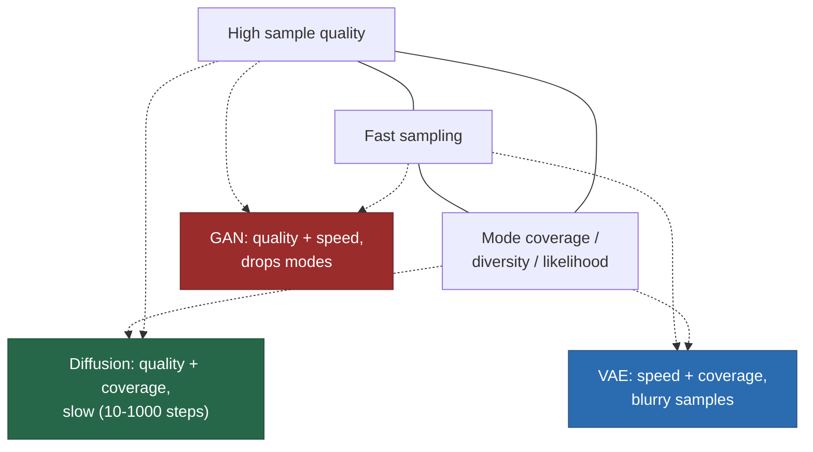

# What is Generative AI?

> **Summary** — A generative model learns the probability distribution that produced a dataset, so
> that it can produce *new* samples from that distribution. A discriminative model only learns the
> boundary between classes. This one difference — modelling $p(x)$ rather than $p(y \mid x)$ —
> explains why generative models need vastly more capacity, why they can be used for far more
> tasks, and why they were impractical until roughly 2012.

**Prerequisites**: none. **Next**: → [Probability & information theory](02-probability-and-information-theory.md)

---

## 1. The core distinction

Imagine a dataset of handwritten digits. Two very different questions:

| Question | Model type | Learns | Output |
|---|---|---|---|
| "Is this image a 7?" | **Discriminative** | $p(y \mid x)$ | A label |
| "Draw me a 7." | **Generative** | $p(x \mid y)$ or $p(x)$ | A new image |

> [!TIP]
> **Intuition** — A discriminative model is a *border guard*: it only needs to know where the line
> between countries is. A generative model is a *cartographer*: it must know the shape of the entire
> terrain, including regions nowhere near any border. The cartographer's job is enormously harder,
> but once you have the map you can do things the border guard never could — navigate, plan routes,
> spot when someone hands you a forged map.

Formally, the border guard needs only the *decision boundary*: the set $\{x : p(y{=}1 \mid x) = 0.5\}$.
That is a surface of dimension $d-1$ in a $d$-dimensional space. The cartographer needs the full
$d$-dimensional density. For a $256\times256$ RGB image, $d = 196{,}608$.

```
Discriminative                          Generative
─────────────                           ──────────

    ×  ×  │  ○  ○                          ×  ×    ╭───╮
  ×  ×    │    ○  ○                      ×  ×  ×  │ ○ ○ │
    ×  ×  │  ○                             ×  ×   │○ ○ ○│
  ×    ×  │    ○  ○                      ×   ×     ╰─○──╯
          │
   learn ONE surface                     learn TWO densities
   (the boundary)                        (where mass lives)

   cheap, task-specific                  expensive, reusable
   cannot sample                         can sample, score, impute,
                                          compress, detect anomalies
```

> [!WARNING]
> **Pitfall** — "Generative" in "generative AI" is used loosely. A modern LLM trained with RLHF is
> no longer a clean density model of web text; a GAN never models a density at all. The useful
> definition is behavioural: **a model that produces novel, structured, high-dimensional output.**

---

## 2. Why modelling p(x) is hard: the curse of dimensionality

Suppose you want to model $28 \times 28$ binary images (tiny MNIST). The sample space has

$$2^{784} \approx 10^{236}$$

possible images. A lookup table is impossible — there are roughly $10^{80}$ atoms in the observable
universe. Your training set has maybe $6 \times 10^4$ examples.

**Worked example — how sparse is the data?**

If you tried to cover the space by binning each of $d$ dimensions into just 2 bins, you would need
$2^d$ bins. With 60,000 samples:

| $d$ | Number of bins | Samples per bin |
|---|---|---|
| 10 | 1,024 | 58.6 |
| 20 | 1,048,576 | 0.057 |
| 30 | $1.07 \times 10^9$ | $5.6\times10^{-5}$ |
| 784 | $10^{236}$ | $\approx 0$ |

Beyond $d \approx 20$, essentially every bin is empty. **Any method that relies on local
neighbourhoods — histograms, kernel density estimation, nearest neighbours — dies here.**

### The escape hatch: the manifold hypothesis

Real data does not fill its ambient space. Natural images occupy a thin, curved, low-dimensional
*manifold* inside $\mathbb{R}^{196608}$. Randomly sample pixel values and you get static, never a
face. Empirical estimates put the intrinsic dimension of natural image datasets at roughly 10–100,
not 200,000.

```
Ambient space R^784                Data manifold (intrinsic dim ~10)
┌───────────────────────────┐      ┌───────────────────────────┐
│ · · · · · · · · · · · · · │      │          ╭──────╮         │
│ · · · · · · · · · · · · · │      │      ╭───╯      ╰──╮      │
│ · · ·  mostly noise · · · │  →   │   ╭──╯   digits    ╰─╮    │
│ · · · · · · · · · · · · · │      │  ╰──╮  live here  ╭──╯    │
│ · · · · · · · · · · · · · │      │     ╰─────────────╯       │
└───────────────────────────┘      └───────────────────────────┘
 almost all volume is             all probability mass is on a
 probability ~ 0                   thin, curved, connected sheet
```

**Every generative model is a different strategy for discovering and parameterizing that manifold.**

- VAEs and diffusion models learn an explicit map from a simple latent space onto the manifold.
- GANs learn the map without ever writing down a density.
- Autoregressive models sidestep geometry entirely, factorizing into a chain of 1-D problems.
- Flows learn an invertible map, so the manifold is the image of a bijection.

→ [Taxonomy of generative models](06-taxonomy.md) makes this systematic.

---

## 3. The four things a generative model can do

Not all models can do all four. This table is the single most useful thing on this page.

| Capability | What it means | AR | VAE | GAN | Flow | Diffusion | EBM |
|---|---|:--:|:--:|:--:|:--:|:--:|:--:|
| **Sample** | produce new $x \sim p_\theta$ | ✅ slow | ✅ fast | ✅ fast | ✅ fast | ✅ slow | ⚠️ MCMC |
| **Evaluate density** | compute $p_\theta(x)$ exactly | ✅ | ❌ bound | ❌ | ✅ | ❌ bound | ⚠️ unnormalized |
| **Learn a latent** | get a useful compressed $z$ | ❌ | ✅ | ⚠️ | ✅ | ⚠️ | ❌ |
| **Interpolate** | blend two samples meaningfully | ❌ | ✅ | ✅ | ✅ | ✅ | ⚠️ |

**Reading the table**: it explains the market. Autoregressive models won text because text is
naturally sequential and exact likelihood gives a clean training signal. Diffusion won images
because sampling quality beat GANs and it trains stably. VAEs survive as the *compressor* inside
latent diffusion. Flows are niche because invertibility constrains architecture too much.

---

## 4. The generative trilemma

You want three things. You get two.



| Model | Quality | Speed | Coverage | The failure mode |
|---|---|---|---|---|
| GAN | ★★★ | ★★★ | ★ | **Mode collapse** — generator finds a few outputs that fool $D$ and stops exploring |
| VAE | ★ | ★★★ | ★★★ | **Blurriness** — the Gaussian likelihood averages over plausible outputs |
| Diffusion | ★★★ | ★ | ★★★ | **Cost** — hundreds of network evaluations per sample |
| Autoregressive | ★★★ | ★ | ★★★ | **Sequential** — $O(n)$ forward passes, no parallel sampling |
| Flow | ★★ | ★★★ | ★★★ | **Constrained** — invertibility + tractable Jacobian limits expressivity |

Almost every research direction since 2021 is an attempt to break one leg of the trilemma:
consistency models and flow matching attack diffusion's speed (→ [Flow matching](../05-diffusion-and-vision/04-flow-matching.md));
speculative decoding attacks autoregressive latency (→ [Inference & decoding](../04-large-language-models/06-inference-and-decoding.md)).

---

## 5. Why now? The three-factor explanation

Generative models are old. The Boltzmann machine is from 1985; the variational autoencoder's core
math is 1990s statistics. The explosion after 2012 has three causes, and it is worth getting the
relative weights right.

### Factor 1: Compute (the dominant factor)

**Training compute of landmark models** (FLOPs, log scale)



*Training compute, log scale. Sources: AlexNet 0.0058 pfs-days (OpenAI, “AI and Compute”); Transformer-big 2.3e19 (Vaswani et al. 2017, Table 2); GPT-3 3.14e23; Chinchilla 5.76e23; PaLM 2.53e24; Llama 3.1 405B 3.8e25 (each from its paper). *Llama 2 70B is derived as 6 × 70B params × 2T tokens. Line: least-squares fit of log₁₀(FLOPs) on year.*

That is roughly **8 orders of magnitude in 12 years**. The fitted trend doubles every **5.3 months**,
far faster than Moore's law (24 months). The extra speed comes from hardware specialization (GPU →
tensor cores → TPUs), lower precision (FP32 → FP16/BF16 → FP8), and above all from *spending more
money*: cluster sizes grew from 1 GPU to $10^5$ accelerators.

### Factor 2: Data

The internet provided a corpus of human-generated text and images at a scale nobody could have
curated deliberately.

**Dataset scale**

| Dataset | Size | Domain | Year |
|---|---|---|---|
| MNIST | 60 K images | digits | 1998 |
| ImageNet | 1.3 M images | objects | 2009 |
| WebText (GPT-2) | ~40 GB of text (≈10 B tokens) | web | 2019 |
| Common Crawl, filtered (GPT-3) | 410 B tokens | web | 2020 |
| LAION-5B | 5.85 B image–text pairs | web | 2022 |
| Modern frontier corpora | 10–30+ T tokens | web+code+books+synthetic | 2024+ |

> [!WARNING]
> **The looming constraint** — high-quality public text is finite (estimates: $10^{13}$–$10^{14}$
> tokens). Frontier runs are within an order of magnitude of it. Hence the shift toward synthetic
> data, multimodal data, and *test-time* compute (→ [Reasoning](../04-large-language-models/10-reasoning.md)).

### Factor 3: Architecture and algorithms

| Year | Idea | Why it mattered |
|---|---|---|
| 2012 | AlexNet / GPU training | proved deep nets scale with compute |
| 2014 | GAN, VAE | first deep generative models that produced recognizable images |
| 2015 | ResNet, BatchNorm | made >100-layer networks trainable |
| 2017 | **Transformer** | replaced sequential recurrence with parallel attention |
| 2020 | GPT-3, DDPM, scaling laws | in-context learning; diffusion beats GAN; scaling becomes predictable |
| 2022 | InstructGPT / RLHF, latent diffusion | alignment makes models usable; diffusion becomes cheap |
| 2023+ | MoE, long context, RL on reasoning | decouple capacity from cost; buy capability with inference compute |

> [!TIP]
> **Intuition on why the Transformer specifically** — Recurrent networks process tokens one at a
> time, so training a sequence of length $n$ takes $n$ sequential steps and gradients must travel $n$
> hops. The Transformer makes every position directly reachable from every other in *one* hop and
> makes all positions computable *in parallel*. It converted the bottleneck from "sequential depth"
> to "matrix multiplication throughput" — exactly the thing GPUs are good at. Scaling then became an
> engineering problem rather than a research problem. → [The Transformer](../03-sequence-models/04-transformer.md)

---

## 6. What "learning a distribution" actually means in practice

You never see $p_{\text{data}}$. You see $N$ samples from it. Training almost always means
**maximum likelihood estimation**:

$$\theta^* = \arg\max_\theta \frac{1}{N}\sum_{i=1}^{N} \log p_\theta(x^{(i)})$$

**Derivation — why MLE is the same as minimizing KL divergence**

$$
\begin{aligned}
D_{\mathrm{KL}}(p_{\text{data}} \,\|\, p_\theta)
&= \mathbb{E}_{x \sim p_{\text{data}}}\!\left[\log \frac{p_{\text{data}}(x)}{p_\theta(x)}\right] \\
&= \underbrace{\mathbb{E}_{p_{\text{data}}}[\log p_{\text{data}}(x)]}_{\text{$-H(p_{\text{data}})$, constant in }\theta}
 - \mathbb{E}_{p_{\text{data}}}[\log p_\theta(x)]
\end{aligned}
$$

The first term does not depend on $\theta$. So

$$\arg\min_\theta D_{\mathrm{KL}}(p_{\text{data}} \| p_\theta) = \arg\max_\theta \mathbb{E}_{p_{\text{data}}}[\log p_\theta(x)]$$

— **maximizing likelihood is exactly minimizing the KL divergence from data to model.** This is the
single most important identity in generative modelling. → [Probability & information theory](02-probability-and-information-theory.md)

### The consequence: mode-covering behaviour

$D_{\mathrm{KL}}(p_{\text{data}} \| p_\theta)$ is **asymmetric**, and the asymmetry has teeth:

$$D_{\mathrm{KL}}(p \| q) = \int p(x) \log\frac{p(x)}{q(x)}\,dx$$

Wherever $p(x) > 0$ but $q(x) \to 0$, the integrand $\to \infty$. So a model trained by MLE is
**infinitely punished for assigning zero probability to real data**, but only mildly punished for
assigning probability to nonsense. Result: MLE models *over-generalize* — they cover all the modes,
and blur between them.


*Computed numerically: p = ½N(−2, 0.6²) + ½N(2, 0.6²). Forward KL is minimized by moment matching (μ = 0, σ = 2.09); reverse KL by grid search (μ = ±2, σ = 0.60). → full treatment in [Probability & information theory §4](02-probability-and-information-theory.md#4-kl-divergence-the-excess-cost-of-being-wrong).*

This one picture explains **why VAEs are blurry and GANs collapse.** VAEs minimize (a bound on)
forward KL → cover everything → blur. GAN training is closer to a symmetric/reverse objective →
sharp but drops modes. → [VAE](../02-classical-models/02-vae.md), → [GAN](../02-classical-models/03-gan.md)

---

## 7. Conditional generation: where the value is

Unconditional generation ("draw any image") is a research benchmark. Products want
**conditional** generation:

$$p_\theta(x \mid c)$$

where $c$ is a caption, a prompt, a class label, an input image, an audio clip.

| $c$ | $x$ | System |
|---|---|---|
| text prompt | text continuation | LLM chat |
| text prompt | image | text-to-image |
| image | text | captioning / VLM |
| text | audio | TTS, music generation |
| code context | code | code completion |
| text + image | robot action | vision-language-action models |

Two ways to condition, and the distinction matters:

1. **Train it in** — feed $c$ to the network (cross-attention, concatenation, FiLM, prefix tokens).
   Used by text-to-image models, VLMs, instruction-tuned LLMs.
2. **Guide at sample time** — nudge the sampler toward high $p(c \mid x)$ using Bayes' rule:
   $\nabla \log p(x \mid c) = \nabla \log p(x) + \nabla \log p(c \mid x)$.
   This is **classifier guidance**; the classifier-free variant dominates in practice.
   → [Latent diffusion](../05-diffusion-and-vision/03-latent-diffusion.md)

---

## 8. Emergence, or the lack of it

A widely-cited observation is that some capabilities appear *suddenly* at scale. The GPT-3
paper's own arithmetic results are a clean example: the 13B model (≈$2\times10^{22}$ training FLOPs)
solves 3-digit addition **under 10%** of the time, while the 175B model (≈$3\times10^{23}$) solves
it **80.2%** of the time ([Brown et al. 2020](https://arxiv.org/abs/2005.14165), §3.9.1).

The important caveat, from *Are Emergent Abilities of Large Language Models a Mirage?* (Schaeffer
et al., 2023): much apparent emergence is an artifact of **discontinuous metrics**. Exact-match
accuracy on a 5-digit sum is all-or-nothing; per-digit cross-entropy on the same task improves
smoothly. Change the metric, and the cliff becomes a ramp.


*Synthetic illustration of Schaeffer et al.'s argument: exact match on a 5-digit answer is (per-digit accuracy)⁵, so a smooth underlying improvement shows up as a sudden jump.*

> [!TIP]
> **The honest summary** — the *underlying* competence improves smoothly and predictably with
> compute (→ [Scaling laws](../04-large-language-models/03-scaling-laws.md)). Whether that shows up
> as a sudden jump depends on how you measure. But it is also true that *which* smooth improvement
> crosses a usefulness threshold at what scale is not currently predictable, and that is a genuine
> open problem, not a metric artifact.

---

## 9. Exercises

**Problem 1 — bin counting.** Redo the sparsity table in §2 for $d = 15$ and $d = 25$, still with
60,000 samples. At what $d$ does the expected count per bin first drop below 1?

<details><summary>Solution</summary>

Bins $= 2^d$; samples/bin $= 60000/2^d$.

| $d$ | bins | samples/bin |
|---|---|---|
| 15 | 32,768 | 1.83 |
| 25 | 33,554,432 | 0.0018 |

Setting $60000/2^d = 1$ gives $d = \log_2 60000 \approx 15.87$, so **$d = 16$** is the first
integer dimension where the expected count per bin drops below 1 (at $d=16$, $60000/65536 = 0.916$).
Any method relying on local neighbourhoods is already in trouble by $d \approx 16$ — far below a
$196{,}608$-dimensional image.

</details>

**Problem 2 — forward vs reverse KL, by hand.** Let $p$ put mass $0.5$ at $x{=}0$ and $0.5$ at
$x{=}10$ (two point masses), and let $q_1, q_2$ be candidate approximations: $q_1$ puts all its
mass at $x{=}5$ (between the modes), $q_2$ puts all its mass at $x{=}0$ (on one mode). Using the
informal "infinite penalty" rule from §6, which of $q_1, q_2$ would forward KL $D_{KL}(p\|q)$
prefer, and which would reverse KL $D_{KL}(q\|p)$ prefer? Why can neither actually be evaluated
if $q$ is a point mass?

<details><summary>Solution</summary>

Forward KL integrates $p(x)\log(p(x)/q(x))$: wherever $p(x)>0$ but $q(x)=0$, the term is
$+\infty$. Since $p$ has mass at *both* 0 and 10, **any** $q$ that is zero at either point gives
infinite forward KL — so *neither* $q_1$ nor $q_2$ is preferred by forward KL over the other; both
are catastrophic, which is exactly the "must cover everything" property from §6. A $q$ that
actually minimizes forward KL here must itself be spread across both modes (e.g. reproduce $p$
exactly, or in the Gaussian-fit case in the linked info-theory page, straddle both).

Reverse KL integrates $q(x)\log(q(x)/p(x))$: it is only evaluated where $q(x)>0$. For $q_1$
(mass at 5), $p(5)=0$, so reverse KL is $+\infty$ too — $q_1$ puts mass where $p$ has *none*. For
$q_2$ (mass at 0), $p(0)=0.5>0$, so reverse KL is finite ($=\log(1/0.5)=\log 2$). **Reverse KL
strictly prefers $q_2$** — it "picks one mode" exactly as the mode-seeking behaviour predicts.

The reason neither can be "actually evaluated" in the usual sense is that point masses have no
density in the calculus sense (they're Diracs); the argument above is the discrete/informal
version of the same infinite-penalty logic that applies to continuous densities in
→ [Probability & information theory §4](02-probability-and-information-theory.md#4-kl-divergence-the-excess-cost-of-being-wrong).

</details>

**Problem 3 — the trilemma.** A colleague proposes a new "instant GAN" that samples in one
forward pass, claims perfect mode coverage (no mode collapse, ever), and produces
state-of-the-art FID. Using the trilemma from §4, what should you be suspicious of, and what's
the first experiment you'd run?

<details><summary>Solution</summary>

The trilemma says quality, speed, and coverage cannot all be maximized simultaneously by any
known method — every real model sits at a point on the triangle with at least one weaker leg. A
claim of "fast + high quality + provably-always-covers-every-mode" is exactly the combination the
trilemma says is unusual, so the reasonable prior is that at least one claim is measured
narrowly, overstated, or holds only on an easy benchmark.

The cheapest diagnostic: run it on a toy multi-modal distribution with **known, countable** modes
(e.g. a mixture of 25 well-separated 2-D Gaussians, the standard GAN mode-collapse toy problem
referenced in → [GAN §3](../02-classical-models/03-gan.md#3-why-gans-are-hard-the-four-structural-problems)).
Count how many of the 25 modes actually receive samples. Real mode collapse is usually invisible
on aggregate metrics like FID (which average over many samples) and only shows up when you check
coverage directly.

</details>

**Problem 4 — conditional generation as Bayes.** A text-to-image model is guided at sample time
(not trained-in) using $\nabla\log p(x\mid c) = \nabla\log p(x) + \nabla\log p(c\mid x)$ from §7.
If you *double* the weight on the second term, informally what should happen to (a) how closely
images match the prompt, and (b) sample diversity for a fixed prompt? Which page derives this
precisely?

<details><summary>Solution</summary>

Doubling the $\nabla\log p(c\mid x)$ term pushes samples harder toward high-$p(c\mid x)$ regions
of image space — i.e. (a) **prompt adherence increases**. But that same push shrinks the
effective set of $x$ that the sampler explores for a fixed $c$, since it's discounting the
unconditional prior more, so (b) **diversity across samples decreases** (you get more similar,
more "prototypical" images for the same prompt).

This is exactly classifier-free guidance, derived precisely — including the extrapolation
argument and the $w\approx7$–8 empirical sweet spot — in
→ [Latent diffusion §3](../05-diffusion-and-vision/03-latent-diffusion.md#3-classifier-free-guidance).

</details>

## 10. Key takeaways

| # | Takeaway |
|---|---|
| 1 | Generative = model $p(x)$ or $p(x\mid c)$ and sample from it; discriminative = model $p(y \mid x)$. |
| 2 | Modelling $p(x)$ in high dimensions is only possible because real data lies on a low-dimensional manifold. |
| 3 | Maximum likelihood ≡ minimizing $D_{\mathrm{KL}}(p_{\text{data}} \| p_\theta)$; the asymmetry of KL causes mode-covering (blur). |
| 4 | The trilemma — quality, speed, coverage: pick two. Every architecture is a point on this triangle. |
| 5 | Compute grew ~$10^8\times$ in 13 years; that, more than any single algorithm, is the story. |
| 6 | The Transformer mattered because it traded sequential depth for parallel matrix multiplication. |
| 7 | "Emergence" is partly real, partly a metric artifact. Be suspicious of any sudden-capability plot using exact-match. |

---

## Further reading

- Bishop, *Pattern Recognition and Machine Learning*, ch. 1–2 — the classical framing.
- Goodfellow, Bengio & Courville, [*Deep Learning*](https://arxiv.org/abs/1607.00133), ch. 20 — deep generative models.
- Murphy, *Probabilistic Machine Learning: Advanced Topics* (2023) — the most current textbook treatment.
- Kaplan et al., [*Scaling Laws for Neural Language Models*](https://arxiv.org/abs/2001.08361) (2020).
- Schaeffer et al., [*Are Emergent Abilities of LLMs a Mirage?*](https://arxiv.org/abs/2304.15004) (2023).

**Next** → [Probability & information theory](02-probability-and-information-theory.md)
