# Probability and Information Theory for Generative Models

> **Summary** — Generative modelling is applied information theory. Entropy measures how many bits
> a distribution needs; cross-entropy is your training loss; KL divergence is what you are really
> minimizing; and the ELBO is what you minimize when KL is intractable. This page derives all of
> them, and shows the arithmetic in bits so the quantities stop being abstract.

**Prerequisites**: → [What is generative AI?](01-what-is-generative-ai.md) · **Next**: → [Math toolkit](03-math-toolkit.md)

---

## 1. Notation and the two rules everything is built from

| Symbol | Meaning |
|---|---|
| $p(x)$ | probability (mass or density) of $x$ |
| $p_{\text{data}}$ | the true, unknown data distribution |
| $p_\theta$ | our model, with parameters $\theta$ |
| $\mathbb{E}_{x\sim p}[f(x)]$ | expectation, $\sum_x p(x)f(x)$ or $\int p(x)f(x)\,dx$ |
| $q(z \mid x)$ | an approximate posterior (the "encoder") |
| $H(\cdot)$, $D_{\mathrm{KL}}$, $I(\cdot;\cdot)$ | entropy, KL divergence, mutual information |

**Chain rule** (exact, always true, no assumptions):

$$p(x_1, \dots, x_n) = \prod_{i=1}^{n} p(x_i \mid x_{<i})$$

**Bayes' rule**:

$$p(z \mid x) = \frac{p(x \mid z)\,p(z)}{p(x)}, \qquad p(x) = \int p(x \mid z)\,p(z)\,dz$$

These two lines generate the whole field. The chain rule gives you **autoregressive models** (GPT
is literally this equation with a neural net for each factor). Bayes' rule gives you **latent
variable models** — and the intractable $p(x) = \int p(x\mid z)p(z)dz$ in the denominator is
precisely why VAEs and diffusion models need a variational bound.

---

## 2. Entropy: the cost of describing a random variable

Before any of that machinery is useful, you need a way to answer a simpler question: how many bits does it take to describe a random variable at all? That's entropy, and every other quantity on this page — cross-entropy, KL, perplexity, mutual information — is a variation on it.

$$H(p) = -\sum_x p(x)\log p(x) = \mathbb{E}_{x\sim p}[-\log p(x)]$$

Units: **bits** if $\log = \log_2$, **nats** if $\log = \ln$. ($1 \text{ nat} = 1.4427$ bits.)

> [!TIP]
> **Intuition** — $-\log_2 p(x)$ is the *surprisal* of $x$: how many bits an optimal code spends on
> it. Rare events get long codewords, common events short ones. Entropy is the average codeword
> length — the irreducible cost of transmitting samples from $p$. **You cannot compress below
> entropy** (Shannon's source coding theorem), and a perfect generative model is exactly a perfect
> compressor.

**Worked example — four distributions over 4 symbols**

| Distribution | $p$ | $H$ (bits) | Comment |
|---|---|---|---|
| Uniform | $(0.25, 0.25, 0.25, 0.25)$ | $2.000$ | maximum: needs 2 full bits |
| Skewed | $(0.5, 0.25, 0.125, 0.125)$ | $1.750$ | Huffman code: 1,2,3,3 bits |
| Very skewed | $(0.97, 0.01, 0.01, 0.01)$ | $0.242$ | almost deterministic |
| Deterministic | $(1, 0, 0, 0)$ | $0.000$ | no information at all |

Check the second one by hand:

$$H = -[0.5\log_2 0.5 + 0.25\log_2 0.25 + 2\times 0.125\log_2 0.125]$$
$$= -[0.5(-1) + 0.25(-2) + 0.25(-3)] = 0.5 + 0.5 + 0.75 = 1.75 \text{ bits}$$

Notice this matches the Huffman code lengths exactly ($0.5\cdot1 + 0.25\cdot2 + 0.125\cdot3 +
0.125\cdot3 = 1.75$). That is not a coincidence — that is the source coding theorem.

**Real numbers to anchor on**

| Source | Entropy |
|---|---|
| Fair coin | 1 bit/flip |
| English letters, i.i.d. frequency model | ~4.1 bits/char |
| English, human prediction (Shannon 1951) | ~0.6–1.3 bits/char |
| Strong modern LLM on clean English | ~0.6–0.9 bits/char |
| Uniform over 32-bit integers | 32 bits |

The gap between 4.1 and 0.8 is the entire value proposition of language modelling: **structure is
compressible**.

---

## 3. Cross-entropy: what you actually optimize

Entropy is the *best* any model could do — the bit cost when the model knows $p$ exactly. Real models never know $p$; they only have their own guess, $q$. The bits you actually pay when using $q$ to describe data drawn from $p$ is a different, larger quantity: cross-entropy.

$$H(p, q) = -\sum_x p(x)\log q(x) = \mathbb{E}_{x\sim p}[-\log q(x)]$$

> [!TIP]
> **Intuition** — "I built a code optimized for $q$, but the world emits $p$. What's my average
> message length?" It is always *at least* $H(p)$, with equality only when $q = p$.

This is your loss function. Training a language model with cross-entropy loss means: minimize the
number of bits you'd need to encode the real text using your model's predictions.

**Worked example — the cost of a wrong model**

True: $p = (0.5, 0.25, 0.125, 0.125)$, so $H(p) = 1.75$ bits.
Model: $q = (0.25, 0.25, 0.25, 0.25)$ (uniform — the model learned nothing).

$$H(p,q) = -\sum_x p(x)\log_2 q(x) = -\log_2(0.25)\sum_x p(x) = 2.0 \text{ bits}$$

You pay $2.00 - 1.75 = 0.25$ extra bits per symbol. That excess *is* the KL divergence.

---

## 4. KL divergence: the excess cost of being wrong

$$\boxed{\;D_{\mathrm{KL}}(p \,\|\, q) = \sum_x p(x)\log\frac{p(x)}{q(x)} = H(p,q) - H(p)\;}$$

**Properties** (know these cold):

| Property | Statement | Why it matters |
|---|---|---|
| Non-negative | $D_{\mathrm{KL}}(p\|q) \ge 0$ | by Jensen's inequality |
| Zero iff equal | $= 0 \iff p = q$ a.e. | it's a valid "distance to truth" |
| **Asymmetric** | $D_{\mathrm{KL}}(p\|q) \ne D_{\mathrm{KL}}(q\|p)$ | determines mode-covering vs mode-seeking |
| Not a metric | violates triangle inequality | don't treat it as a distance |
| Infinite on support mismatch | $p(x)>0, q(x)=0 \Rightarrow \infty$ | MLE can never assign 0 to real data |

**Proof of non-negativity** (Jensen, one line):

$$-D_{\mathrm{KL}}(p\|q) = \sum_x p(x)\log\frac{q(x)}{p(x)} \le \log\sum_x p(x)\frac{q(x)}{p(x)} = \log\sum_x q(x) = \log 1 = 0$$

using concavity of $\log$. Hence $D_{\mathrm{KL}} \ge 0$. ∎

### The asymmetry, visually: the single most important picture in generative modelling

Fit a **single** Gaussian $q$ to a bimodal $p$. Two objectives, two answers:



*Computed numerically for p = ½N(−2, 0.6²) + ½N(2, 0.6²). Forward KL (min KL(p‖q)) is minimized by matching p's mean and variance: μ = 0, σ = 2.09, which puts most of q's mass in the empty valley. Reverse KL (min KL(q‖p)), found by grid search, locks onto one mode: μ = 2, σ = 0.60. Forward KL is infinitely penalized where p > 0 but q ≈ 0, so it must cover everything; reverse KL is infinitely penalized where q > 0 but p ≈ 0, so it hides inside one mode.*

**Where you meet each one:**

| Objective | Appears in |
|---|---|
| Forward $D_{\mathrm{KL}}(p_{\text{data}}\|p_\theta)$ | Maximum likelihood: all AR models, flows, VAE reconstruction |
| Reverse $D_{\mathrm{KL}}(q\|p)$ | Variational inference, the KL penalty in RLHF/PPO, expectation propagation |
| Symmetric-ish (JSD) | Original GAN objective |

> [!WARNING]
> **Pitfall** — in RLHF the KL penalty is $D_{\mathrm{KL}}(\pi_\theta \| \pi_{\text{ref}})$ —
> *reverse* KL, mode-seeking. This is part of why aligned models lose output diversity: the objective
> literally rewards collapsing onto a narrow region of the reference policy's support.
> → [Alignment](../04-large-language-models/05-alignment.md)

### Jensen–Shannon divergence

The symmetrized, bounded version, with $m = \frac{1}{2}(p+q)$:

$$D_{\mathrm{JS}}(p\|q) = \tfrac12 D_{\mathrm{KL}}(p\|m) + \tfrac12 D_{\mathrm{KL}}(q\|m) \in [0, \log 2]$$

The original GAN objective is equivalent to minimizing $2\,D_{\mathrm{JS}} - 2\log 2$.
→ [GAN](../02-classical-models/03-gan.md)

---

## 5. Perplexity: cross-entropy in disguise

Cross-entropy in nats is exact but unintuitive — nobody has a feel for what "3.2 nats" means. Exponentiating it gives a number practitioners actually report and compare models by: perplexity.

$$\mathrm{PPL} = \exp\!\left(-\frac{1}{N}\sum_{i=1}^{N}\log p_\theta(x_i \mid x_{<i})\right) = \exp(H(p_{\text{data}}, p_\theta))$$

> [!TIP]
> **Intuition** — "the model is as confused as if it were choosing uniformly among PPL options at
> each step." PPL 1 = perfect. PPL = vocabulary size = learned nothing.

**Worked example**

A model with vocabulary 50,257 predicting the next token:

| Loss (nats/token) | Perplexity | Interpretation |
|---|---|---|
| 10.82 | 50,257 | uniform guessing — untrained |
| 4.00 | 54.6 | weak n-gram-ish model |
| 3.00 | 20.1 | small neural LM |
| 2.00 | 7.39 | decent LM |
| 1.50 | 4.48 | strong LM |
| 0.00 | 1.0 | perfect (impossible; language has irreducible entropy) |

> [!WARNING]
> **Pitfall** — perplexity is **not comparable across tokenizers**. A model with a bigger
> vocabulary packs more characters into each token, so its per-token perplexity is naturally higher
> even if it is a better model. To compare fairly, convert to **bits per character**:

$$\text{BPC} = \frac{\text{total nats}}{\ln 2 \times \text{number of characters}}$$

If a model scores loss $2.0$ nats/token with an average of $4.1$ characters/token:

$$\text{BPC} = \frac{2.0}{0.693 \times 4.1} = 0.704 \text{ bits/char}$$

→ [Evaluation metrics](../07-evaluation/01-metrics.md)

---

## 6. Mutual information

Perplexity and cross-entropy both compare a model's distribution to the true one. A related but different question is how much two separate random variables — not a model and its target, any two variables — reveal about each other. That's mutual information, built from the same KL divergence you already have.

$$I(X;Y) = D_{\mathrm{KL}}\big(p(x,y) \,\big\|\, p(x)p(y)\big) = H(X) - H(X\mid Y) = H(Y) - H(Y \mid X)$$

> [!TIP]
> **Intuition** — how many bits knowing $Y$ saves you when describing $X$. Zero iff independent.
> Symmetric, unlike KL.

```
   H(X,Y)  ──────────────────────────────────────
           │◄──── H(X) ────────►│
           │        │◄──────── H(Y) ────────►│
           ├────────┼───────────┼─────────────┤
           │ H(X|Y) │  I(X;Y)   │   H(Y|X)    │
           └────────┴───────────┴─────────────┘
```

**Where it shows up:**
- **InfoNCE / contrastive learning** (CLIP, SimCLR, sentence embeddings) maximizes a lower bound on
  $I(\text{view}_1; \text{view}_2)$. → [Embeddings](../06-applications/02-embeddings-and-vector-search.md)
- **Posterior collapse** in VAEs is exactly $I(x;z) \to 0$ — the latent carries no information.
  → [VAE](../02-classical-models/02-vae.md)
- **InfoGAN** adds an MI term to force interpretable latent factors.

The InfoNCE bound, for a batch of $N$ positive pairs:

$$I(X;Y) \ge \log N - \mathcal{L}_{\text{InfoNCE}}$$

Note the $\log N$: **your MI estimate is capped by batch size.** With $N = 256$ you cannot certify
more than $\log 256 = 8$ nats. This is a large part of why contrastive methods want huge batches
(CLIP used 32,768).

---

## 7. The ELBO: what to do when the likelihood is intractable

Every quantity so far has assumed $p(x)$ is something you can actually evaluate. For latent-variable models it usually isn't — the integral $p_\theta(x) = \int p_\theta(x\mid z)p(z)\,dz$ has no closed form. KL divergence, again, is what rescues a training signal from that intractability.

For a latent-variable model $p_\theta(x) = \int p_\theta(x\mid z)p(z)\,dz$, that integral is
intractable for any interesting $p_\theta$. Introduce a tractable $q_\phi(z\mid x)$.

**Derivation 1 — via Jensen's inequality**

$$
\begin{aligned}
\log p_\theta(x) &= \log \int p_\theta(x, z)\,dz \\
&= \log \int q_\phi(z\mid x)\frac{p_\theta(x,z)}{q_\phi(z\mid x)}\,dz \qquad \text{(multiply by 1)}\\
&= \log \mathbb{E}_{q_\phi}\!\left[\frac{p_\theta(x,z)}{q_\phi(z\mid x)}\right] \\
&\ge \mathbb{E}_{q_\phi}\!\left[\log \frac{p_\theta(x,z)}{q_\phi(z\mid x)}\right] \equiv \mathcal{L}_{\text{ELBO}}(\theta,\phi;x)
\end{aligned}
$$

**Derivation 2 — via KL, which tells you the size of the gap**

$$
\begin{aligned}
\log p_\theta(x) &= \mathbb{E}_{q_\phi(z|x)}[\log p_\theta(x)] \\
&= \mathbb{E}_{q_\phi}\!\left[\log \frac{p_\theta(x,z)}{p_\theta(z\mid x)}\right] \\
&= \mathbb{E}_{q_\phi}\!\left[\log \frac{p_\theta(x,z)}{q_\phi(z\mid x)}\cdot\frac{q_\phi(z\mid x)}{p_\theta(z\mid x)}\right] \\
&= \underbrace{\mathbb{E}_{q_\phi}\!\left[\log\frac{p_\theta(x,z)}{q_\phi(z\mid x)}\right]}_{\mathcal{L}_{\text{ELBO}}}
 + \underbrace{D_{\mathrm{KL}}\!\big(q_\phi(z\mid x) \,\|\, p_\theta(z\mid x)\big)}_{\ge 0,\ \text{the gap}}
\end{aligned}
$$

$$\boxed{\;\log p_\theta(x) = \mathcal{L}_{\text{ELBO}} + D_{\mathrm{KL}}(q_\phi(z|x)\|p_\theta(z|x))\;}$$

**Read this box carefully — it is the engine of half of modern generative modelling:**

1. The bound is **tight** exactly when $q_\phi$ equals the true posterior.
2. Maximizing the ELBO *simultaneously* raises the likelihood and tightens the approximation.
3. The gap is never observable (you can't compute $p_\theta(z|x)$), so you never know how loose
   your bound is. This is why VAE likelihood numbers are lower bounds, not likelihoods.

```
   log p(x)  ────────────────────────────────  ← true, intractable
                          ▲
                          │  gap = KL(q(z|x) ‖ p(z|x))  ≥ 0
                          ▼
   ELBO      ────────────────────────────────  ← what we maximize

   Push ELBO up  ⇒  either log p(x) rises, or the gap shrinks. Both are good.
```

### The useful rewriting

$$\mathcal{L}_{\text{ELBO}} = \underbrace{\mathbb{E}_{q_\phi(z|x)}[\log p_\theta(x\mid z)]}_{\text{reconstruction}}
 - \underbrace{D_{\mathrm{KL}}(q_\phi(z\mid x) \,\|\, p(z))}_{\text{regularizer}}$$

- **Reconstruction**: decode $z$ back to $x$ well.
- **Regularizer**: keep the encoder's output close to the prior, so that sampling $z \sim p(z)$ at
  generation time lands somewhere the decoder understands.

These two terms fight. That fight is the story of → [VAEs](../02-classical-models/02-vae.md), and
the same decomposition reappears in → [diffusion models](../05-diffusion-and-vision/01-diffusion-models.md).

---

## 8. Gaussians: the closed forms you will use constantly

That regularizer, $D_{\mathrm{KL}}(q_\phi(z\mid x)\,\|\,p(z))$, is only cheap to compute in closed form for one family of distributions — which is exactly why VAEs and diffusion models standardize on it.

The multivariate Gaussian:

$$\mathcal{N}(x; \mu, \Sigma) = (2\pi)^{-d/2}|\Sigma|^{-1/2}\exp\!\left(-\tfrac12 (x-\mu)^\top\Sigma^{-1}(x-\mu)\right)$$

**KL between two diagonal Gaussians** — memorize this; it is the VAE regularizer:

$$D_{\mathrm{KL}}\big(\mathcal{N}(\mu_1,\sigma_1^2)\,\|\,\mathcal{N}(\mu_2,\sigma_2^2)\big)
= \log\frac{\sigma_2}{\sigma_1} + \frac{\sigma_1^2 + (\mu_1-\mu_2)^2}{2\sigma_2^2} - \frac12$$

**Special case against a standard normal prior** $\mathcal{N}(0, I)$, summed over $d$ dimensions:

$$\boxed{\;D_{\mathrm{KL}}\big(\mathcal{N}(\mu,\sigma^2 I)\,\|\,\mathcal{N}(0,I)\big) = \tfrac12\sum_{j=1}^{d}\left(\mu_j^2 + \sigma_j^2 - \log\sigma_j^2 - 1\right)\;}$$

In code this is the single most copy-pasted line in generative modelling:

```python
# encoder outputs mu and logvar, each shape (batch, latent_dim)
kl = -0.5 * torch.sum(1 + logvar - mu.pow(2) - logvar.exp(), dim=1)  # per-sample, in nats
```

**Sanity check** — if $\mu = 0$ and $\sigma = 1$ (i.e. $\log\sigma^2 = 0$):
$\frac12(0 + 1 - 0 - 1) = 0$. ✓ Zero divergence from the prior, as it must be.

If $\mu = 2, \sigma = 1$ in one dimension: $\frac12(4 + 1 - 0 - 1) = 2$ nats $= 2.89$ bits.
Shifting a unit Gaussian by two standard deviations costs about 3 bits to describe.

**Other closed forms worth having:**

| Quantity | Formula |
|---|---|
| Entropy of $\mathcal{N}(\mu,\sigma^2)$ | $\frac12\log(2\pi e\sigma^2)$ nats |
| Product of Gaussians | $\mathcal{N}(\mu_1,\sigma_1^2)\mathcal{N}(\mu_2,\sigma_2^2) \propto \mathcal{N}(\mu_*,\sigma_*^2)$, $\sigma_*^{-2}=\sigma_1^{-2}+\sigma_2^{-2}$, $\mu_*=\sigma_*^2(\mu_1/\sigma_1^2 + \mu_2/\sigma_2^2)$ |
| Sum of independent Gaussians | $\mathcal{N}(\mu_1+\mu_2, \sigma_1^2+\sigma_2^2)$ |
| Reparameterization | $z = \mu + \sigma\odot\epsilon,\ \epsilon\sim\mathcal{N}(0,I)$ |

The "sum of independent Gaussians" line is why the diffusion forward process telescopes into a
single closed-form jump from $x_0$ to $x_t$.
→ [Diffusion](../05-diffusion-and-vision/01-diffusion-models.md)

---

## 9. The softmax and its temperature

Gaussians are the right tool when the variable is continuous. The moment a model is choosing among a fixed set of discrete options instead — the next token, a class label — the tool changes: you need a way to turn raw scores into a valid probability distribution. That's the softmax.

$$p_i = \frac{\exp(z_i/\tau)}{\sum_j \exp(z_j/\tau)}$$

**Worked example** — logits $z = (2.0, 1.0, 0.5, -1.0)$:

| $\tau$ | Resulting probabilities | Entropy (bits) | Behaviour |
|---|---|---|---|
| 0.1 | $(1.000, 0.000, 0.000, 0.000)$ | 0.001 | ≈ argmax |
| 0.5 | $(0.842, 0.114, 0.042, 0.002)$ | 0.78 | confident |
| 1.0 | $(0.609, 0.224, 0.136, 0.030)$ | 1.46 | as trained |
| 2.0 | $(0.434, 0.263, 0.205, 0.097)$ | 1.83 | softened |
| 5.0 | $(0.322, 0.263, 0.238, 0.177)$ | 1.97 | ≈ uniform |
| →∞ | $(0.25,0.25,0.25,0.25)$ | 2.00 | uniform |

**Key facts:**
- $\tau \to 0$ gives argmax (greedy decoding); $\tau \to \infty$ gives uniform.
- Softmax is **shift-invariant**: $\mathrm{softmax}(z) = \mathrm{softmax}(z + c)$. Implementations
  subtract $\max_i z_i$ for numerical stability — otherwise $\exp(1000)$ overflows.
- The gradient of cross-entropy through a softmax is beautifully simple:
  $\partial \mathcal{L}/\partial z_i = p_i - y_i$. Predicted minus actual. That simplicity is why
  softmax+cross-entropy is the default pairing.

→ [Inference & decoding](../04-large-language-models/06-inference-and-decoding.md) for how $\tau$
interacts with top-$k$ and top-$p$.

---

## 10. Monte Carlo estimation and the two gradient estimators

Softmax gives you a distribution; training a model often means differentiating *through* a sample drawn from one. That sampling step is not naturally differentiable, and working around it is the last piece of machinery this page needs.

You will constantly need $\nabla_\phi \mathbb{E}_{q_\phi(z)}[f(z)]$ — a gradient of an expectation
whose *distribution* depends on the parameters. Two tools:

### (a) REINFORCE (score-function estimator): works always, high variance

$$\nabla_\phi \mathbb{E}_{q_\phi}[f(z)] = \mathbb{E}_{q_\phi}\!\big[f(z)\,\nabla_\phi \log q_\phi(z)\big]$$

Works for discrete $z$. Used in RL (this is the policy gradient theorem).
Variance is high → needs baselines, which is exactly what the value function in PPO is for.

### (b) Reparameterization trick: low variance, needs continuous z

Write $z = g_\phi(\epsilon, x)$ with $\epsilon$ from a *fixed* distribution:

$$\nabla_\phi \mathbb{E}_{q_\phi(z|x)}[f(z)] = \mathbb{E}_{\epsilon \sim p(\epsilon)}\big[\nabla_\phi f(g_\phi(\epsilon,x))\big]$$

For a Gaussian: $z = \mu_\phi(x) + \sigma_\phi(x)\odot\epsilon$, $\epsilon \sim \mathcal{N}(0,I)$.

```
  WITHOUT reparameterization              WITH reparameterization
  (sampling blocks gradients)             (randomness moved off the path)

      x                                       x            ε ~ N(0,I)
      │                                       │             │
   ┌──▼───┐                                ┌──▼───┐         │
   │ enc  │──► μ, σ                        │ enc  │──► μ, σ │
   └──────┘      │                         └──────┘     │   │
                 ▼                            ▲         ▼   ▼
             ╔═══════╗   ✗ gradient           │      z = μ + σ⊙ε
             ║sample ║     stops here         │         │
             ╚═══════╝                        └─────────┤ ✓ gradient flows
                 │                                      ▼
                 ▼                                   ┌──────┐
              decoder                                │ dec  │
                                                     └──────┘
```

Variance comparison on a typical VAE: the reparameterized estimator has variance orders of
magnitude lower than REINFORCE. This trick is *the* reason VAEs train at all, and it is why
discrete latents need special handling (→ Gumbel-softmax, straight-through, VQ-VAE).

---

## 11. Exercises

**Problem 1 — entropy by hand.** A biased 4-sided die has $p = (0.4, 0.3, 0.2, 0.1)$. Compute
$H(p)$ in bits, and say whether it is closer to the uniform-4 entropy (2 bits) or to a
near-deterministic distribution (0 bits), and why that makes sense.

<details markdown="1"><summary>Solution</summary>

$$H = -(0.4\log_2 0.4 + 0.3\log_2 0.3 + 0.2\log_2 0.2 + 0.1\log_2 0.1) = 1.846\text{ bits}$$

This sits closer to the uniform value (2 bits) than to 0, which makes sense: the distribution is
skewed but not sharply — the most likely outcome (0.4) is still less than half the mass, so an
optimal code still needs most of its 2-bit budget. Compare with the very-skewed row in §2's table
$(0.97, 0.01, 0.01, 0.01)$, which gives only 0.242 bits — *that* distribution is close to
deterministic and needs almost no bits.

</details>

**Problem 2 — Gaussian KL, general form.** Using the general diagonal-Gaussian KL formula from
§8, compute $D_{KL}\big(\mathcal{N}(1, 2)\,\|\,\mathcal{N}(0, 1)\big)$ in nats (note: variance 2,
not variance 1, for the first Gaussian). Then confirm that the general formula reduces to the
boxed special-case formula when the *second* distribution is $\mathcal{N}(0,1)$ (i.e.
$\mu_2{=}0,\sigma_2^2{=}1$, leaving $\mu_1,\sigma_1$ general).

<details markdown="1"><summary>Solution</summary>

General formula: $D_{KL} = \log\frac{\sigma_2}{\sigma_1} + \frac{\sigma_1^2+(\mu_1-\mu_2)^2}{2\sigma_2^2} - \frac12$.

With $\mu_1{=}1,\sigma_1^2{=}2,\mu_2{=}0,\sigma_2^2{=}1$ (so $\sigma_1=\sqrt2,\sigma_2=1$):

$$D_{KL} = \log\frac{1}{\sqrt2} + \frac{2 + 1}{2} - \frac12 = -0.3466 + 1.5 - 0.5 = 0.653\text{ nats}$$

Reduction check: setting $\mu_2{=}0,\sigma_2{=}1$ (the *second* distribution is standard
normal) in the general formula, and keeping $\mu_1{=}\mu,\sigma_1{=}\sigma$ general:

$$D_{KL} = \log\frac{1}{\sigma} + \frac{\sigma^2+\mu^2}{2} - \frac12
= -\tfrac12\log\sigma^2 + \tfrac12\sigma^2+\tfrac12\mu^2-\tfrac12
= \tfrac12\big(\mu^2+\sigma^2-\log\sigma^2-1\big)$$

— exactly the boxed formula from §8, confirming the general form correctly specializes to it. As
a further numeric check, plugging in this problem's own $\mu{=}1,\sigma^2{=}2$ into the boxed
formula directly: $\frac12(1+2-\log2-1)=\frac12(2-0.693)=0.653$ nats ✓ — matches the value
computed above.

</details>

**Problem 3 — cross-entropy loss, concretely.** True label distribution $p=(0.7,0.3)$ (a soft
label). Your model predicts $q=(0.5,0.5)$. Compute $H(p,q)$, $H(p)$, and $D_{KL}(p\|q)$ in bits.
If you then improve the model to predict $q'=(0.7,0.3)$ exactly, what does $D_{KL}(p\|q')$
become, and why?

<details markdown="1"><summary>Solution</summary>

$$H(p,q) = -(0.7\log_2 0.5 + 0.3\log_2 0.5) = 1.000\text{ bit}$$
$$H(p) = -(0.7\log_2 0.7 + 0.3\log_2 0.3) = 0.881\text{ bits}$$
$$D_{KL}(p\|q) = H(p,q) - H(p) = 0.119\text{ bits}$$

Every prediction pays the irreducible $H(p) = 0.881$ bits plus an "excess" of 0.119 bits for
using the wrong $q$. If the model predicts $q' = p$ exactly, $D_{KL}(p\|q') = 0$ by the
non-negativity property (§4): $D_{KL}=0 \iff p=q$ a.e. Cross-entropy loss then equals $H(p)$
exactly — the *lowest possible* loss, since you cannot do better than the target's own entropy.
This is the formal reason a perfectly-fit classifier's loss doesn't go to zero when labels are
genuinely soft/noisy.

</details>

**Problem 4 — reparameterization, spot the bug.** A colleague implements a VAE encoder as:

```python
z = mu + logvar.exp() * torch.randn_like(mu)   # BUG
```

What's wrong, and what does it do to training?

<details markdown="1"><summary>Solution</summary>

The encoder outputs `logvar` $= \log\sigma^2$, so the standard deviation is
$\sigma = \exp(\frac12\log\sigma^2)$ — the code is missing the $\times 0.5$ before the exponential.
As written, it computes $\exp(\log\sigma^2) = \sigma^2$ (the *variance*, not the standard
deviation) as the multiplier on the noise.

Effect: whenever $\sigma^2 \ne \sigma$ — i.e. whenever $\sigma \ne 1$ — the sampled $z$ has the
wrong spread. For $\sigma < 1$ (the common case once training pushes the KL term to shrink
variance), $\sigma^2 < \sigma$, so the model *systematically under-samples* noise, making the
latent code closer to deterministic than the model believes. The KL term in the loss (computed
correctly from `logvar` elsewhere) then no longer matches what was actually sampled, producing a
silent mismatch between the ELBO you're optimizing and the generative process you're running.
Correct line: `z = mu + (0.5 * logvar).exp() * torch.randn_like(mu)`, matching the code block in §8.

</details>

## 12. Key takeaways

| # | Takeaway |
|---|---|
| 1 | Chain rule → autoregressive models. Bayes rule + intractable evidence → variational methods. |
| 2 | Entropy = irreducible bits. Cross-entropy = your loss. KL = excess bits = cross-entropy − entropy. |
| 3 | MLE ≡ minimizing forward KL ≡ mode-covering ≡ blurry-but-complete. |
| 4 | Reverse KL ≡ mode-seeking ≡ sharp-but-incomplete. RLHF's KL penalty is the reverse kind. |
| 5 | Perplexity $=\exp(\text{cross-entropy})$; never compare it across tokenizers — use bits/char. |
| 6 | $\log p(x) = \text{ELBO} + \text{KL}(q\|p(z\mid x))$. Maximize the ELBO; the gap is invisible. |
| 7 | Gaussian KL against $\mathcal{N}(0,I)$: $\frac12\sum(\mu^2+\sigma^2-\log\sigma^2-1)$. Memorize it. |
| 8 | Reparameterization moves randomness off the gradient path; REINFORCE is the fallback for discrete variables. |

---

## Further reading

- Cover & Thomas, *Elements of Information Theory*, ch. 2 — the canonical treatment.
- MacKay, *Information Theory, Inference, and Learning Algorithms* — free online, unusually intuitive.
- Kingma & Welling, [*An Introduction to Variational Autoencoders*](https://arxiv.org/abs/1906.02691) (2019) — the ELBO done properly.
- Blei, Kucukelbir & McAuliffe, [*Variational Inference: A Review for Statisticians*](https://arxiv.org/abs/1601.00670) (2017).

**Next** → [Math toolkit](03-math-toolkit.md)
