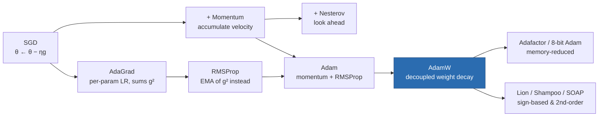

# Optimization and Training Dynamics

> **Summary** — How a 10-billion-parameter model actually gets trained: the optimizer family from
> SGD to AdamW (with the memory bill for each), learning-rate schedules and why warmup exists,
> batch-size scaling laws, gradient clipping, mixed precision, and the loss-spike debugging
> playbook that every large-run engineer eventually needs.

**Prerequisites**: → [Neural networks refresher](04-neural-network-refresher.md) · **Next**: → [Taxonomy](06-taxonomy.md)

---

## 1. The optimizer family tree



### SGD with momentum

$$v_t = \beta v_{t-1} + g_t, \qquad \theta_t = \theta_{t-1} - \eta v_t$$

> [!TIP]
> A ball rolling downhill. Momentum averages out gradient noise and builds speed along consistent
> directions. With $\beta = 0.9$, the effective averaging window is $\frac{1}{1-\beta} = 10$ steps
> and the effective step size along a consistent direction is $\frac{1}{1-\beta} = 10\times$ larger.

### Adam

$$
\begin{aligned}
m_t &= \beta_1 m_{t-1} + (1-\beta_1)g_t &&\text{(1st moment: mean)}\\
v_t &= \beta_2 v_{t-1} + (1-\beta_2)g_t^2 &&\text{(2nd moment: uncentered variance)}\\
\hat m_t &= \frac{m_t}{1-\beta_1^t}, \quad \hat v_t = \frac{v_t}{1-\beta_2^t} &&\text{(bias correction)}\\
\theta_t &= \theta_{t-1} - \eta\frac{\hat m_t}{\sqrt{\hat v_t}+\epsilon}
\end{aligned}
$$

Defaults: $\beta_1 = 0.9$, $\beta_2 = 0.999$ (LLMs often use $0.95$), $\epsilon = 10^{-8}$.

> [!TIP]
> **The core idea** — divide by the running magnitude of the gradient, so every parameter gets a
> step of roughly the same *size* regardless of its gradient scale. Embedding gradients for rare
> tokens are tiny; attention gradients are large. Plain SGD would need a different learning rate for
> each. Adam normalizes them automatically.

**Why bias correction is needed** — $m_0 = 0$, so $m_1 = (1-\beta_1)g_1 = 0.1g_1$, a 10×
underestimate. Since $\mathbb{E}[m_t] = (1-\beta_1^t)\mathbb{E}[g]$, dividing by $(1-\beta_1^t)$
restores an unbiased estimate. The correction matters for roughly the first $1/(1-\beta_2) = 1000$
steps and then becomes negligible.

**Worked example — one Adam step**

$g_1 = 0.1$, $\eta = 10^{-3}$, first step:

| Quantity | Computation | Value |
|---|---|---|
| $m_1$ | $0.9(0) + 0.1(0.1)$ | $0.01$ |
| $v_1$ | $0.999(0) + 0.001(0.01)$ | $10^{-5}$ |
| $\hat m_1$ | $0.01/(1-0.9)$ | $0.1$ |
| $\hat v_1$ | $10^{-5}/(1-0.999)$ | $0.01$ |
| step | $10^{-3}\cdot\frac{0.1}{\sqrt{0.01}+10^{-8}}$ | $10^{-3}$ |

Note the update is **exactly $\eta$**. With bias correction and a single observation, Adam's step
size equals the learning rate regardless of gradient magnitude. This is the property that makes
Adam so robust to scale — and also why the learning rate is the hyperparameter you must tune.

### AdamW: the decoupling fix

> [!WARNING]
> Adding L2 regularization to the gradient ($g \leftarrow g + \lambda\theta$) inside Adam is
> **wrong**. The $\lambda\theta$ term gets divided by $\sqrt{\hat v}$ along with everything else, so
> parameters with large gradients get *less* effective decay — the opposite of the intent.

**AdamW** applies decay directly:

$$\theta_t = \theta_{t-1} - \eta\left(\frac{\hat m_t}{\sqrt{\hat v_t}+\epsilon} + \lambda\theta_{t-1}\right)$$

This single change (Loshchilov & Hutter, 2017) improved generalization enough that AdamW is now
universal. Typical $\lambda = 0.1$ for LLM pretraining.

> [!WARNING]
> **Do not decay** LayerNorm/RMSNorm gains, biases, or embeddings. Shrinking a normalization gain
> toward zero destroys the layer's scale; standard practice splits parameters into two groups:

```python
decay, no_decay = [], []
for n, p in model.named_parameters():
    if p.dim() >= 2:        # matrices: weights of Linear, Embedding
        decay.append(p)
    else:                   # vectors: norms, biases
        no_decay.append(p)
opt = torch.optim.AdamW([
    {'params': decay,    'weight_decay': 0.1},
    {'params': no_decay, 'weight_decay': 0.0},
], lr=3e-4, betas=(0.9, 0.95), eps=1e-8)
```

---

## 2. The optimizer memory bill

Per-parameter state, mixed-precision training:

| Optimizer | States | Bytes/param (BF16 weights) | 7B model |
|---|---|---|---|
| SGD | none | 2 (w) + 2 (g) = **4** | 28 GB |
| SGD + momentum | $v$ | 4 + 4 = **8** | 56 GB |
| **Adam/AdamW** | $m, v$ + FP32 master | 2+2+4+4+4 = **16** | **112 GB** |
| Adam, 8-bit states | quantized $m,v$ | 2+2+1+1+4 = **10** | 70 GB |
| Adafactor | factored $v$ | ≈ 2+2+4+$\epsilon$ = **~8** | 56 GB |
| LoRA (base frozen) | only adapter states | ~2/param + tiny | **~15 GB** |

> [!TIP]
> **Adafactor's trick** — instead of storing the full $v \in \mathbb{R}^{m\times n}$ for a weight
> matrix, store row sums $R \in \mathbb{R}^m$ and column sums $C \in \mathbb{R}^n$, and reconstruct
> $v_{ij} \approx R_i C_j / \sum_k R_k$. Memory drops from $O(mn)$ to $O(m+n)$. Used for T5 and many
> TPU-trained models.

This table is *why* distributed training exists. → [Pretraining](../04-large-language-models/02-pretraining.md)

---

## 3. Learning rate schedules

The learning rate is the single most important hyperparameter. The schedule matters almost as much
as the peak value.


*Both schedules: linear warmup over 2k steps to 3×10⁻⁴, ending at 3×10⁻⁵. Cosine decays continuously and needs the run length up front; WSD holds the peak and decays only in the final 10%.*

### Warmup: why it is not optional

**The Adam variance argument** — at step $t$, $\hat v_t$ is estimated from very few samples. Its
relative variance is large, so $1/\sqrt{\hat v_t}$ occasionally takes huge values and produces a
wild update. Early wild updates land the model in a bad region it may never escape. Warmup keeps
$\eta$ small until $\hat v$ has enough samples to be reliable. (This is exactly the analysis in
*On the Variance of the Adaptive Learning Rate*, Liu et al. 2019, which motivated RAdam.)

**The post-norm argument** — in post-norm Transformers, gradients at initialization are badly
scaled with depth, and a large first step diverges immediately. Pre-norm reduces but does not
eliminate the need.

Typical: linear warmup over 0.5–2% of total steps (e.g. 2000 steps of a 500k-step run).

### Cosine decay

$$\eta_t = \eta_{\min} + \tfrac12(\eta_{\max}-\eta_{\min})\left(1 + \cos\!\left(\pi\frac{t - t_{\text{warm}}}{T - t_{\text{warm}}}\right)\right)$$

> [!WARNING]
> **Cosine has a serious practical flaw**: the schedule depends on $T$, the *total* step count, so
> you must decide the length of the run in advance. Stop early and you get a model that never
> annealed; extend the run and the schedule is wrong. This is why **WSD (Warmup–Stable–Decay)** has
> gained ground: hold the LR constant indefinitely, and decay rapidly only over the final ~10% of
> whatever budget you end up using. It gives comparable final loss *and* lets you checkpoint-and-
> branch mid-run.

| Schedule | Formula | Pros | Cons |
|---|---|---|---|
| Constant | $\eta$ | simple | worse final loss (no anneal) |
| Cosine | above | strong final loss, standard | must fix $T$ up front |
| Linear decay | $\eta(1 - t/T)$ | simple, close to cosine | same $T$ problem |
| **WSD** | warmup → constant → fast decay | resumable, branchable | needs decay-phase tuning |
| Inverse sqrt | $\eta/\sqrt{\max(t, t_{\text{warm}})}$ | original Transformer, $T$-free | weaker at large scale |

---

## 4. Batch size, and the critical batch size

Larger batch → less gradient noise → you can take larger steps. But the return diminishes.

**Gradient noise scale** (McCandlish et al., 2018). Define

$$B_{\text{crit}} = \frac{\mathrm{tr}(H\Sigma)}{G^\top H G}$$

where $G$ is the true gradient, $\Sigma$ the per-example gradient covariance, $H$ the Hessian.
Then the speedup from batch size $B$ behaves like:

$$\frac{\text{steps at batch }B}{\text{steps at batch }\infty} \approx 1 + \frac{B_{\text{crit}}}{B}$$


*Steps to reach a target loss, relative to the infinite-batch minimum: 1 + B_crit/B (McCandlish et al. 2018), drawn for B_crit = 1,000. Below B_crit, doubling B nearly halves the steps; above it, doubling B mostly wastes compute.*

**Practical consequences:**
- Below $B_{\text{crit}}$: doubling batch size ≈ halves the number of steps. Perfect scaling.
- Above $B_{\text{crit}}$: you burn 2× compute for a marginal reduction in steps.
- $B_{\text{crit}}$ **grows during training** as the loss decreases — so batch-size ramping
  (start small, grow) is compute-optimal and is used in real frontier runs.

Typical LLM batch sizes: 0.5M–4M tokens per step at frontier scale, e.g. 2048 sequences × 2048
tokens = 4.2M tokens.

### Scaling the learning rate with batch size

| Rule | Formula | When |
|---|---|---|
| Linear scaling | $\eta \propto B$ | SGD, vision, small batches |
| Square-root scaling | $\eta \propto \sqrt B$ | Adam, large batches |

> [!TIP]
> The square-root rule for Adam comes from the fact that Adam's update is already normalized by
> gradient magnitude; only the *noise* reduction ($\propto 1/\sqrt B$) is left to compensate for.

---

## 5. Gradient clipping

$$g \leftarrow g \cdot \min\!\left(1, \frac{c}{\|g\|_2}\right), \qquad c \text{ typically } 1.0$$

> [!TIP]
> Rare batches (a weird document, a long repeated string, a numerical edge case) produce gradients
> orders of magnitude larger than typical. Without clipping, one such batch can destroy a run that
> cost millions of dollars. Clipping caps the damage without changing the gradient *direction*.

> [!WARNING]
> **Clip on the global norm across all parameters**, not per-parameter. Per-parameter clipping
> changes the direction of the overall update and degrades quality.

Standard training step:

```python
loss.backward()
grad_norm = torch.nn.utils.clip_grad_norm_(model.parameters(), max_norm=1.0)
optimizer.step()
optimizer.zero_grad(set_to_none=True)   # set_to_none saves memory vs zeroing
scheduler.step()
```

**Monitor `grad_norm`** — it is the single most informative training diagnostic. Healthy
pretraining shows a slow decay with occasional 2–3× spikes. A sustained rise, or spikes above
~10×, means trouble is coming.

---

## 6. Mixed precision training

```
 ┌─────────────── FP32 master weights ───────────────┐
 │                                                    │
 │  cast ▼                                    ▲ update│
 │   ┌─────────┐   forward   ┌──────┐  backward│      │
 │   │ BF16 w  │────────────►│ loss │──────────┤      │
 │   └─────────┘             └──────┘   BF16 g │      │
 │        matmuls in BF16 on tensor cores      │      │
 │                                        cast ▼      │
 └────────────────── optimizer step in FP32 ──────────┘
```

**Why keep FP32 master weights?** A typical update is $\eta \cdot \text{something} \approx 10^{-7}$
relative to a weight of magnitude $10^{-2}$. BF16 has 8 bits of mantissa → relative resolution
$\approx 2^{-8} = 0.004$. The update is **smaller than the representable difference** and would be
silently rounded away. Every step would be a no-op. FP32 master weights (relative resolution
$2^{-24} \approx 6\times10^{-8}$) fix this.

| Concern | FP16 | BF16 |
|---|---|---|
| Dynamic range | narrow ($\pm 65504$) → overflow | same as FP32 ✅ |
| Loss scaling required | ✅ yes (fragile) | ❌ no |
| Mantissa bits | 10 | 7 |
| Recommendation | legacy | **use this** |

Speedup from BF16 on tensor-core hardware: roughly 2× vs FP32, plus half the activation memory.
FP8 gives another ~1.5–2× on H100-class hardware but needs per-tensor scaling factors and careful
handling of outlier channels.

---

## 7. Loss spikes: the debugging playbook

Real large runs *will* spike. The loss jumps from 2.1 to 6.0 in a few steps and either recovers
or diverges.

```
 loss │
  6.0 │              ╱╲
      │             ╱  ╲
  4.0 │            ╱    ╲
      │           ╱      ╲___
  2.5 │──────────╯           ╰────────────  ← recovers (usually)
  2.0 │
      └──────────────────────────────────► steps
                  spike
```

**Causes, in rough order of frequency:**

| Cause | Signature | Fix |
|---|---|---|
| Bad data batch | one-off spike, `grad_norm` explodes | skip batch; better data filtering |
| Attention logit blowup | spike in a specific layer's activations | **QK-norm**, logit soft-capping |
| LR too high | repeated spikes, worse over time | lower peak LR; longer warmup |
| $\epsilon$ too small in Adam | sudden huge update | raise $\epsilon$ to $10^{-8}$/$10^{-6}$ |
| FP16 overflow | NaN, not a spike | switch to BF16 |
| Embedding norm growth | slow drift then spike | decay embeddings, or z-loss |

> [!TIP]
> **QK-norm**, the most effective modern fix: apply RMSNorm to $Q$ and $K$ before computing
> attention scores. This bounds $\|q\|\|k\|$, so the pre-softmax logits cannot blow up, which is the
> mechanism behind most mid-training instability in large models.

> [!TIP]
> **z-loss** — add $10^{-4}\cdot(\log Z)^2$ where $Z$ is the softmax partition function. It keeps
> the logits from drifting to large absolute values, which both stabilizes training and improves
> post-training quantization.

**The standard recovery procedure** for a real run: roll back to a checkpoint ~100–500 steps before
the spike, skip the offending data shard, and resume. Many public training logs (OPT, BLOOM)
document doing exactly this dozens of times.

---

## 8. Hyperparameter starting points

Sensible defaults for a decoder-only LM. Start here, then tune the LR.

| Hyperparameter | Value | Notes |
|---|---|---|
| Optimizer | AdamW | always |
| $\beta_1, \beta_2$ | 0.9, 0.95 | 0.95 (not 0.999) for LLMs — faster adaptation |
| $\epsilon$ | $10^{-8}$ | raise to $10^{-6}$ if unstable |
| Weight decay | 0.1 | matrices only |
| Grad clip | 1.0 | global norm |
| Peak LR | $\approx 3\times10^{-4}$ at ~1B params | see scaling below |
| LR schedule | warmup 1% → cosine to 10% of peak | or WSD |
| Batch size | 0.5–4M tokens | ramp up if possible |
| Precision | BF16 with FP32 master | never FP16 |
| Init std | 0.02, residual projections $\times 1/\sqrt{2L}$ | |

**LR vs model size** — the optimal peak LR falls as models grow. Published values
(GPT-3 paper, Table 2.1; LLaMA-2 paper) give a feel for the trend:

| Params | Typical peak LR |
|---|---|
| 125 M | $6\times10^{-4}$ |
| 1.3 B | $2\times10^{-4}$ |
| 7 B | $3\times10^{-4}$ (LLaMA-2 used this) |
| 70 B | $1.5\times10^{-4}$ |

> [!TIP]
> **μP (maximal update parameterization)** is the principled answer: reparameterize initialization
> and per-layer learning rates so that the *optimal* LR is invariant to width. Then tune
> hyperparameters on a 40M-parameter proxy model and **transfer them directly** to a 10B run. This
> is a genuinely large cost saving and is used by several frontier labs.

---

## 9. Key takeaways

| # | Takeaway |
|---|---|
| 1 | AdamW is the default. Adam + L2 is a bug; decoupled decay is the fix. |
| 2 | Adam costs ~16 bytes/param with FP32 master weights → 7B needs 112 GB before activations. |
| 3 | Warmup exists because early $\hat v$ estimates are unreliable; it is not superstition. |
| 4 | Cosine needs the total step count in advance; WSD avoids that and is resumable. |
| 5 | Batch size helps linearly up to $B_{\text{crit}}$, then wastes compute. $B_{\text{crit}}$ grows during training. |
| 6 | Clip the **global** gradient norm at 1.0 and monitor it — it is your best early-warning signal. |
| 7 | BF16 everywhere, FP32 master weights, never FP16 for new work. |
| 8 | Loss spikes are normal. QK-norm and z-loss prevent most of them; checkpoint rollback fixes the rest. |
| 9 | μP lets you tune hyperparameters on a small proxy and transfer to the big run. |

---

## Further reading

- Kingma & Ba, *Adam* (2014); Loshchilov & Hutter, *Decoupled Weight Decay Regularization* (2017).
- McCandlish et al., *An Empirical Model of Large-Batch Training* (2018) — the critical batch size.
- Yang et al., *Tensor Programs V: Tuning Large Neural Networks via Zero-Shot Hyperparameter Transfer* (2022) — μP.
- Chowdhery et al., *PaLM* (2022), §5 — an honest account of training instabilities.
- Hu et al., *MiniCPM* (2024) — the WSD schedule.

**Next** → [Taxonomy of generative models](06-taxonomy.md)
