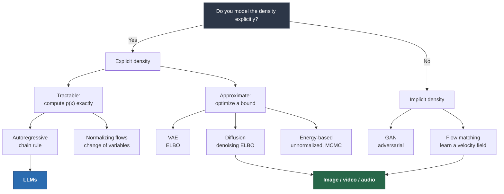
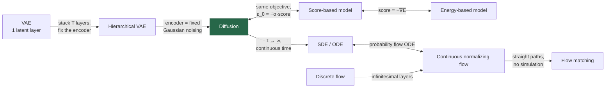

# Taxonomy of Generative Models

> **Summary** — A single map of every major generative model family, organized by the one question
> that determines everything else: *how do you handle the likelihood?* Includes a side-by-side
> comparison table, the deep connections between families (diffusion ⊂ hierarchical VAE ⊂ …), and
> a decision guide for picking a model for a new problem.

**Prerequisites**: → [Probability & information theory](02-probability-and-information-theory.md) · **Next**: → [Reinforcement learning basics](07-reinforcement-learning.md)

---

## 1. The organizing question

Every generative model must let you *sample*. Whether it also lets you *evaluate* $p_\theta(x)$ —
and at what cost — is the fault line that splits the field.



---

## 2. The master comparison table

That fault line splits the field into families. Before reading about each one individually, here's the whole comparison side by side, so you know what to look for.

| | **Autoregressive** | **VAE** | **GAN** | **Flow** | **Diffusion** | **EBM** |
|---|---|---|---|---|---|---|
| **Core equation** | $p(x)=\prod_i p(x_i\|x_{<i})$ | $\log p(x)\ge\text{ELBO}$ | $\min_G\max_D V(D,G)$ | $p(x)=p(z)\|\det J\|^{-1}$ | $\log p(x)\ge\text{ELBO}_T$ | $p(x)=\frac{e^{-E(x)}}{Z}$ |
| **Exact likelihood** | ✅ | ❌ (lower bound) | ❌ | ✅ | ❌ (lower bound) | ❌ ($Z$ intractable) |
| **Sampling cost** | $O(n)$ net evals | $O(1)$ | $O(1)$ | $O(1)$ | $O(T)$, $T$=10–1000 | $O(\text{MCMC})$ |
| **Training stability** | ★★★ | ★★★ | ★ | ★★★ | ★★★ | ★ |
| **Sample quality** | ★★★ | ★ | ★★★ | ★★ | ★★★ | ★★ |
| **Mode coverage** | ★★★ | ★★★ | ★ | ★★★ | ★★★ | ★★ |
| **Latent space** | ❌ none | ✅ structured | ⚠️ unstructured | ✅ same dim as $x$ | ⚠️ same dim as $x$ | ❌ |
| **Architecture freedom** | ⚠️ needs causal masking | ✅ free | ✅ free | ❌ must be invertible | ✅ free | ✅ free |
| **Parallel training** | ✅ (teacher forcing) | ✅ | ✅ | ✅ | ✅ | ❌ |
| **Parallel sampling** | ❌ | ✅ | ✅ | ✅ | ❌ (sequential in $t$) | ❌ |
| **Dominant in** | text, code, audio tokens | compression, as a component | (historic) faces, fast GANs | density estimation, RL | images, video, audio, molecules | physics, niche |
| **Landmark** | GPT, WaveNet, PixelCNN | VAE, VQ-VAE | StyleGAN | Glow, RealNVP | DDPM, Stable Diffusion | RBM, JEM |

---

## 3. Family-by-family, in one paragraph each

The table tells you *what* each family trades off. It doesn't explain *why* — each family made a specific, deliberate choice about how to handle the likelihood, and that choice is worth spelling out once per family.

### Autoregressive: *factorize and conquer*

Apply the chain rule, $p(x) = \prod_i p(x_i \mid x_{<i})$, and model each conditional with a shared
neural network. No approximation anywhere: the likelihood is exact and the loss is plain
cross-entropy. Training is fully parallel (predict all positions at once with causal masking);
sampling is inherently serial, one token at a time. The fit with language is perfect because text
*is* a sequence with a natural order. The fit with images is poor because pixels have no canonical
order — which is why AR image models lost to diffusion.
→ [Autoregressive models](../02-classical-models/01-autoregressive-models.md)

### VAE: *compress to a latent, decode from a prior*

Introduce a latent $z$ with a simple prior, learn an encoder $q_\phi(z\mid x)$ and decoder
$p_\theta(x\mid z)$, and maximize the ELBO. You get a genuinely useful latent space (interpolation,
attribute arithmetic, compression) and fast one-shot sampling. You also get blurry samples,
because a Gaussian likelihood on pixels means the decoder outputs the *mean* of all plausible
images, and because the ELBO is a loose bound. VAEs survive not as standalone generators but as
the **compression stage inside latent diffusion**.
→ [VAE](../02-classical-models/02-vae.md)

### GAN: *skip the density, just learn to fool a critic*

Two networks play a game: $G$ maps noise to samples, $D$ tries to tell real from fake. At the
optimum $G$ matches $p_{\text{data}}$, and the objective is equivalent to minimizing
Jensen–Shannon divergence. Sampling is a single forward pass, and quality was state-of-the-art for
years (StyleGAN faces are still striking). The cost is a non-stationary min-max optimization that
is genuinely hard to stabilize, plus **mode collapse**: $G$ can win by producing a few outputs $D$
can't classify, ignoring most of the data distribution.
→ [GAN](../02-classical-models/03-gan.md)

### Normalizing flows: *an invertible map with a cheap Jacobian*

Build $x = f_\theta(z)$ where $f$ is invertible and $\log|\det J_f|$ is computable in $O(d)$. Then
the change-of-variables formula gives you the **exact** likelihood, plus exact inference
($z = f^{-1}(x)$) and fast sampling. The price is severe architectural constraints: invertibility
forbids dimensionality reduction and most standard layers. Flows are excellent for density
estimation on moderate-dimensional data, and their continuous-time cousins evolved into flow
matching, which is now competitive with diffusion for images.
→ [Normalizing flows](../02-classical-models/04-normalizing-flows.md)

### Diffusion: *destroy structure gradually, learn to reverse it*

Add Gaussian noise over $T$ steps until the data becomes pure noise, then train a network to undo
one step of noising. Generation runs the chain backwards. Because each step is a small, local,
*Gaussian* correction, the learning problem is easy and training is as stable as supervised
regression. Because there are many steps, the model gets many chances to fix errors, producing
excellent quality and coverage. The cost is $T$ network evaluations per sample — the central
engineering problem, attacked by DDIM, distillation, consistency models and flow matching.
→ [Diffusion](../05-diffusion-and-vision/01-diffusion-models.md)

### Energy-based: *just define a scalar score, normalize later*

Define $p(x) = e^{-E_\theta(x)}/Z$ with an arbitrary network $E_\theta$. Maximum architectural
freedom — no invertibility, no latent, no ordering. But $Z = \int e^{-E(x)}dx$ is intractable, so
both training (contrastive divergence) and sampling (Langevin MCMC) require expensive, fragile
Markov chains. EBMs are conceptually central — diffusion's score function *is* $-\nabla_x E(x)$ —
but rarely used directly.
→ [Energy-based models](../02-classical-models/05-energy-based-models.md)

---

## 4. The connections (this is where understanding clicks)

Read individually, these families look like a list of unrelated tricks. They aren't — several of them are literally special cases of each other, and seeing the reductions is what turns memorized facts into an actual mental model.

These families are not separate species. They are views of the same object.



**The five connections worth memorizing:**

1. **Diffusion is a hierarchical VAE with a frozen encoder.** The "encoder" $q(x_t \mid x_{t-1})$
   is fixed Gaussian noise addition — no parameters to learn. The "decoder" is the denoiser. The
   diffusion loss *is* the ELBO of this hierarchical model. That is why the derivation in
   → [Diffusion](../05-diffusion-and-vision/01-diffusion-models.md) looks like the VAE derivation.

2. **Score matching ≡ denoising diffusion.** The score is $s_\theta(x) = \nabla_x \log p(x)$, and
   $$s_\theta(x_t, t) = -\frac{\epsilon_\theta(x_t,t)}{\sqrt{1-\bar\alpha_t}}$$
   Predicting the noise and predicting the score are the *same network* up to a scalar. Song &
   Ermon's score-based framework and Ho et al.'s DDPM were developed independently and turned out
   to be the same algorithm.

3. **Score = negative gradient of energy.** $\nabla_x \log p(x) = \nabla_x(-E(x) - \log Z) =
   -\nabla_x E(x)$, because $Z$ is constant in $x$. Diffusion models sidestep the intractable $Z$
   by only ever needing the *gradient* of the log-density. This is the trick that made EBM ideas
   practical.

4. **The probability-flow ODE turns any diffusion model into a normalizing flow.** Every SDE has a
   deterministic ODE with identical marginals. Run that ODE and you have an invertible map — so
   you can compute exact likelihoods for a diffusion model, and DDIM is simply a discretization of
   it.

5. **Flow matching is a CNF trained without simulation.** Rather than backpropagating through an
   ODE solver (what neural ODEs did, and why they were slow), regress directly onto a known
   conditional velocity field. Straight-line paths make it work.
   → [Flow matching](../05-diffusion-and-vision/04-flow-matching.md)

---

## 5. Why each modality picked what it picked

Those are structural connections between model families in the abstract. In practice, which family wins is decided by the data — text, images, audio and molecules each favor a different family for concrete, mechanical reasons.

| Modality | Winner | Why |
|---|---|---|
| **Text** | Autoregressive | Text is discrete, sequential, has a canonical order, and variable length. AR fits all four natively. Diffusion on discrete tokens remains awkward (no natural Gaussian noise on a simplex). |
| **Images** | Diffusion / flow matching | No canonical pixel order → AR is unnatural. Continuous-valued → Gaussian noise works. Quality beat GANs by 2021, with far more stable training. |
| **Video** | Diffusion (+ AR in latent) | Same as images, plus temporal attention. Some systems tokenize and go AR over the tokens. |
| **Audio (waveform)** | Diffusion / flow matching | Continuous, high sample rate. Early AR (WaveNet) was excellent but far too slow (16k sequential steps/second of audio). |
| **Audio (music/speech)** | AR over discrete tokens | Neural codecs (EnCodec, SoundStream) turn audio into a token stream, then a language model generates it. |
| **Molecules / proteins** | Diffusion, flow matching | 3-D coordinates are continuous; equivariance constraints are easy to bake into a denoiser. |
| **Tabular / scientific density** | Flows, diffusion | Exact likelihood is often required (e.g. for simulation-based inference). |

> [!TIP]
> **The generalizable rule** — *discrete + ordered → autoregressive; continuous + unordered →
> diffusion/flow.* When your data is continuous but you also want a token stream (audio, video),
> **tokenize with a VQ-VAE first, then go autoregressive.** That hybrid — a learned discrete codebook
> plus a Transformer over the codes — is one of the most reusable patterns in the field.

---

## 6. Decision guide

That rule of thumb tells you which family fits your *data*. It doesn't yet tell you which specific model to reach for given your actual constraints — compute, need for exact likelihood, latency — which is what the decision guide below is for.

```
START: what do you need?
│
├─ Exact log p(x) required (anomaly detection, compression, SBI)?
│   ├─ data is sequential/discrete ──► AUTOREGRESSIVE
│   └─ data is continuous ──────────► NORMALIZING FLOW
│
├─ Best possible sample quality, don't care about latency?
│   ├─ text/code ───────────────────► AUTOREGRESSIVE (LLM)
│   └─ image/video/audio/3D ────────► DIFFUSION or FLOW MATCHING
│
├─ Need single-step sampling (real-time, on-device)?
│   ├─ can afford adversarial training ──► GAN
│   ├─ have a good teacher diffusion model ──► DISTILL IT (consistency / adversarial distillation)
│   └─ need a latent + speed, quality secondary ──► VAE
│
├─ Need a structured, interpretable, low-dim latent?
│   └─────────────────────────────────► VAE (or VQ-VAE for discrete codes)
│
└─ Very high-dimensional continuous data + limited compute?
    └────────────► LATENT DIFFUSION (VAE compress ×8, diffuse in latent space)
```

> [!WARNING]
> **The honest default in 2026**: for text, a pretrained Transformer LLM that you fine-tune. For
> images/video, a latent diffusion or flow-matching model that you fine-tune with LoRA. Training a
> generative model from scratch is almost never the right first move — the interesting engineering
> is in adaptation, conditioning, retrieval and evaluation.

---

## 7. The trilemma, revisited with the escape routes

The decision guide above is a snapshot of what works today. The trilemma from → [What is generative AI?](01-what-is-generative-ai.md) is the reason the landscape keeps shifting: every family in this taxonomy is a different bet on which two of quality, speed and coverage to keep.

| Leg being attacked | Technique | Result |
|---|---|---|
| Diffusion's slow sampling | DDIM, DPM-Solver, higher-order solvers | 1000 → 20 steps |
| Diffusion's slow sampling | Progressive/consistency distillation | 20 → 1–4 steps |
| Diffusion's slow sampling | Rectified flow (straight paths) | few steps natively |
| Diffusion's cost per step | Latent diffusion (compress 8×8 first) | 64× fewer pixels per step |
| AR's sequential latency | Speculative decoding | 2–3× with identical output distribution |
| AR's sequential latency | Multi-token prediction, diffusion LMs | active research |
| GAN's mode collapse | WGAN-GP, spectral norm, StyleGAN tricks | usable, still finicky |
| VAE's blurriness | VQ-VAE + AR prior; adversarial decoder loss | sharp (this is what SD's VAE does) |
| Flow's expressivity limit | Continuous time + flow matching | competitive with diffusion |

> [!TIP]
> **The meta-observation**: the trilemma has been substantially *broken* since 2023. Distilled
> latent flow-matching models give near-diffusion quality in 1–4 steps. The frontier has moved from
> "which family?" to "how do you condition, control, align and evaluate it?"

---

## 8. Exercises

**Problem 1 — classify by likelihood handling.** For each model below, say whether its likelihood
is (a) exact, (b) a bound, or (c) not modeled at all, using the organizing question from §1: a
normalizing flow used for anomaly detection; a GAN generating faces; a diffusion model trained
with the simple $\epsilon$-prediction loss.

<details markdown="1"><summary>Solution</summary>

- **Normalizing flow**: exact. The whole point of the change-of-variables construction is that
  $\log p(x)$ is computable exactly, which is exactly why it's the right tool for anomaly
  detection (you need a real likelihood to threshold on).
- **GAN**: not modeled at all — implicit density. There is no $p_\theta(x)$ anywhere in a GAN's
  training or sampling; §1's decision tree correctly routes GANs to the right branch with no
  likelihood claim.
- **Diffusion (simple loss)**: a bound. The $\epsilon$-prediction MSE loss is a simplified,
  reweighted version of the variational bound derived in
  → [Diffusion models §4](../05-diffusion-and-vision/01-diffusion-models.md#4-the-loss-from-full-elbo-to-three-lines-of-code);
  it optimizes an ELBO on $\log p(x)$, not $\log p(x)$ itself.

</details>

**Problem 2 — the five connections, applied.** Using the five connections in §4, explain in one
sentence each why (a) you can compute an "exact likelihood" for a diffusion model using the
probability-flow ODE, even though diffusion is normally listed as "approximate/bound" in the
master table, and (b) why a score-based model never needs to know the normalizing constant $Z$ of
the data distribution.

<details markdown="1"><summary>Solution</summary>

(a) The probability-flow ODE (connection 4 in §4) turns the *stochastic* diffusion process into
a *deterministic, invertible* map with the same marginals — and any invertible map admits exact
change-of-variables likelihood computation, the same trick normalizing flows use. So "diffusion"
the *training objective* only gives a bound, but "diffusion" the *deterministic sampler* is
secretly a flow with an exact likelihood — these are two different claims about the same model.

(b) Connection 3 in §4: score $= -\nabla_x E(x)$, and $E(x) = -\log p(x) - \log Z$. Since $Z$
doesn't depend on $x$, $\nabla_x(\log Z) = 0$, so the score is entirely $Z$-independent by
construction — the intractable normalizing constant simply differentiates away.

</details>

**Problem 3 — decision guide, edge case.** You need to generate 3-D molecular conformations where
(a) you don't need exact likelihoods, (b) sample quality matters more than speed, and (c) the
data is continuous. Walk through §6's decision tree and say which branch you land on, then check
your answer against §5's modality table.

<details markdown="1"><summary>Solution</summary>

Following §6's tree: "exact log p(x) required?" → No (ruled out by (a)). "Best possible sample
quality, don't care about latency?" → Yes, and the data is continuous (not text/code) → routes to
**"DIFFUSION or FLOW MATCHING."**

Checking against §5's modality table: the "Molecules / proteins" row explicitly lists "Diffusion,
flow matching" with the noted reason "3-D coordinates are continuous; equivariance constraints
are easy to bake into a denoiser" — confirming the decision-tree answer and adding the specific
reason (equivariance) that the tree itself doesn't mention but the modality table does. This is a
good illustration of why §5 and §6 are complementary: the tree gives you the *family*, the
modality table gives you the domain-specific *why*.

</details>

## 9. Key takeaways

| # | Takeaway |
|---|---|
| 1 | The organizing question is how you handle the likelihood: exact, bounded, or ignored entirely. |
| 2 | Autoregressive = exact likelihood, serial sampling. Diffusion = bounded likelihood, serial *refinement*. GAN = no likelihood, one-shot. |
| 3 | Diffusion is a hierarchical VAE with a frozen Gaussian encoder — the ELBO derivations are the same. |
| 4 | Noise prediction, score estimation and energy gradients are the same object: $s_\theta = -\epsilon_\theta/\sqrt{1-\bar\alpha_t} = -\nabla_x E$. |
| 5 | Every SDE has an equivalent probability-flow ODE, which makes diffusion models invertible flows. |
| 6 | Discrete + ordered → AR. Continuous + unordered → diffusion/flow. For the hybrid, tokenize first. |
| 7 | Latent diffusion = VAE (compress) + diffusion (generate). It is the dominant image architecture because it addresses cost, not quality. |
| 8 | The trilemma is now mostly an engineering tradeoff, not a hard wall. |

---

## Further reading

- Bond-Taylor et al., *Deep Generative Modelling: A Comparative Review* (2021) — the best survey.
- Luo, [*Understanding Diffusion Models: A Unified Perspective*](https://arxiv.org/abs/2208.11970) (2022) — the VAE↔diffusion bridge, done carefully.
- Song et al., [*Score-Based Generative Modeling through SDEs*](https://arxiv.org/abs/2011.13456) (2021) — the unification.
- Lipman et al., [*Flow Matching for Generative Modeling*](https://arxiv.org/abs/2210.02747) (2023).
- Tomczak, *Deep Generative Modeling* (Springer, 2nd ed. 2024) — textbook coverage of all families.

**Next** → [Reinforcement learning basics](07-reinforcement-learning.md)
