# Generative Adversarial Networks

> **Summary** — Two networks play a zero-sum game: a generator turns noise into samples, a
> discriminator tries to tell real from fake. At equilibrium the generator matches the data
> distribution. GANs produce sharp samples in a single forward pass and dominated image synthesis
> from 2017 to 2021, but the min-max objective is genuinely hard to optimize and the generator can
> win by ignoring most of the data (**mode collapse**). Understanding GANs matters both
> historically and because adversarial losses remain a key component *inside* modern systems.

**Prerequisites**: → [Probability & information theory](../01-foundations/02-probability-and-information-theory.md) · **Next**: → [Normalizing flows](04-normalizing-flows.md)

---

## 1. The game

$$\min_G \max_D \; V(D,G) = \mathbb{E}_{x\sim p_{\text{data}}}[\log D(x)] + \mathbb{E}_{z\sim p_z}[\log(1 - D(G(z)))]$$

```
     z ~ N(0,I)                                       real data x
         │                                                 │
    ┌────▼─────┐                                           │
    │GENERATOR │                                           │
    │   G(z)   │                                           │
    └────┬─────┘                                           │
         │ fake x̃                                          │
         └──────────────┐                    ┌─────────────┘
                        ▼                    ▼
                    ┌───────────────────────────┐
                    │      DISCRIMINATOR D      │
                    │   outputs P(real) ∈ [0,1] │
                    └─────────────┬─────────────┘
                                  │
                ┌─────────────────┴──────────────────┐
                ▼                                    ▼
        D wants: D(x)→1, D(x̃)→0            G wants: D(x̃)→1
        (classify correctly)                 (fool the critic)
```

> [!TIP]
> **Intuition** — a forger and a detective. The detective learns to spot fakes; the forger learns
> to defeat the current detective. Each improvement forces the other to improve. At equilibrium the
> forgeries are indistinguishable from real currency and the detective is reduced to guessing
> ($D \equiv 1/2$).

**The crucial difference from every other model here**: there is no likelihood, no reconstruction,
no explicit density. The *only* training signal is a learned critic. That is both the strength (no
blurriness — nothing rewards hedging) and the weakness (no objective number tells you whether
training is going well).

---

## 2. Theory: what the game actually optimizes

That adversarial signal is intuitive as a story about a forger and a detective. It's worth checking that the story actually converges somewhere sensible — that the min-max game has a well-defined optimum, and what that optimum is in terms of the divergences from earlier in the wiki.

**Step 1 — the optimal discriminator.** For a fixed $G$ with induced distribution $p_g$,
maximize the integrand pointwise:

$$V = \int_x \Big[p_{\text{data}}(x)\log D(x) + p_g(x)\log(1-D(x))\Big]dx$$

Setting $\frac{\partial}{\partial D}\big[a\log D + b\log(1-D)\big] = \frac{a}{D} - \frac{b}{1-D} = 0$ gives

$$\boxed{\;D^*(x) = \frac{p_{\text{data}}(x)}{p_{\text{data}}(x) + p_g(x)}\;}$$

> [!TIP]
> Read this: **the optimal discriminator is a density ratio estimator.** $D^*(x) = 0.5$ exactly
> where the two densities are equal. This is why "$D$ is at 0.5 everywhere" is the target equilibrium
> — and why a $D$ that reaches 1.0 on all real data means $p_g$ has no overlap with $p_{\text{data}}$.

**Step 2 — substitute back.**

$$
\begin{aligned}
V(D^*,G) &= \mathbb{E}_{p_{\text{data}}}\!\left[\log\frac{p_{\text{data}}}{p_{\text{data}}+p_g}\right] + \mathbb{E}_{p_g}\!\left[\log\frac{p_g}{p_{\text{data}}+p_g}\right]\\
&= \mathbb{E}_{p_{\text{data}}}\!\left[\log\frac{p_{\text{data}}}{2m}\right] + \mathbb{E}_{p_g}\!\left[\log\frac{p_g}{2m}\right], \quad m = \tfrac{p_{\text{data}}+p_g}{2}\\
&= D_{\mathrm{KL}}(p_{\text{data}}\|m) + D_{\mathrm{KL}}(p_g\|m) - 2\log 2\\
&= \boxed{\;2\,D_{\mathrm{JS}}(p_{\text{data}}\,\|\,p_g) - 2\log 2\;}
\end{aligned}
$$

Since $D_{\mathrm{JS}} \ge 0$ with equality iff the distributions match, the global minimum over $G$
is at $p_g = p_{\text{data}}$, where $V = -2\log 2 \approx -1.386$. ∎

**Diagnostic value**: if your GAN is training correctly with the original objective, $D$'s loss
should hover near $2\log 2 \approx 1.386$ (nats). A $D$ loss crashing to 0 means the discriminator
has won and the generator is receiving no useful gradient.

---

## 3. Why GANs are hard: the four structural problems

That derivation is also the theory's limit: it describes the game *at equilibrium*, assuming both players are optimized perfectly at every step. Real training never reaches that idealized equilibrium, and the ways it fails to get there are structural, not incidental.

### (a) Vanishing gradients when D wins

If $D$ is too good, $D(G(z)) \approx 0$, so $\log(1 - D(G(z))) \approx \log 1 = 0$ — flat, no
gradient. The generator is starved exactly when it most needs help.

**The non-saturating fix** (in the original paper):

$$\max_G \; \mathbb{E}_z[\log D(G(z))] \quad\text{instead of}\quad \min_G\;\mathbb{E}_z[\log(1-D(G(z)))]$$



*With D = σ(a), the gradient of each generator loss with respect to the discriminator's logit a is D for minimax (log(1 − D)) and 1 − D for non-saturating (−log D). When G is bad, D(G(z)) ≈ 0: the minimax gradient vanishes exactly when G needs it most, while the non-saturating one is largest. Same fixed point, very different learning signal.*

Same fixed point, vastly better gradients. **Always use the non-saturating form.**

### (b) Mode collapse

$G$ discovers a handful of outputs that reliably fool the current $D$ and emits only those. It is a
rational strategy: the objective never asks $G$ to cover the data, only to fool $D$.

```
  p_data: 8 Gaussian modes        G output after collapse
     ○  ○  ○                          ●
   ○       ○         ──────►
     ○  ○  ○                     (all mass on one mode;
                                  cycles between modes
                                  as D catches up)
```

The standard diagnostic is the **8-Gaussians / 25-Gaussians toy problem**: if your GAN variant
can't cover 8 modes in 2-D, it won't cover the modes of ImageNet.

| Mitigation | Mechanism |
|---|---|
| **Minibatch discrimination** | let $D$ see *batch statistics*, so a batch of identical samples is detectable |
| **Unrolled GAN** | let $G$ optimize against $D$'s *future* response, not its current one |
| **WGAN/WGAN-GP** | a better divergence with gradients everywhere (§4) |
| **Two-timescale (TTUR)** | different LRs for $G$ and $D$; provably converges to a local Nash point |
| **Packing (PacGAN)** | $D$ classifies *sets* of samples |

### (c) Non-convergence and oscillation

A min-max game need not converge — it can cycle. The canonical example is $\min_x\max_y xy$: the
gradient dynamics trace circles around the saddle at $(0,0)$ forever without approaching it.
Real GAN training shows exactly this signature: losses oscillate, samples improve then regress.

### (d) No meaningful loss curve

In every other model, the loss tells you how training is going. In a GAN, both losses are relative
to a moving opponent. **A generator loss of 0.7 means nothing in isolation.** You must evaluate
with a separate metric (FID) and by looking at samples. This is a genuine engineering handicap.
→ [Evaluation metrics](../07-evaluation/01-metrics.md)

---

## 4. Wasserstein GAN: a better divergence

Problem (d) — no informative loss curve — and mode collapse both trace back to the same root cause: the JS divergence the original objective minimizes provides almost no useful gradient once $p_g$ and $p_{\text{data}}$ stop overlapping. Swapping in a divergence that stays informative even then fixes several of these problems at once.

> [!WARNING]
> **The root problem with JSD.** If $p_{\text{data}}$ and $p_g$ live on low-dimensional manifolds
> that don't overlap — which, per the manifold hypothesis, is *generically* the case early in
> training — then $D_{\mathrm{JS}} = \log 2$ **constant**, so its gradient is zero. The objective
> gives no signal about *how far apart* the distributions are.

**The canonical example.** Let $p_0$ be a point mass at $x=0$ and $p_\theta$ a point mass at
$x=\theta$. Then:

| $\theta$ | $D_{\mathrm{JS}}$ | $W_1$ |
|---|---|---|
| 0 | 0 | 0 |
| 0.001 | $\log 2$ | 0.001 |
| 1 | $\log 2$ | 1 |
| 100 | $\log 2$ | 100 |

JSD is a step function — useless for gradient descent. **Wasserstein distance is smooth and
informative everywhere.**

$$W_1(p, q) = \inf_{\gamma \in \Pi(p,q)} \mathbb{E}_{(x,y)\sim\gamma}\big[\|x-y\|\big]$$

> [!TIP]
> **"Earth mover's distance"** — the minimum total work to reshape one pile of dirt into another,
> where work = mass × distance moved.

**Kantorovich–Rubinstein duality** makes it computable:

$$W_1(p,q) = \sup_{\|f\|_L \le 1} \; \mathbb{E}_{x\sim p}[f(x)] - \mathbb{E}_{x\sim q}[f(x)]$$

The supremum is over all **1-Lipschitz** functions. Parameterize $f$ with a network (now called a
*critic*, since it outputs an unbounded score rather than a probability) and you get:

$$\min_G\max_{\|D\|_L\le1} \; \mathbb{E}_{p_{\text{data}}}[D(x)] - \mathbb{E}_{p_z}[D(G(z))]$$

**Enforcing the Lipschitz constraint** — three generations of answers:

| Method | How | Problem |
|---|---|---|
| Weight clipping (WGAN) | clamp weights to $[-c,c]$ | crude; capacity loss, exploding/vanishing with depth |
| **Gradient penalty (WGAN-GP)** | add $\lambda(\|\nabla_{\hat x}D(\hat x)\|_2 - 1)^2$, $\hat x$ on lines between real and fake | slow (needs a double backward), but effective |
| **Spectral normalization** | divide each weight by $\sigma_{\max}(W)$ (power iteration) | cheap, robust — **the modern default** |

Spectral norm is one line in PyTorch:

```python
d = nn.Sequential(
    nn.utils.parametrizations.spectral_norm(nn.Conv2d(3, 64, 4, 2, 1)), nn.LeakyReLU(0.2),
    nn.utils.parametrizations.spectral_norm(nn.Conv2d(64, 128, 4, 2, 1)), nn.LeakyReLU(0.2),
    # ...
)
```

**Benefits reported for WGAN-family losses**: a critic loss that *correlates with sample
quality* (finally, a usable training curve), much reduced mode collapse, and tolerance for training
$D$ to optimality — in fact WGAN *wants* $n_{\text{critic}} = 5$ critic steps per generator step,
the opposite of standard GAN advice.

---

## 5. The architecture lineage

A better loss function fixes *how* the game is scored. It says nothing about *what* the generator and discriminator are made of, and that architecture — largely independent of the WGAN-vs-original-loss question — is where most of the visible progress in GAN image quality actually came from.

| Year | Model | Contribution | 📊 FID on FFHQ/ImageNet |
|---|---|---|---|
| 2014 | GAN | the idea; MLPs on MNIST | — |
| 2015 | **DCGAN** | conv architecture recipe: strided convs, BatchNorm, no FC layers | — |
| 2016 | InfoGAN | mutual information term → interpretable latents | — |
| 2017 | WGAN / WGAN-GP | Wasserstein objective, stable training | — |
| 2017 | **ProGAN** | progressive growing 4×4 → 1024×1024 | 7.8 (CelebA-HQ) |
| 2018 | SNGAN, SAGAN | spectral norm; self-attention in $G$ and $D$ | 18.7 (ImageNet) |
| 2018 | **BigGAN** | scale (batch 2048), truncation trick, class conditioning | **7.4** (ImageNet 128) |
| 2019 | **StyleGAN** | mapping network $z\to w$, AdaIN style injection, per-layer noise | **4.4** (FFHQ) |
| 2020 | StyleGAN2 | removed droplet artifacts; weight demodulation; path-length reg | **2.8** (FFHQ) |
| 2021 | StyleGAN3 | alias-free — fixed "texture sticking" under motion | 2.79 (T) / 3.07 (R), FFHQ-U |
| 2023+ | GigaGAN, adversarial distillation | GANs as *fast samplers* / distillation losses | — |

### StyleGAN's key innovation, because it generalizes

```
  TRADITIONAL GAN                        STYLEGAN
  
   z ──► [generator] ──► image            z ──►[8-layer MLP]──► w   (intermediate latent)
        z injected only                                        │
        at the input                       const 4×4 ──┐       │
                                                       ▼       ▼
                                                  [conv]──►[AdaIN(w)]
                                                       ▼       ▼         ← w injected at
                                                  [upsample]           EVERY resolution
                                                       ▼       ▼
                                                  [conv]──►[AdaIN(w)]
                                                       ▼
                                                     image
```

> [!TIP]
> **Why the mapping network matters** — $z \sim \mathcal{N}(0,I)$ is forced to be a nice round
> Gaussian, but the *actual* factors of variation in faces are not distributed that way (e.g. very
> few training images combine "child" with "beard", so that region should be empty). A round latent
> forced onto a non-round data distribution produces **entangled**, warped mappings. The learned
> $f: z \to w$ lets $\mathcal{W}$ take whatever shape it needs. Measured disentanglement
> (perceptual path length, linear separability) improves substantially.

**The practical payoff**: $\mathcal{W}$ and the extended $\mathcal{W}^+$ space support real
semantic editing — find the "smile" direction with a linear probe, add $\alpha \cdot w_{\text{smile}}$,
get a smiling version of the same face. GAN inversion (optimize $w$ to reconstruct a given photo)
made this work on real images, and this was the dominant face-editing technology before diffusion.

---

## 6. Practical training recipe

None of that theory or architecture guarantees a GAN trains cleanly in practice. Getting one to actually converge comes down to a short list of empirically discovered tricks, most of which have no clean theoretical justification.

A working DCGAN training step, with the details that matter:

```python
import torch, torch.nn as nn

# -------- setup --------
G, D = Generator(z_dim=128), Discriminator()
# TTUR: discriminator learns faster than generator
opt_G = torch.optim.Adam(G.parameters(), lr=1e-4, betas=(0.0, 0.99))
opt_D = torch.optim.Adam(D.parameters(), lr=4e-4, betas=(0.0, 0.99))
bce = nn.BCEWithLogitsLoss()

for real, _ in loader:
    B = real.size(0)

    # -------- discriminator step --------
    z = torch.randn(B, 128, device=real.device)
    fake = G(z)
    d_real = D(real)
    d_fake = D(fake.detach())                 # detach: no gradient into G here
    # one-sided label smoothing: real target 0.9, not 1.0 -> prevents an overconfident D
    loss_D = bce(d_real, torch.full_like(d_real, 0.9)) + \
             bce(d_fake, torch.zeros_like(d_fake))
    opt_D.zero_grad(); loss_D.backward(); opt_D.step()

    # -------- generator step (non-saturating) --------
    d_fake = D(fake)                          # recompute WITHOUT detach
    loss_G = bce(d_fake, torch.ones_like(d_fake))   # == maximize log D(G(z))
    opt_G.zero_grad(); loss_G.backward(); opt_G.step()
```

**The checklist that actually matters**

| Practice | Why |
|---|---|
| Non-saturating $G$ loss | gradients when $G$ is losing (§3a) |
| **Spectral norm on $D$** | Lipschitz control; the cheapest big win |
| TTUR ($\text{lr}_D > \text{lr}_G$) | provable convergence to a local Nash point |
| $\beta_1 = 0$ or $0.5$ in Adam | high momentum destabilizes adversarial dynamics |
| LeakyReLU(0.2) in $D$ | avoids dead units that kill $G$'s gradient |
| No BatchNorm in $D$ (with GP) | GP is a per-sample constraint; BN couples samples |
| One-sided label smoothing | stops $D$ becoming overconfident |
| **EMA of $G$ weights** for sampling | large, consistent FID improvement, nearly free |
| Track FID every ~5k steps | the loss curve tells you nothing (§3d) |

> [!WARNING]
> **The single most common bug**: forgetting `.detach()` on the fake batch in the $D$ step. Without
> it, $D$'s loss backpropagates into $G$ and actively trains $G$ to be *more* detectable. Symptom:
> the generator gets steadily worse while $D$'s loss looks fine.

---

## 7. What happened to GANs

Even with every trick above applied correctly, GANs lost the image-synthesis race by 2022. Understanding why — and where the adversarial idea survived anyway — is the honest ending to this page.

The turning point was Dhariwal & Nichol, *Diffusion Models Beat GANs on Image Synthesis* (2021):

| Model | ImageNet 256×256 FID |
|---|---|
| BigGAN-deep | 6.95 |
| ADM (diffusion) + guidance | **4.59** |
| Later diffusion/flow models | ~2 and below |

Diffusion won on quality **and** coverage **and** training stability. GANs retain one advantage —
**single-step sampling** — and that is exactly where they still live:

| Current use | Why a GAN |
|---|---|
| **Decoder loss in VAEs** | the adversarial term is what makes latent-diffusion VAEs sharp |
| **Diffusion distillation** | adversarial losses (ADD, LADD) distill 50-step models into 1–4 steps |
| Super-resolution, restoration | ESRGAN and successors remain competitive and fast |
| Real-time / on-device generation | one forward pass beats any multi-step method |
| Domain translation | CycleGAN's unpaired-translation setup has no diffusion equivalent as simple |

> [!TIP]
> **The intellectual legacy is larger than the deployment footprint.** "Train a network to
> critique another network's output" is now everywhere: it is the reward model in RLHF, the
> discriminator in neural codecs, the LPIPS-adjacent perceptual losses, and LLM-as-judge evaluation.
> The adversarial *idea* outlived the adversarial *architecture*.

---

## 8. Exercises

**Problem 1 — optimal discriminator.** At some point during training, $p_{\text{data}}(x_0)=0.6$
and $p_g(x_0)=0.2$ at a particular point $x_0$. Using §2's formula, what does the optimal
discriminator output at $x_0$? Is $x_0$ a region where real or fake data is relatively more
common, and does $D^*$'s value reflect that?

<details markdown="1"><summary>Solution</summary>

$$D^*(x_0) = \frac{p_{\text{data}}(x_0)}{p_{\text{data}}(x_0)+p_g(x_0)} = \frac{0.6}{0.8} = 0.75$$

Real data is 3× more likely than fake data at this point ($0.6$ vs $0.2$), and the optimal
discriminator assigns $75\%$ confidence that a point here is real — directly reflecting the
*density ratio*, exactly as §2 states ("the optimal discriminator is a density ratio
estimator"). At true equilibrium ($p_g=p_{\text{data}}$ everywhere), this would read exactly
$0.5$ at every point; $0.75$ here tells you training is not yet converged at this $x_0$.

</details>

**Problem 2 — non-saturating gradient, verify the claim.** §3(a) claims the non-saturating loss
gives a *large* gradient exactly when $G$ is performing badly ($D(G(z))\approx0$). Differentiate
$-\log D(G(z))$ and $\log(1-D(G(z)))$ with respect to $D(G(z))$ directly (treat $D(G(z))$ as a
variable $d\in(0,1)$) and evaluate both derivatives at $d=0.01$ (G is very bad) and $d=0.99$ (G
is very good). Do the numbers match the qualitative claim?

<details markdown="1"><summary>Solution</summary>

$\frac{d}{dd}[-\log d] = -1/d$; $\frac{d}{dd}[\log(1-d)] = -1/(1-d)$.

At $d=0.01$ (G bad): non-saturating magnitude $=1/0.01=100$; minimax magnitude
$=1/(1-0.01)=1.01$. **Non-saturating gives a gradient ~100× larger** exactly where G needs help
most — confirming §3(a)'s claim precisely.

At $d=0.99$ (G good): non-saturating $=1/0.99=1.01$; minimax $=1/(1-0.99)=100$. Now it's
*reversed* — minimax has the huge gradient, but this is the region where G is already winning and
doesn't need a strong push. This confirms the picture in §3(a)'s diagram: minimax gives strong
signal exactly where it's least needed and weak signal exactly where it's most needed; the
non-saturating loss inverts this to the useful pattern.

</details>

**Problem 3 — coupling layer, new numbers.** Using §-adjacent normalizing-flow style notation, an
affine coupling layer has $h=(h_1,h_2)=(2.0,-1.0)$, with $s(h_1)=0.3h_1$ and $t(h_1)=0.5$
(constant, for simplicity). Compute $y_2$, verify the inverse recovers $h_2$, and give
$\log|\det J|$.

<details markdown="1"><summary>Solution</summary>

$s = 0.3\times2.0=0.6$. $y_2 = h_2 e^s+t = (-1.0)(e^{0.6})+0.5 = -1.822+0.5=-1.322$.

Inverse: $h_2 = (y_2-t)e^{-s} = (-1.322-0.5)\times e^{-0.6} = -1.822\times0.549 = -1.000$ ✓
recovers exactly.

$\log|\det J| = s = 0.6$ (the sum of $s$ over the transformed dimensions — here just one). This
matches the mechanism in → [Normalizing flows §3](04-normalizing-flows.md#3-affine-coupling-layers-realnvp):
the log-determinant is *just the sum of the scale outputs*, computed in one forward pass, with no
determinant computation needed at all.

</details>

## 9. Key takeaways

| # | Takeaway |
|---|---|
| 1 | $\min_G\max_D$; the optimal $D$ is the density ratio $\frac{p_{\text{data}}}{p_{\text{data}}+p_g}$, and the game minimizes $2D_{\mathrm{JS}} - 2\log2$. |
| 2 | Always use the non-saturating generator loss — same optimum, usable gradients. |
| 3 | Mode collapse is rational under the objective: nothing rewards coverage. |
| 4 | JSD is constant when supports don't overlap → no gradient. Wasserstein is smooth everywhere. |
| 5 | Spectral normalization is the cheapest effective Lipschitz constraint. |
| 6 | StyleGAN's mapping network $z\to w$ un-warps the latent space and enables semantic editing. |
| 7 | The GAN loss curve is uninformative — evaluate with FID and with your eyes. |
| 8 | GANs lost to diffusion on quality but survive as fast samplers, distillation losses, and VAE decoder losses. |

---

## Further reading

- Goodfellow et al., [*Generative Adversarial Networks*](https://arxiv.org/abs/1406.2661) (2014).
- Arjovsky et al., [*Wasserstein GAN*](https://arxiv.org/abs/1701.07875) (2017) and Gulrajani et al., [*Improved Training of WGANs*](https://arxiv.org/abs/1704.00028) (2017).
- Miyato et al., [*Spectral Normalization for GANs*](https://arxiv.org/abs/1802.05957) (2018).
- Karras et al., [*A Style-Based Generator Architecture*](https://arxiv.org/abs/1812.04948) (StyleGAN, 2018) and [*Analyzing and Improving StyleGAN*](https://arxiv.org/abs/1912.04958) (2019).
- Dhariwal & Nichol, [*Diffusion Models Beat GANs on Image Synthesis*](https://arxiv.org/abs/2105.05233) (2021).
- Sauer et al., [*Adversarial Diffusion Distillation*](https://arxiv.org/abs/2311.17042) (2023) — GANs' second life.

**Next** → [Normalizing flows](04-normalizing-flows.md)
