# RNNs, LSTMs and GRUs

> **Summary** — Recurrent networks process sequences one step at a time, carrying a hidden state.
> They dominated NLP from 2013 to 2017 and then lost decisively to the Transformer. Understanding
> *why* they lost — the vanishing gradient problem, the information bottleneck, and above all the
> impossibility of parallel training — is the best way to understand what attention actually
> bought. Recurrence is also returning, in modernized form, as state-space models.

**Prerequisites**: → [Neural networks refresher](../01-foundations/04-neural-network-refresher.md) · **Next**: → [Attention](03-attention.md)

---

## 1. The vanilla RNN

$$h_t = \tanh(W_{hh}h_{t-1} + W_{xh}x_t + b), \qquad y_t = W_{hy}h_t$$

```
   UNROLLED IN TIME

   x₁        x₂        x₃        x₄
    │         │         │         │
    ▼         ▼         ▼         ▼
   ┌──┐ h₁   ┌──┐ h₂   ┌──┐ h₃   ┌──┐ h₄
h₀─│  │─────►│  │─────►│  │─────►│  │────►
   └──┘      └──┘      └──┘      └──┘
    │         │         │         │
    ▼         ▼         ▼         ▼
   y₁        y₂        y₃        y₄

   SAME weights W at every step (parameter sharing across time)
```

> [!TIP]
> **Intuition** — a fixed-size "memory" vector $h_t$ summarizes everything seen so far. The same
> transition function applies at every step, which is what lets the network handle arbitrary-length
> sequences with a fixed parameter count.

**The two structural problems**, both fatal at scale:

1. **$h_t$ is a fixed-size bottleneck.** A 512-dimensional vector must summarize a 10,000-token
   document. Information is necessarily lost, and the loss is worst for the oldest tokens.
2. **Computation is inherently sequential.** $h_t$ depends on $h_{t-1}$. You cannot compute step
   100 before step 99. **Training cannot be parallelized over the time axis** — and this, not
   accuracy, is what killed RNNs.

---

## 2. Backpropagation through time, and the vanishing gradient

The gradient of the loss at step $T$ with respect to the state at step $k$:

$$\frac{\partial \mathcal{L}_T}{\partial h_k} = \frac{\partial \mathcal{L}_T}{\partial h_T}\prod_{t=k+1}^{T}\frac{\partial h_t}{\partial h_{t-1}}
= \frac{\partial \mathcal{L}_T}{\partial h_T}\prod_{t=k+1}^{T}W_{hh}^\top \operatorname{diag}\!\big(\tanh'(\cdot)\big)$$

**A product of $T - k$ matrices.** That product is the entire problem.

$$\left\|\frac{\partial h_t}{\partial h_{t-1}}\right\| \le \|W_{hh}\| \cdot \max|\tanh'| = \|W_{hh}\|\cdot 1$$

Let $\lambda$ be the largest singular value of $W_{hh}$. Then the gradient magnitude scales roughly
as $\lambda^{T-k}$:

**The numbers, over 100 time steps:**

| $\lambda$ | $\lambda^{100}$ | Outcome |
|---|---|---|
| 0.9 | $2.7\times10^{-5}$ | gradient effectively zero — **no learning** |
| 0.99 | $0.366$ | workable |
| 1.0 | $1.0$ | the knife edge |
| 1.01 | $2.70$ | manageable |
| 1.1 | $1.4\times10^{4}$ | **exploding** — NaN |



*λᵏ for k up to 100. At λ = 0.9 the gradient from 100 steps back is 2.7×10⁻⁵ of its size; at λ = 1.1 it is 1.4×10⁴ times larger. Only λ extremely close to 1 is stable.*

> [!WARNING]
> **There is essentially no safe value.** Anything below 1 vanishes exponentially; anything above 1
> explodes exponentially. Plus $\tanh' \le 1$ (and $\tanh' \ll 1$ once the unit saturates), which
> *always* shrinks the product further.

**The two problems have very different difficulty:**

| Problem | Symptom | Fix |
|---|---|---|
| **Exploding** | NaN loss, wild jumps | ✅ **Easy** — gradient clipping |
| **Vanishing** | training "works" but long-range dependencies are never learned | ❌ **Hard** — needs an architectural change |

> [!TIP]
> Vanishing is the insidious one: nothing crashes, the loss goes down, and you simply never learn
> that the subject 40 words back determines the verb agreement here.

---

## 3. LSTM: an additive memory path

Hochreiter & Schmidhuber's insight (1997): create a path through time where information flows by
**addition** rather than repeated matrix multiplication.

$$
\begin{aligned}
f_t &= \sigma(W_f[h_{t-1}, x_t] + b_f) && \textbf{forget gate: what to erase}\\
i_t &= \sigma(W_i[h_{t-1}, x_t] + b_i) && \textbf{input gate: what to write}\\
\tilde c_t &= \tanh(W_c[h_{t-1}, x_t] + b_c) && \textbf{candidate: what could be written}\\
c_t &= f_t \odot c_{t-1} + i_t \odot \tilde c_t && \textbf{cell state: the memory highway}\\
o_t &= \sigma(W_o[h_{t-1}, x_t] + b_o) && \textbf{output gate: what to expose}\\
h_t &= o_t \odot \tanh(c_t) && \textbf{hidden state}
\end{aligned}
$$

```
                      ┌──────────────── c_t ────────────────►
                      │                                  the CELL STATE:
   c_{t-1} ───────►( ⊗ )─────────────►( ⊕ )──────┬──────► a near-linear
                      ▲                  ▲        │        conveyor belt
                      │                  │        │
                     f_t                ⊗         │
                  forget               ▲ ▲        │
                      ▲            i_t │ │ c̃_t    ▼
                      │                           tanh
        ┌─────────────┴──────┬────────┴─┐          │
        │   σ      σ       tanh     σ   │          ▼
        └───────────────────────────────┘        ( ⊗ )◄── o_t
                      ▲                             │
              [h_{t-1}, x_t]                        └────► h_t
```

**Why the additive path fixes vanishing.** The gradient along the cell state:

$$\frac{\partial c_t}{\partial c_{t-1}} = f_t$$

That's it — no weight matrix, no $\tanh'$. Over $T$ steps:

$$\frac{\partial c_T}{\partial c_k} = \prod_{t=k+1}^{T} f_t$$

If the forget gate stays open ($f_t \approx 1$), the product stays $\approx 1$ over hundreds of
steps. **The network can learn to keep a gradient highway open exactly where it needs long-range
memory** — and close it where it doesn't.

> [!WARNING]
> **The critical implementation detail**: initialize the forget gate bias $b_f$ to **+1 or +2**.
> With $b_f = 0$, $f_t \approx \sigma(0) = 0.5$, so the gradient decays as $0.5^T$ — you've
> reintroduced vanishing at initialization. With $b_f = 2$, $f_t \approx 0.88$ and the highway starts
> open. Jozefowicz et al. (2015) found this single change to be one of the highest-impact LSTM
> tweaks.

**Parameter count**: 4 gates × $(d_h \times (d_h + d_x) + d_h)$. For $d_h = d_x = 512$:
$4 \times (512\times1024 + 512) = 2{,}099{,}200$ ≈ **2.1M parameters per layer** — 4× a vanilla RNN.

---

## 4. GRU: the same idea, cheaper

$$
\begin{aligned}
z_t &= \sigma(W_z[h_{t-1},x_t]) && \text{update gate}\\
r_t &= \sigma(W_r[h_{t-1},x_t]) && \text{reset gate}\\
\tilde h_t &= \tanh(W[r_t\odot h_{t-1}, x_t]) && \text{candidate}\\
h_t &= (1-z_t)\odot h_{t-1} + z_t\odot\tilde h_t && \text{interpolate}
\end{aligned}
$$

| | LSTM | GRU |
|---|---|---|
| Gates | 3 (forget, input, output) | 2 (update, reset) |
| States | 2 ($h$, $c$) | 1 ($h$) |
| Parameters | $4d(d+x)$ | $3d(d+x)$ — **25% fewer** |
| Memory exposure | gated by $o_t$ | full state always exposed |
| Empirically | better on very long dependencies | better on small data, faster |

> [!TIP]
> **The key structural difference**: GRU *couples* forget and input into a single interpolation —
> $h_t = (1-z)h_{t-1} + z\tilde h_t$ — so it cannot simultaneously keep old memory *and* add new
> information to the same unit. LSTM can. In practice the gap is small; Greff et al. (2017)
> benchmarked thousands of variants and found **no variant consistently beats the standard LSTM**,
> and that the forget gate and output activation are the components that actually matter.

---

## 5. Seq2seq and the bottleneck that created attention

The 2014 machine-translation architecture:

```
  ENCODER                                    DECODER
  ───────                                    ───────
  x₁   x₂   x₃   x₄                          y₁   y₂   y₃
   │    │    │    │                           ▲    ▲    ▲
   ▼    ▼    ▼    ▼                           │    │    │
  ┌─┐  ┌─┐  ┌─┐  ┌─┐    ╔═══════╗           ┌─┐  ┌─┐  ┌─┐
  │ ├─►│ ├─►│ ├─►│ ├───►║   c   ║──────────►│ ├─►│ ├─►│ │
  └─┘  └─┘  └─┘  └─┘    ╚═══════╝           └─┘  └─┘  └─┘
                            ▲
                    ONE fixed-size vector.
                    The ENTIRE source sentence
                    must fit through here.
```

**The measured symptom** (Cho et al., 2014): BLEU score degrades sharply as source sentence
length grows past ~20 words. A 512-dimensional vector cannot hold a 50-word sentence.

> [!TIP]
> **This bottleneck is precisely what attention was invented to remove.** Bahdanau et al. (2015)
> proposed: instead of compressing everything into $c$, keep *all* the encoder hidden states and let
> the decoder **look up** the relevant ones at each output step. The flat-BLEU-vs-length curve in
> that paper is one of the most consequential plots in the field.

→ [Attention](03-attention.md) picks up exactly here.

---

## 6. Why RNNs lost: the decisive table

| Property | RNN/LSTM | Transformer |
|---|---|---|
| **Training parallelism over time** | ❌ $O(T)$ sequential steps | ✅ $O(1)$ — all positions at once |
| Path length between positions $i$ and $j$ | $O(\|i-j\|)$ | $O(1)$ |
| Compute per layer | $O(T d^2)$ | $O(T^2 d + T d^2)$ |
| Memory per layer | $O(Td)$ | $O(T^2)$ for attention |
| **GPU utilization** | poor (small sequential matmuls) | excellent (huge batched matmuls) |
| Scaling behaviour | plateaus | predictable power law |
| Inference per token | $O(d^2)$, $O(d)$ state | $O(Td)$, $O(Td)$ KV cache |

> [!TIP]
> **The single sentence that explains it all**: *the Transformer trades asymptotic compute
> ($O(T^2)$ vs $O(T)$) for parallelism.* On hardware where a $4096\times4096$ matmul and a
> $512\times512$ matmul take nearly the same wall-clock time — because both are latency-bound, not
> FLOP-bound — the "worse" algorithm trains 10–100× faster in practice. RNNs lost to **hardware
> economics**, not to accuracy.

The empirical consequence: by 2018 a Transformer could be trained on 100× more data than an LSTM
in the same wall-clock time. That ended the debate.

> [!WARNING]
> Note the last row, though: at **inference** time RNNs have the better asymptotics. Constant
> state size, $O(1)$ per token, no growing KV cache. That advantage is exactly what has brought
> recurrence back.

---

## 7. The return of recurrence: state-space models

Since 2022, modernized recurrent architectures have become competitive again.

**The core trick — a linear recurrence can be parallelized.** If

$$h_t = A h_{t-1} + B x_t$$

with **no nonlinearity**, then the recurrence unrolls into a convolution:

$$h_t = \sum_{k=0}^{t} A^{k} B x_{t-k}$$

which is a **prefix scan** — computable in $O(\log T)$ parallel depth, or as an FFT convolution in
$O(T\log T)$. You get parallel training *and* $O(1)$ recurrent inference.

| Model | Year | Idea |
|---|---|---|
| S4 | 2021 | structured state space, HiPPO initialization for long memory |
| **Mamba** | 2023 | *selective* SSM: $A, B$ depend on the input; hardware-aware parallel scan |
| RWKV | 2023 | linear-attention recurrence, Transformer-quality with RNN inference |
| Mamba-2, Griffin, Jamba | 2024 | hybrids: mostly SSM layers plus a few full-attention layers |

> [!TIP]
> **Why hybrids specifically.** A fixed-size state cannot do exact retrieval — "what was the phone
> number mentioned 5000 tokens ago?" requires looking it up, and a compressed state has thrown the
> digits away. Attention does exact lookup natively. Empirically, interleaving a small number of
> full-attention layers (1 in 6 or so) into an SSM stack recovers retrieval ability while keeping
> most of the efficiency. → [Long context](../04-large-language-models/09-long-context.md)

Mamba-class models match Transformers of the same size on language modelling perplexity, with
linear-time training and constant-memory inference — a genuine advance, though Transformers retain
the ecosystem advantage.

---

## 8. Minimal implementation

An LSTM cell written out explicitly (use `nn.LSTM` in practice — it calls fused cuDNN kernels
that are ~10× faster):

```python
import torch, torch.nn as nn

class LSTMCell(nn.Module):
    def __init__(self, d_in, d_h):
        super().__init__()
        # one matrix for all four gates -> a single matmul
        self.W = nn.Linear(d_in + d_h, 4 * d_h)
        self.d_h = d_h
        # THE critical init: forget-gate bias = 1
        with torch.no_grad():
            self.W.bias[d_h:2*d_h].fill_(1.0)

    def forward(self, x, state):
        h, c = state
        gates = self.W(torch.cat([x, h], dim=-1))
        i, f, g, o = gates.chunk(4, dim=-1)
        i, f, o = torch.sigmoid(i), torch.sigmoid(f), torch.sigmoid(o)
        g = torch.tanh(g)
        c = f * c + i * g            # <- the additive memory highway
        h = o * torch.tanh(c)
        return h, (h, c)
```

> [!WARNING]
> **Gradient clipping is mandatory** for RNNs, not optional:

```python
loss.backward()
torch.nn.utils.clip_grad_norm_(model.parameters(), max_norm=5.0)   # 5.0 typical for RNNs
optimizer.step()
```

> [!WARNING]
> **Truncated BPTT** — backpropagating through 10,000 steps is infeasible. Cut the graph every
> $k$ steps (typically 32–256), carrying the hidden state forward but detaching it:

```python
h = h.detach()   # forward the value, cut the gradient
```

This caps memory and compute at the price of never learning dependencies longer than $k$.

---

## 9. Exercises

**Problem 1 — vanishing gradient, a milder $\lambda$.** Using §2's formula, compute
$\lambda^{50}$ and $\lambda^{200}$ for $\lambda=0.95$ (milder than the §2 table's $0.9$). Is
0.95 "safe" for a 200-step dependency? Compare against the §2 table's verdict for $\lambda=0.99$.

<details><summary>Solution</summary>

$0.95^{50} = 0.0769$ (still usable — a 50-step gradient survives at about 7.7% of its original
scale). $0.95^{200} = 3.5\times10^{-5}$ — **effectively vanished**, comparable to §2's
$\lambda{=}0.9$ row at $k{=}100$ ($2.7\times10^{-5}$).

So $\lambda=0.95$ is only "safe" up to roughly a hundred-ish steps, then fails the same way
$0.9$ does at $k{=}100$ — it just buys you a longer runway before the exponential decay bites,
not immunity from it. This is the point §2 makes explicitly: "there is essentially no safe
value" — 0.95 isn't a qualitatively different regime from 0.9, just a quantitatively later
failure point. Only $\lambda$ extremely close to 1 (like the LSTM's forget gate, engineered to
sit near 1 via bias initialization) genuinely escapes this.

</details>

**Problem 2 — forget-gate bias, quantified.** Using $\sigma(b_f)$ as the effective forget-gate
value when the gate input is dominated by the bias (a common approximation early in training),
compute $\sigma(b_f)^{50}$ for $b_f \in \{0, 1, 2, 3\}$. At what bias value does the 50-step
survival first exceed 10%? Does this support §3's recommendation of "+1 or +2"?

<details><summary>Solution</summary>

| $b_f$ | $\sigma(b_f)$ | $\sigma(b_f)^{50}$ |
|---|---|---|
| 0 | 0.500 | $8.9\times10^{-16}$ |
| 1 | 0.731 | $1.6\times10^{-7}$ |
| 2 | 0.881 | $0.00175$ |
| 3 | 0.953 | $0.0881$ |

10% survival is first exceeded somewhere between $b_f{=}3$ and $b_f{=}4$ (at $b_f{=}3$ it's
already 8.8%, close). This actually suggests $b_f{=}2$ (giving 0.18% survival at 50 steps) is
still fairly weak in absolute terms — but note the *relative* improvement from $b_f{=}0$ to
$b_f{=}2$ is a factor of nearly $2\times10^{12}$, which is the point: §3's "+1 or +2"
recommendation isn't claiming perfect long-range memory out of the box, it's fixing the
*catastrophic* near-zero-at-initialization regime ($b_f{=}0$) so that gradient-based learning has
any chance at all of discovering which gates should stay open longer — the bias sets a much
better *starting point*, and training does the rest.

</details>

**Problem 3 — GRU vs LSTM parameter count, a specific size.** For $d=256$ (hidden size) and
$x=128$ (input size), compute the LSTM and GRU parameter counts using §4's formulas
($4d(d+x)$ and $3d(d+x)$). Confirm the 25% reduction claim.

<details><summary>Solution</summary>

LSTM: $4\times256\times(256+128) = 4\times256\times384 = 393{,}216$.
GRU: $3\times256\times384 = 294{,}912$.

Reduction: $(393216-294912)/393216 = 25.0\%$ exactly — confirming §4's "25% fewer" claim, which
follows directly from the $4d(d{+}x)$ vs $3d(d{+}x)$ formulas (the ratio $3/4=0.75$ is
independent of $d$ and $x$, so the 25% figure holds at *any* size, not just this example).

</details>

## 10. Key takeaways

| # | Takeaway |
|---|---|
| 1 | An RNN's gradient is a product of $T$ Jacobians → exponential vanishing or explosion. No safe spectral radius exists. |
| 2 | Exploding gradients are easy (clip). Vanishing gradients require an architectural fix. |
| 3 | The LSTM cell state is an **additive** path: $\partial c_t/\partial c_{t-1} = f_t$, so gradients survive when the gate is open. |
| 4 | Initialize the forget-gate bias to +1. This is one of the highest-value single lines in RNN code. |
| 5 | GRU ≈ LSTM with 25% fewer parameters; no variant reliably beats the standard LSTM. |
| 6 | Seq2seq's fixed-size context vector is the bottleneck that directly motivated attention. |
| 7 | RNNs lost because training cannot be parallelized over time — a hardware-economics defeat, not an accuracy one. |
| 8 | Linear recurrences *can* be parallelized (prefix scan) → SSMs/Mamba bring recurrence back with $O(1)$ inference. |
| 9 | Fixed-size state fundamentally cannot do exact retrieval — hence attention–SSM hybrids. |

---

## Further reading

- Hochreiter & Schmidhuber, *Long Short-Term Memory* (1997).
- Bengio et al., *Learning Long-Term Dependencies with Gradient Descent is Difficult* (1994) — the vanishing gradient analysis.
- Pascanu et al., [*On the Difficulty of Training Recurrent Neural Networks*](https://arxiv.org/abs/1211.5063) (2013) — clipping.
- Olah, [*Understanding LSTM Networks*](https://colah.github.io/posts/2015-08-Understanding-LSTMs/) (2015) — the clearest visual explanation ever written.
- Greff et al., [*LSTM: A Search Space Odyssey*](https://arxiv.org/abs/1503.04069) (2017) — which components actually matter.
- Gu & Dao, [*Mamba: Linear-Time Sequence Modeling with Selective State Spaces*](https://arxiv.org/abs/2312.00752) (2023).

**Next** → [Attention](03-attention.md)
