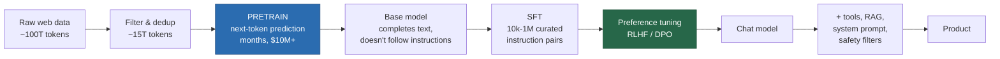

# LLM Architecture

> **Summary** — What a modern large language model actually is, component by component: the
> decoder-only stack, the specific choices (RMSNorm, SwiGLU, RoPE, GQA, no biases) and why each
> one is there, how a request flows through the system, and the memory/compute budget at every
> stage. This page is the practical companion to → [The Transformer](../03-sequence-models/04-transformer.md).

**Prerequisites**: → [The Transformer](../03-sequence-models/04-transformer.md), → [Positional encoding](../03-sequence-models/05-positional-encoding.md) · **Next**: → [Pretraining](02-pretraining.md)

---

## 1. The whole model on one diagram

```
                     token ids  (B, T)
                         │
              ┌──────────▼──────────┐
              │  Token Embedding    │   V × d      e.g. 128256 × 4096
              └──────────┬──────────┘
                         │  (B, T, d)
   ┌─────────────────────▼─────────────────────┐
   │                                            │  ×L  (e.g. 32 layers)
   │   ┌────────────────────────────────────┐  │
   │   │  RMSNorm                           │  │
   │   │  Grouped-Query Attention + RoPE    │  │   ← positions mix here
   │   │  residual add                      │  │
   │   └────────────────────────────────────┘  │
   │   ┌────────────────────────────────────┐  │
   │   │  RMSNorm                           │  │
   │   │  SwiGLU MLP  (d → 8d/3 → d)        │  │   ← per-token compute
   │   │  residual add                      │  │
   │   └────────────────────────────────────┘  │
   └─────────────────────┬─────────────────────┘
                         │  (B, T, d)
              ┌──────────▼──────────┐
              │   Final RMSNorm     │
              └──────────┬──────────┘
              ┌──────────▼──────────┐
              │  LM head (d × V)    │   often tied to the embedding
              └──────────┬──────────┘
                         │  (B, T, V)  logits
                         ▼
                  softmax → next-token distribution
```

**That is the entire model.** Everything that distinguishes a 1B model from a 500B one is $L$, $d$,
the amount of data, and the post-training.

---

## 2. Component-by-component rationale

That diagram is a skeleton — every box is a choice, and modern LLMs make a specific, opinionated choice at nearly every one of them. Going through the rationale component by component is what turns the diagram into an actual architecture.

| Component | Choice | Why this one |
|---|---|---|
| Norm placement | **pre-norm** | clean residual highway → stable at any depth |
| Norm type | **RMSNorm** | drops mean subtraction; ~10% faster, no quality cost |
| Activation | **SwiGLU** | multiplicative gating; best perplexity per parameter |
| $d_{\text{ff}}$ | $\frac83 d$ rounded to ×256 | keeps SwiGLU's 3 matrices parameter-neutral vs 2×4d |
| Position | **RoPE** in attention | relative, parameter-free, extensible after training |
| Attention | **GQA**, $H_{kv}\in\{4,8\}$ | 8× smaller KV cache at ~no quality cost |
| Biases | **none** | redundant after a norm; improves stability |
| Dropout | **0.0** in pretraining | models under-fit at <1 epoch |
| Embedding tying | tied at small $V$, untied at large | untied helps when $Vd$ is a large parameter share |
| Attention stability | **QK-norm** | bounds pre-softmax logits; prevents late-run spikes |
| Precision | **BF16** + FP32 optimizer states | full FP32 range, half the memory |

> [!TIP]
> **The pattern across this table**: the modern architecture is the 2017 Transformer with things
> *removed* (biases, dropout, mean-centering, separate encoder) and two things *replaced* (activation,
> position encoding). Almost nothing was added. That convergence is a sign the architecture is near a
> local optimum — the action has moved to data, scale, and post-training.

---

## 3. Where the parameters and the memory go

Those component choices settle *what* the model computes. Turning that into a real budget — how many parameters, how much memory, at inference and at training — is the next practical question anyone deploying one has to answer.

**LLaMA-3 8B**, fully worked ($L{=}32$, $d{=}4096$, $H{=}32$, $H_{kv}{=}8$, $d_{ff}{=}14336$, $V{=}128256$):

| Component | Formula | Parameters |
|---|---|---|
| Token embedding | $Vd$ | 525.3 M |
| Attention per layer | $d^2 + 2\cdot d\cdot\frac{d}{4} + d^2 = 2.5d^2$ | 41.9 M |
| MLP per layer | $3\,d\,d_{ff}$ | 176.2 M |
| Norms per layer | $2d$ | 8 K |
| **Per layer total** | | **218.1 M** |
| × 32 layers | | 6.98 B |
| Final norm | $d$ | 4 K |
| LM head (untied) | $Vd$ | 525.3 M |
| **Total** | | **8.03 B** ✓ |

Note GQA's effect: attention is $2.5d^2$ instead of $4d^2$ because $W_K$ and $W_V$ produce only
$d/4$ outputs each.

**Inference memory**, BF16, batch 1, 8192 tokens:

| Item | Size |
|---|---|
| Weights | $8.03\text{B}\times2 = 16.1$ GB |
| KV cache | $2\times32\times8\times128\times8192\times2 = 1.07$ GB |
| Activations (transient) | ~0.5 GB |
| **Total** | **~17.7 GB** |

Fits on a 24 GB consumer GPU. In **INT4** the weights drop to ~4 GB and the whole thing fits in
8 GB — which is why 4-bit quantization made local LLMs a real thing.
→ [Efficiency](07-efficiency.md)

**Training memory** for the same model (AdamW, BF16, FP32 master):

$$8.03\times10^9 \times 16\text{ bytes} = 128\text{ GB} \quad\text{+ activations}$$

Needs multiple GPUs with sharding. → [Pretraining](02-pretraining.md)

---

## 4. Request lifecycle: prefill and decode

That memory budget assumes the model just sits there. In production it has to actually serve requests, and a request's memory and compute profile look very different depending on which of the two phases — prefill or decode — it's in.

Serving an LLM has **two phases with completely different performance characteristics**. Confusing
them is the most common source of bad inference engineering.

```
  PREFILL                                DECODE
  process the whole prompt at once       generate one token at a time

  prompt: 2000 tokens                    ┌─► forward pass on 1 token
      │                                  │        │
      ▼  ONE forward pass                │        ▼
  ┌────────────────┐                     │   sample next token
  │ 2000×2000 attn │                     │        │
  │ big matmuls    │                     └────────┘  repeat N times
  └────────────────┘
      │                                  each step: tiny matmul,
      ▼                                  but must READ ALL WEIGHTS
  KV cache filled                        from HBM

  ⇒ COMPUTE-bound                        ⇒ MEMORY-BANDWIDTH-bound
  ⇒ high GPU utilization                 ⇒ ~5% GPU utilization
  ⇒ scales with prompt length            ⇒ scales with output length
```

**The arithmetic intensity argument, which explains everything about LLM serving.**

Decoding one token for a 7B model in BF16:
- FLOPs: $2N = 1.4\times10^{10}$
- Bytes read from HBM: $14\times10^9$ (all the weights, once)
- Arithmetic intensity: $\mathbf{1}$ FLOP per byte

An H100 has ~1000 TFLOP/s BF16 and ~3.35 TB/s HBM bandwidth → a ratio of ~300 FLOPs per byte. At
intensity 1, you are using roughly $1/300$ of the available compute. **The GPU is idle, waiting on
memory.**

> [!TIP]
> **The one fix that matters: batching.** Process 64 sequences at once and you read the weights
> *once* for 64 tokens of output. Arithmetic intensity rises to 64, throughput rises nearly 64×, and
> per-request latency barely changes.

**Practical consequences:**

| Observation | Explanation |
|---|---|
| Throughput scales ~linearly with batch size until the KV cache fills memory | decode is bandwidth-bound |
| Time-to-first-token scales with prompt length | prefill is compute-bound |
| Time-per-output-token is nearly constant | decode cost is dominated by weight reads |
| Quantization speeds up decode a lot, prefill little | fewer bytes to read; same FLOPs |
| A 2× smaller model is ~2× faster at decode | half the weights to read |

**Continuous batching** (vLLM, TGI, SGLang) exploits this: instead of waiting for a whole batch to
finish, evict finished sequences and admit new ones every step. Reported throughput gains over
naive static batching are large (often 5–20×).
→ [Inference & decoding](06-inference-and-decoding.md)

---

## 5. Model size tiers, and what each is for

Prefill and decode costs both scale with model size in a predictable way, which is exactly why picking *how big* a model to train or deploy is the highest-leverage decision in this whole page.

A practical map (parameter counts, September 2026):

| Tier | Params | Runs on | Typical use |
|---|---|---|---|
| **Tiny** | 0.1–1 B | phone, browser (WASM) | classification, autocomplete, on-device assist |
| **Small** | 1–4 B | laptop CPU, 8 GB GPU | drafting, simple extraction, speculative-decoding drafts |
| **Mid** | 7–15 B | one consumer/prosumer GPU | general assistant, RAG, fine-tuning target |
| **Large** | 30–80 B | 1–4 datacenter GPUs | strong reasoning, code, agents |
| **Frontier** | 200 B+ (often MoE) | a cluster | best-in-class capability |

> [!TIP]
> **The most useful trend to internalize**: capability at a given parameter count keeps improving.
> A 2026-vintage 8B model outperforms a 2022 70B model on most benchmarks. The gains come from
> better data (more, cleaner, more synthetic/curated), longer training well past Chinchilla-optimal,
> and much better post-training — **not** from architecture.

**Why models are trained far past compute-optimal**: Chinchilla optimizes *training* cost. If you
will serve billions of tokens, inference cost dominates the total, and a smaller model trained on
more data is cheaper forever. LLaMA-3 8B saw ~15T tokens — about **1875 tokens per parameter**,
roughly 94× the Chinchilla ratio of 20. → [Scaling laws](03-scaling-laws.md)

---

## 6. Dense vs Mixture-of-Experts

Every size tier above assumed a dense model — every parameter used on every token. There's a second axis entirely: keep the total parameter count high but only activate a fraction of it per token, which changes the memory-vs-compute tradeoff completely.

```
  DENSE                             MIXTURE OF EXPERTS

  every token → every parameter     every token → router → top-2 of 8 experts

  ┌──────────────┐                  ┌───┐┌───┐┌───┐┌───┐┌───┐┌───┐┌───┐┌───┐
  │   MLP (big)  │                  │E1 ││E2 ││E3 ││E4 ││E5 ││E6 ││E7 ││E8 │
  └──────────────┘                  └───┘└───┘└───┘└───┘└───┘└───┘└───┘└───┘
                                       ▲          ▲
  N params, N active                   └── router picks 2 ──┘

                                    8N params total, 2N active
                                    ⇒ capacity of 8N, cost of 2N
```

| | Dense 70B | MoE 8×22B (≈141B total, ≈39B active) |
|---|---|---|
| Total parameters | 70 B | 141 B |
| Active per token | 70 B | 39 B |
| Training FLOPs/token | $6\times70$B | $6\times39$B |
| **Memory to serve** | 140 GB (BF16) | **282 GB** ⚠️ |
| Quality | baseline | better per FLOP |

> [!WARNING]
> **The MoE catch**: you save *compute*, not *memory*. All experts must be resident, because any
> token might route to any of them. MoE is a win when you are compute-bound (large batches) and lose
> when you are memory-bound (single-user local inference). → [Mixture of Experts](08-mixture-of-experts.md)

---

## 7. The pipeline from base model to product

Dense or MoE, everything up to this point describes a model that has only ever seen the pretraining objective: predict the next token. Turning that into something you'd actually ship as a product takes a separate pipeline of its own.



**The cost asymmetry is striking:**

| Stage | Compute | Data | Wall-clock |
|---|---|---|---|
| Pretraining | ~99% | 10–30 T tokens | weeks–months |
| SFT | ~0.5% | 10 K–1 M examples | hours–days |
| Preference tuning | ~0.5% | 10 K–1 M comparisons | hours–days |

> [!TIP]
> **The "Superficial Alignment Hypothesis"** (Zhou et al., LIMA, 2023): essentially all knowledge
> and capability is acquired during pretraining; post-training only teaches the model *which
> distribution of responses to produce*. Evidence: LIMA fine-tuned LLaMA-65B on **1,000** carefully
> curated examples and was competitive with RLHF'd models on many prompts.

> [!WARNING]
> **The hypothesis is only partly right, and the exception matters.** RL on verifiable tasks
> (math, code) at scale does appear to teach genuinely new capability, not just style — reasoning
> models trained this way solve problems their base models could not solve at any sampling budget.
> The current best understanding: **style is superficial, reasoning is not.**
> → [Reasoning](10-reasoning.md)

---

## 8. Reading a model config

All of the choices covered in this page — architecture, size, dense-vs-MoE, post-training stage — end up encoded in one place: the JSON config file shipped alongside a model's weights. Being able to read one and reconstruct the whole picture is the practical payoff.

A real `config.json` and what every field means:

```jsonc
{
  "architectures": ["LlamaForCausalLM"],
  "hidden_size": 4096,               // d — the residual stream width
  "intermediate_size": 14336,        // d_ff — SwiGLU hidden (note: 3.5d, not 8d/3)
  "num_hidden_layers": 32,           // L
  "num_attention_heads": 32,         // H  (query heads)
  "num_key_value_heads": 8,          // H_kv — GQA with 4 queries per kv head
  "vocab_size": 128256,              // V
  "max_position_embeddings": 8192,   // trained context length
  "rope_theta": 500000.0,            // RoPE base — raised from 10000 for long context
  "rms_norm_eps": 1e-05,
  "tie_word_embeddings": false,      // separate LM head (adds V·d params)
  "torch_dtype": "bfloat16",
  "attention_bias": false,           // no biases
  "hidden_act": "silu"               // SwiGLU (silu = swish)
}
```

**Estimate the parameter count from this file in your head:**

$$N \approx L(2.5d^2 + 3d\,d_{ff}) + 2Vd = 32(4.19\times10^7 + 1.76\times10^8) + 1.05\times10^9 \approx 8.0\text{ B}$$ ✓

**And the FLOPs to train it on 15T tokens:**

$$6 \times 8\times10^9 \times 1.5\times10^{13} = 7.2\times10^{23}\text{ FLOPs}$$

At 400 TFLOP/s effective per GPU on 16,000 GPUs: $\approx 1.25\times10^5$ s $\approx$ **1.5 days**
of pure compute (real runs take longer due to restarts, evals and data loading).

---

## 9. Exercises

**Problem 1 — parameter count with aggressive GQA.** Using §3's method, estimate the parameter
count of a LLaMA-3-8B-shaped model ($L{=}32$, $d{=}4096$, $H{=}32$, $d_{ff}{=}14336$,
$V{=}128256$) but with $H_{kv}{=}4$ instead of the real model's $H_{kv}{=}8$. How much smaller is
it than the real 8.03B, and does halving $H_{kv}$ roughly halve the *attention* portion of the
per-layer parameters?

<details markdown="1"><summary>Solution</summary>

With $H_{kv}{=}4$: $W_K, W_V$ each shrink to $d\times(d\times4/32)=d\times(d/8)$. Per-layer
attention $= d^2(\text{Wq}) + 2\times d^2/8(\text{Wk,Wv}) + d^2(\text{Wo}) = 2.25d^2 = 37.75$M
(vs $2.5d^2=41.9$M at $H_{kv}{=}8$, from the page's own §3 table) — only a **10% drop** in the
attention portion, *not* a halving, because $W_Q$ and $W_O$ (each a full $d^2$) don't shrink at
all with $H_{kv}$; only $W_K,W_V$ do, and they were already a minority of the attention
parameters. Total model: $\approx7.90$B vs the real $8.03$B — about **1.6% smaller overall**.

The KV *cache*, by contrast, scales linearly and fully with $H_{kv}$: at $T{=}8192$,
$H_{kv}{=}4$ gives $0.537$GB vs $H_{kv}{=}8$'s $1.07$GB (§3) — a clean **2× reduction**, exactly
matching the ratio of $H_{kv}$ values. This is the asymmetry worth remembering: GQA barely moves
the *parameter count*, but moves the *serving memory* proportionally.

</details>

**Problem 2 — training cost, a smaller run.** Using §3's cost formula, estimate the FLOPs,
GPU-hours (at 400 TFLOP/s effective), and dollar cost (\$2/GPU-hour) to train a 3B model on 5T
tokens.

<details markdown="1"><summary>Solution</summary>

$C = 6\times3\times10^9\times5\times10^{12} = 9\times10^{22}$ FLOPs.

GPU-hours $= 9\times10^{22}/(400\times10^{12}\times3600) = 62{,}500$ GPU-hours.

Cost $\approx 62{,}500\times\$2 = \$125{,}000$ — comparable order of magnitude to the page's own
7B/2T-token example (\$117K), because this run trades a smaller model for proportionally more
tokens ($3\text{B}\times5\text{T} \approx 7\text{B}\times2\text{T}$ isn't quite equal — $1.5{\times}10^{13}$
vs $1.4{\times}10^{13}$ token-parameter product — close enough that the near-equal cost makes
sense given $C\propto ND$).

</details>

**Problem 3 — prefill vs decode, applied.** A request has a 4,000-token prompt (RAG context) and
asks for a 50-token answer. Using §4's arithmetic-intensity argument, which phase dominates
*wall-clock* time for this request, and would the answer change if the prompt were 50 tokens and
the answer 4,000 tokens (e.g. a long generated report)?

<details markdown="1"><summary>Solution</summary>

Case 1 (4000-token prompt, 50-token answer): prefill processes all 4000 prompt tokens in one
compute-bound forward pass — potentially fast per-token since it's compute-bound and highly
parallel, but there's a lot of tokens to process. Decode then does 50 sequential,
memory-bandwidth-bound steps, each paying the "read all weights" cost regardless of how few
tokens are being generated. For a 7B-class model, prefill of 4000 tokens might take well under a
second on modern hardware, while 50 sequential memory-bound decode steps (per §4: dominated by
weight-read time, roughly constant per token) could take a comparable or greater amount of
wall-clock time — **the phases are roughly comparable here**, with decode's fixed per-token cost
mattering more as the answer gets longer.

Case 2 (50-token prompt, 4000-token answer): prefill is now tiny (50 tokens, fast). Decode must
run 4000 sequential steps — **decode dominates overwhelmingly**. This is the everyday case for
long-form generation (reports, long code files, chain-of-thought reasoning traces): per §4,
"time-per-output-token is nearly constant," so total decode wall-clock scales almost linearly
with output length, and a 4000-token answer takes roughly 80× longer to decode than a 50-token
one, while prefill cost barely changes with such a short prompt.

</details>

## 10. Key takeaways

| # | Takeaway |
|---|---|
| 1 | Modern LLM = pre-norm decoder stack with RMSNorm, SwiGLU, RoPE, GQA, no biases, no dropout. |
| 2 | The architecture converged; progress now comes from data, scale, and post-training. |
| 3 | Serving has two phases: prefill is compute-bound, decode is memory-bandwidth-bound. |
| 4 | Decode has arithmetic intensity ≈ 1 FLOP/byte on a ~300 FLOP/byte machine — batching is the fix. |
| 5 | Models are trained far past Chinchilla-optimal because inference cost dominates over a model's lifetime. |
| 6 | MoE saves compute, not memory — all experts stay resident. |
| 7 | Pretraining is ~99% of the compute; post-training is ~99% of the perceived quality. |
| 8 | You can estimate any model's size and training cost from its config in under a minute. |

---

## Further reading

- Touvron et al., [*LLaMA 2*](https://arxiv.org/abs/2307.09288) (2023); Grattafiori et al., [*The Llama 3 Herd of Models*](https://arxiv.org/abs/2407.21783) (2024) — unusually detailed.
- Chowdhery et al., [*PaLM*](https://arxiv.org/abs/2204.02311) (2022) — thorough on architecture and training infrastructure.
- Kwon et al., [*Efficient Memory Management for LLM Serving with PagedAttention*](https://arxiv.org/abs/2309.06180) (vLLM, 2023).
- Zhou et al., [*LIMA: Less Is More for Alignment*](https://arxiv.org/abs/2305.11206) (2023).
- Pope et al., [*Efficiently Scaling Transformer Inference*](https://arxiv.org/abs/2211.05102) (2022) — the arithmetic-intensity analysis.

**Next** → [Pretraining](02-pretraining.md)
