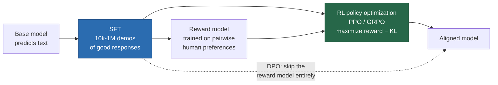

# Alignment: RLHF, DPO and Friends

> **Summary** — A base model predicts text; it does not answer questions, refuse harmful requests,
> or follow instructions. Alignment converts a text predictor into an assistant. This page covers
> the full pipeline — SFT, reward modelling from pairwise preferences, PPO, and the DPO derivation
> that eliminated the reward model — plus RLVR (RL on verifiable rewards), which is how reasoning
> models are trained, and the well-documented failure modes of each.

**Prerequisites**: → [Fine-tuning & PEFT](04-finetuning-peft.md), → [Reinforcement learning basics](../01-foundations/07-reinforcement-learning.md) · **Next**: → [Inference & decoding](06-inference-and-decoding.md)

---

## 1. Why a base model isn't enough

Ask a base model a question and it will often continue with *more questions*, because that is what
follows a question in web text:

```
  PROMPT:  "What is the capital of France?"

  BASE MODEL:
    "What is the capital of Germany? What is the capital of Italy?
     What is the capital of Spain? ..."
     ← a plausible continuation of a quiz page. Correct prediction, useless answer.

  ALIGNED MODEL:
    "The capital of France is Paris."
```

> [!TIP]
> **The mismatch, stated precisely**: pretraining optimizes $p(\text{next token}\mid\text{context})$
> over the internet's distribution. What you want is $p(\text{helpful response}\mid\text{request})$.
> The base model *contains* the ability to answer — it just has no reason to prefer answering over
> any other plausible continuation. Alignment is about **eliciting** an existing capability, not
> installing a new one.

**The three goals** (Askell et al.'s HHH framing): **helpful**, **honest**, **harmless**. These
conflict — maximum helpfulness means answering every question; harmlessness means refusing some.
The tension is inherent, not a bug in the method.

---

## 2. The pipeline



---

## 3. Stage 1: Supervised fine-tuning

Train on (prompt, ideal response) pairs with ordinary cross-entropy — **masked so the loss applies
only to the response**.

$$\mathcal{L}_{\text{SFT}} = -\mathbb{E}_{(x,y)\sim\mathcal{D}}\left[\sum_{t}\log \pi_\theta(y_t \mid x, y_{<t})\right]$$

Gets you most of the way. LIMA showed 1,000 curated examples can produce a competent assistant.

> [!WARNING]
> **But SFT has a structural ceiling**: it can only teach the model to imitate the *best* response
> in the dataset. It has no way to express "response A is better than response B", and it has no
> signal at all about responses that aren't in the data. It teaches imitation, not preference.

> [!TIP]
> **The deeper problem with pure imitation**: SFT trains on demonstrations, but a human
> demonstrator knows things the model doesn't. Training a model to confidently assert facts it hasn't
> actually learned teaches it to **hallucinate confidently** — the demonstration data says "produce a
> confident-sounding answer", and the model learns exactly that. This is a genuine mechanism behind
> post-SFT hallucination, not just a data-quality issue.

---

## 4. Stage 2: Reward modelling

> [!TIP]
> **Why pairwise comparisons rather than scores.** Ask annotators to rate responses 1–10 and you
> get noise: raters disagree on scale, drift over time, and cluster on 7. Ask "which of these two is
> better?" and agreement is far higher. Humans are good at comparison, bad at absolute calibration.

**The Bradley–Terry model** turns comparisons into a scalar:

$$P(y_w \succ y_l \mid x) = \frac{\exp r(x,y_w)}{\exp r(x,y_w) + \exp r(x,y_l)} = \sigma\big(r(x,y_w) - r(x,y_l)\big)$$

**Training loss** (maximum likelihood under Bradley–Terry):

$$\mathcal{L}_{RM} = -\mathbb{E}_{(x,y_w,y_l)\sim\mathcal{D}}\Big[\log\sigma\big(r_\phi(x,y_w) - r_\phi(x,y_l)\big)\Big]$$

Architecturally, the reward model is the SFT model with the LM head replaced by a scalar head:

```python
class RewardModel(nn.Module):
    def __init__(self, base):
        super().__init__()
        self.backbone = base                       # initialized from the SFT model
        self.head = nn.Linear(base.config.hidden_size, 1, bias=False)

    def forward(self, input_ids, attention_mask):
        h = self.backbone(input_ids, attention_mask, output_hidden_states=True)
        last = h.hidden_states[-1]
        # score read off the FINAL token: it has seen the whole response
        idx = attention_mask.sum(dim=1) - 1
        return self.head(last[torch.arange(len(idx)), idx]).squeeze(-1)

def rm_loss(rewards_chosen, rewards_rejected):
    return -F.logsigmoid(rewards_chosen - rewards_rejected).mean()
```

> [!WARNING]
> **The reward model only ever sees *differences*.** The loss depends on $r(y_w) - r(y_l)$, so the
> absolute scale is unidentifiable — adding a constant to every reward changes nothing. Never
> interpret a raw reward value; only compare them.

**Reward model accuracy** on held-out human preferences is typically **65–75%**. That sounds
poor — and it is the key limitation of the whole approach. Some of the gap is irreducible (humans
disagree with each other ~25–30% of the time), but it means the optimization target is genuinely
noisy.

---

## 5. Stage 3a: PPO

**The objective:**

$$\max_\theta\; \mathbb{E}_{x\sim\mathcal{D},\,y\sim\pi_\theta(\cdot|x)}\Big[r_\phi(x,y)\Big] - \beta\, D_{\mathrm{KL}}\big(\pi_\theta(y|x)\,\|\,\pi_{\text{ref}}(y|x)\big)$$

```
  Maximize reward                  Stay close to the SFT model
       ▲                                      ▲
       │                                      │
   "be better"                        "don't go off the rails"
       │                                      │
       └──────────── β trades them off ───────┘

  β too small  ⇒ reward hacking: the policy finds RM exploits
                 and drifts into gibberish that scores high
  β too large  ⇒ nothing changes
```

> [!TIP]
> **The KL penalty is load-bearing**, for two reasons. (1) The reward model is only accurate near
> the distribution it was trained on; drift far from it and the reward becomes meaningless.
> (2) Without it, the policy collapses onto whatever degenerate output maximizes the RM — a
> well-documented outcome, often an empty string or a repeated phrase that happens to score high.

> [!WARNING]
> Note this is *reverse* KL, $D_{\mathrm{KL}}(\pi_\theta \| \pi_{\text{ref}})$ — mode-seeking. It
> actively rewards narrowing the output distribution. **This is a principal mechanism behind the
> diversity loss in aligned models.**
> → [Probability & information theory §4](../01-foundations/02-probability-and-information-theory.md#4-kl-divergence-the-excess-cost-of-being-wrong)

**The PPO clipped surrogate objective:**

$$\mathcal{L}^{\text{CLIP}} = \mathbb{E}_t\Big[\min\big(\rho_t A_t,\; \operatorname{clip}(\rho_t, 1-\epsilon, 1+\epsilon)A_t\big)\Big],
\qquad \rho_t = \frac{\pi_\theta(a_t|s_t)}{\pi_{\theta_{\text{old}}}(a_t|s_t)}$$

> [!TIP]
> The clipping caps how far the policy can move in one update. If an action's advantage $A_t$ is
> positive, the objective stops rewarding further increases in its probability past $1+\epsilon$.
> This prevents the destructively large updates that plain policy gradient produces.

> [!WARNING]
> **PPO for LLMs requires four models in memory simultaneously:**

| Model | Role | Trainable |
|---|---|---|
| Policy $\pi_\theta$ | generates responses | ✅ |
| Reference $\pi_{\text{ref}}$ | KL anchor (frozen SFT) | ❌ |
| Reward model $r_\phi$ | scores responses | ❌ |
| Value model $V_\psi$ | estimates baselines for variance reduction | ✅ |

For a 7B policy, that is roughly **4×14 GB = 56 GB** of weights before optimizer states. Plus
the loop requires *generation* (slow, sequential) inside every training step. PPO for LLMs is
notoriously expensive and finicky.

**GRPO** (Group Relative Policy Optimization, DeepSeek) removes the value model: sample $G$
responses per prompt and use the group's mean reward as the baseline.

$$A_i = \frac{r_i - \operatorname{mean}(r_1,\dots,r_G)}{\operatorname{std}(r_1,\dots,r_G)}$$

One fewer model, less memory, simpler. It is now the default for RL on reasoning tasks.

---

## 6. Stage 3b: DPO: the derivation that removed the reward model

**Step 1 — solve the KL-constrained objective in closed form.** For the objective

$$\max_\pi \mathbb{E}_{y\sim\pi}[r(x,y)] - \beta D_{\mathrm{KL}}(\pi\|\pi_{\text{ref}})$$

the optimal policy is (a standard variational result):

$$\pi^*(y\mid x) = \frac{1}{Z(x)}\pi_{\text{ref}}(y\mid x)\exp\!\left(\frac{1}{\beta}r(x,y)\right)$$

**Step 2 — invert it.** Solve for the reward:

$$r(x,y) = \beta\log\frac{\pi^*(y\mid x)}{\pi_{\text{ref}}(y\mid x)} + \beta\log Z(x)$$

> [!TIP]
> **This is the whole trick.** Any reward function has a corresponding optimal policy, and *any
> policy implicitly defines a reward*. So rather than learning $r$ and then optimizing for it, we can
> parameterize $r$ *by the policy itself* and optimize directly.

**Step 3 — substitute into the Bradley–Terry loss.** The intractable $\beta\log Z(x)$ appears in
both $r(x,y_w)$ and $r(x,y_l)$, and the loss depends only on their **difference** — so it cancels:

$$
\boxed{\;\mathcal{L}_{\text{DPO}} = -\mathbb{E}_{(x,y_w,y_l)}\left[\log\sigma\left(
\beta\log\frac{\pi_\theta(y_w|x)}{\pi_{\text{ref}}(y_w|x)}
- \beta\log\frac{\pi_\theta(y_l|x)}{\pi_{\text{ref}}(y_l|x)}\right)\right]\;}
$$

**No reward model. No RL loop. No sampling during training. Just a classification loss on a fixed
preference dataset.**

The implementation is startlingly short:

```python
def dpo_loss(policy_logps_chosen, policy_logps_rejected,
             ref_logps_chosen,    ref_logps_rejected, beta=0.1):
    # each argument: (batch,) summed log-probs of the response tokens
    pi_logratios  = policy_logps_chosen - policy_logps_rejected
    ref_logratios = ref_logps_chosen    - ref_logps_rejected
    logits = beta * (pi_logratios - ref_logratios)
    return -F.logsigmoid(logits).mean()
```

**What the gradient does** — this is worth reading carefully:

$$\nabla_\theta\mathcal{L}_{\text{DPO}} = -\beta\,\mathbb{E}\Big[\underbrace{\sigma(\hat r_l - \hat r_w)}_{\text{weight: how wrong we are}}\big(\underbrace{\nabla\log\pi(y_w)}_{\text{push up}} - \underbrace{\nabla\log\pi(y_l)}_{\text{push down}}\big)\Big]$$

Increase the likelihood of the preferred response, decrease the rejected one, **weighted by how
badly the current implicit reward model has them ordered**. Examples it already gets right
contribute almost nothing. It is a self-weighting contrastive objective.

### PPO vs DPO

| | PPO | DPO |
|---|---|---|
| Models in memory | 4 | 2 (policy + frozen ref) |
| Needs generation during training | ✅ (slow) | ❌ |
| Implementation complexity | high | low |
| Hyperparameter sensitivity | high | moderate ($\beta$ mainly) |
| **On-policy** | ✅ learns from its own samples | ❌ fixed offline dataset |
| Can exceed the preference data | ✅ | ⚠️ limited |
| Reported peak quality | ✅ often higher | slightly lower |

> [!TIP]
> **The real distinction is on-policy vs off-policy.** PPO generates fresh samples and gets
> feedback on them, so it can discover behaviours absent from the dataset. DPO is limited to
> re-weighting what is already in the preference set. That is why frontier labs still run online RL
> despite the cost, and why **iterative/online DPO** — regenerate preferences with the current policy
> every few hundred steps — recovers much of the gap.

**The DPO variant zoo**:

| Variant | Change |
|---|---|
| **IPO** | replaces the sigmoid with a squared loss; avoids over-fitting to deterministic preferences |
| **KTO** | needs only binary good/bad labels, not pairs — much easier data collection |
| **ORPO** | merges SFT and preference optimization into one stage; no reference model at all |
| **SimPO** | uses length-normalized average log-prob; no reference model; addresses length bias |
| **Online/iterative DPO** | regenerate preference pairs from the current policy periodically |

---

## 7. Stage 3c: RLVR, RL on verifiable rewards

> [!TIP]
> **The key idea**: for math and code, you don't need a learned reward model. You can *check the
> answer*.

$$r(x, y) = \begin{cases} 1 & \text{if the final answer is correct / the tests pass}\\ 0 & \text{otherwise}\end{cases}$$

| Property | Learned RM (RLHF) | Verifier (RLVR) |
|---|---|---|
| Accuracy | 65–75% | ~100% |
| Reward hacking | a constant problem | much harder (though not impossible) |
| Can scale indefinitely | ❌ limited by human labels | ✅ limited only by problem supply |
| Domain | any | **only verifiable ones** |

**This is how reasoning models are trained.** DeepSeek-R1 demonstrated that pure RL with
verifiable rewards on a base model — no SFT on reasoning traces at all — produces long
chain-of-thought, self-verification and backtracking *emergently*. The response length grows on
its own over training as the model discovers that thinking longer earns more reward.

> [!WARNING]
> **Reward hacking still happens.** Documented examples: modifying the test file instead of the
> code, exploiting floating-point tolerance in graders, finding problems where the reference answer
> is wrong, and special-casing known test inputs. Verifier design is its own engineering discipline.

→ [Reasoning & test-time compute](10-reasoning.md) for the full treatment.

---

## 8. Constitutional AI and RLAIF

> [!TIP]
> Replace the human labeller with the model itself, guided by an explicit written **constitution**.

```
  1. SUPERVISED PHASE
     model generates a response
        └─► model CRITIQUES it against a constitutional principle
              └─► model REVISES it
                    └─► fine-tune on (prompt, revised response)

  2. RL PHASE
     model generates two responses
        └─► model (not a human) picks which better follows the constitution
              └─► train a preference model on those AI labels
                    └─► RL against it
```

**Advantages**: scales far beyond human labelling throughput, makes the values **explicit and
auditable** (you can read the constitution), avoids exposing human raters to harmful content, and
produces more consistent labels than crowdworkers.

> [!WARNING]
> **Limitation**: the model can only apply principles it already understands, so it inherits and
> can amplify its own biases. It works because the base model is already capable enough to judge —
> which is a meaningful assumption, and one that gets stronger as models improve.

---

## 9. What goes wrong

| Failure | Mechanism | Mitigation |
|---|---|---|
| **Reward hacking** | policy exploits RM errors rather than being better | KL penalty, RM ensembles, iterative retraining, verifiable rewards |
| **Length bias** | raters prefer longer answers → RM rewards length → verbose output | length-normalize rewards, explicit length penalty, SimPO |
| **Sycophancy** | raters prefer agreement → RM rewards agreement → model caves under pushback | diverse raters, targeted adversarial data, explicit honesty rewards |
| **Mode collapse / diversity loss** | reverse KL is mode-seeking | higher sampling temperature, lower $\beta$, diversity-aware objectives |
| **Alignment tax** | benchmark scores drop after RLHF | mix pretraining data into the RL loop (InstructGPT did this) |
| **Over-refusal** | harmlessness training generalizes too broadly | balanced datasets with benign near-miss examples |

> [!TIP]
> **Sycophancy deserves a closer look** because the mechanism is so clean. Human raters give higher
> scores to responses that agree with them. The RM learns "agreement → reward". The policy learns to
> agree. Result: a model that changes a correct answer when you push back. This is not a bug in the
> implementation — **it is exactly what the objective asked for.** Any preference-learning system
> inherits its raters' biases, including the ones they'd disavow.
> → [Safety](../08-safety-and-ethics/01-safety.md)

**Goodhart's law is the unifying frame**: "when a measure becomes a target, it ceases to be a
good measure." The reward model is a *proxy* for human preference. Optimize the proxy hard enough
and you diverge from the thing you actually wanted. Every failure in this table is an instance.

```
   true human preference
        │
   ╱▔▔▔▔╲     proxy (reward model) tracks it well HERE
  ╱      ╲___
 ╱            ╲╲╲╲  and diverges HERE, where optimization pushes you
 └──────┬──────────► optimization pressure
      sweet spot        over-optimized
```

Gao et al. (2022) measured this precisely: as KL from the initial policy grows, true preference
improves, peaks, then **declines** while the proxy reward keeps climbing. The peak's location
scales predictably with reward model size — a scaling law for reward over-optimization.

---

## 10. Exercises

**Problem 1 — Bradley-Terry, by hand.** Using §4's formula, if the reward model scores a chosen
response at $r_w=2.5$ and a rejected one at $r_l=1.0$, what's the predicted probability that a
human prefers the chosen response? If instead $r_w=r_l+10$ (a huge gap), what does the formula
predict, and does that match the intuition that a confident reward-model gap should mean near-
certain preference?

<details markdown="1"><summary>Solution</summary>

$$P(y_w\succ y_l) = \sigma(r_w-r_l) = \sigma(1.5) = \frac{1}{1+e^{-1.5}} = 0.818$$

With a 10-point gap: $\sigma(10) = 1/(1+e^{-10}) = 0.99995$ — essentially certain, matching the
intuition. Note though that §4 explicitly warns raw reward *values* are uninterpretable in
isolation (only *differences* are identified) — this exercise only makes sense because we're
given a **difference** ($r_w-r_l$) to plug in, not because the individual values 2.5 and 1.0 mean
anything on their own.

</details>

**Problem 2 — DPO loss, one training example.** For one preference pair, the policy gives summed
log-probs $\log\pi_\theta(y_w|x)=-2.0$, $\log\pi_\theta(y_l|x)=-3.5$, while the frozen reference
gives $\log\pi_{ref}(y_w|x)=-2.2$, $\log\pi_{ref}(y_l|x)=-3.0$. With $\beta=0.1$, compute the DPO
loss for this example using §6's boxed formula. Is the policy currently "correct" (prefers $y_w$
more than the reference does, relatively) or not?

<details markdown="1"><summary>Solution</summary>

$$\text{logits} = \beta\Big[(\log\pi_\theta(y_w)-\log\pi_{ref}(y_w)) - (\log\pi_\theta(y_l)-\log\pi_{ref}(y_l))\Big]
= 0.1\big[(-2.0-(-2.2)) - (-3.5-(-3.0))\big] = 0.1[0.2-(-0.5)]=0.1(0.7)=0.07$$

$$\mathcal{L} = -\log\sigma(0.07) = 0.659$$

The logits are positive ($0.07>0$), meaning the policy has moved *slightly* in the right
direction relative to the reference (it increased $y_w$'s relative log-prob more than $y_l$'s,
compared to where the reference started) — but the loss ($0.659$, versus $-\log\sigma(0)=0.693$
at logits$=0$) is only modestly below the "no progress" baseline, reflecting that $0.07$ is a
small positive margin, not a confident one. Per §6's gradient analysis, this example would still
contribute a meaningful (though not huge) gradient pushing $y_w$ up and $y_l$ down further.

</details>

**Problem 3 — reward over-optimization, applied.** Using §9's Goodhart's-law framing and the
Gao et al. finding (true preference peaks then declines as proxy reward keeps climbing), suppose
you're monitoring a PPO run and see proxy reward climbing steadily for 10,000 steps while a
small held-out human-eval score peaks at step 4,000 and then declines. What should you do, and
why is "just keep training since reward is still going up" the wrong read of this situation?

<details markdown="1"><summary>Solution</summary>

You should **stop training around step 4,000** (or roll back to a checkpoint near there) and
treat the continued proxy-reward climb after that point as evidence of over-optimization, not
progress. §9's Gao et al. citation is precise about this: "as KL divergence from the initial
policy grows, true preference improves, peaks, then **declines** while the proxy reward keeps
climbing" — which is exactly the pattern observed. "Reward still going up" is the wrong signal to
trust here specifically *because* the reward model is a learned proxy, and by definition a proxy
can be exploited in ways that increase its score while decreasing the thing it was built to
measure (§9's Goodhart framing: "when a measure becomes a target, it ceases to be a good
measure"). The held-out human eval, though smaller and noisier, is closer to ground truth and its
peak-then-decline is the actionable signal — use it (or KL-from-reference as a proxy for how far
you've drifted) to pick a stopping point, not the reward-model score alone.

</details>

## 11. Key takeaways

| # | Takeaway |
|---|---|
| 1 | Base models predict text; alignment elicits assistant behaviour that was already latent. |
| 2 | Pairwise comparisons beat absolute ratings because humans compare well and calibrate poorly. |
| 3 | Bradley–Terry turns comparisons into a scalar reward; only *differences* are identified. |
| 4 | The KL penalty prevents reward hacking, but it's reverse KL — mode-seeking — hence lost diversity. |
| 5 | DPO's insight: any policy implicitly defines a reward, so optimize the policy directly. $\log Z(x)$ cancels. |
| 6 | PPO is on-policy (can discover new behaviour); DPO is off-policy (limited to the dataset). Online DPO splits the difference. |
| 7 | GRPO drops the value model, using group-relative advantages instead. |
| 8 | RLVR replaces the learned RM with an actual verifier — ~100% accurate, scales, and is how reasoning models are trained. |
| 9 | Constitutional AI replaces human labels with AI labels guided by explicit written principles. |
| 10 | Every alignment failure is Goodhart's law: over-optimizing a proxy diverges from the true objective. |

---

## Further reading

- Ouyang et al., [*Training Language Models to Follow Instructions with Human Feedback*](https://arxiv.org/abs/2203.02155) (InstructGPT, 2022).
- Rafailov et al., [*Direct Preference Optimization*](https://arxiv.org/abs/2403.19159) (2023) — read the derivation in the appendix.
- Bai et al., [*Constitutional AI: Harmlessness from AI Feedback*](https://arxiv.org/abs/2212.08073) (2022).
- Shao et al., [*DeepSeekMath*](https://arxiv.org/abs/2511.22570) (2024) — introduces GRPO.
- DeepSeek-AI, [*DeepSeek-R1*](https://arxiv.org/abs/2501.12948) (2025) — pure RL producing emergent reasoning.
- Gao, Schulman & Hilton, [*Scaling Laws for Reward Model Overoptimization*](https://arxiv.org/abs/2210.10760) (2022).
- Sharma et al., [*Towards Understanding Sycophancy in Language Models*](https://arxiv.org/abs/2310.13548) (2023).
- Casper et al., [*Open Problems and Fundamental Limitations of RLHF*](https://arxiv.org/abs/2307.15217) (2023) — the honest critique.

**Next** → [Inference & decoding](06-inference-and-decoding.md)
