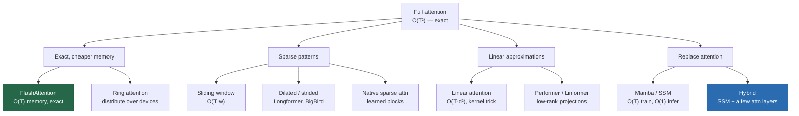

# Long Context

> **Summary** — Going from 2k to 1M tokens required solving three separate problems: the $O(T^2)$
> attention cost, positional extrapolation beyond the training length, and the fact that models
> trained on short sequences simply don't *know how* to use long ones. This page covers efficient
> attention variants, context-extension methods, what "1M context" actually delivers (the
> needle-in-a-haystack and "lost in the middle" results), and when retrieval beats a long window.

**Prerequisites**: → [Attention](../03-sequence-models/03-attention.md), → [Positional encoding](../03-sequence-models/05-positional-encoding.md) · **Next**: → [Reasoning](10-reasoning.md)

---

## 1. The three separate problems

```
  PROBLEM 1: COMPUTE           PROBLEM 2: POSITION        PROBLEM 3: ABILITY
  attention is O(T²)           positions past T_train      the model never learned
                               are out of distribution     to USE long contexts

  T=2k    →  4M ops            RoPE angles the model       trained on 4k docs;
  T=128k  →  16B ops           has never seen              at 128k it attends
  (4000× more)                                             mostly to the ends

  FIX: FlashAttention,         FIX: position               FIX: long-context
  sparse/linear attention,     interpolation, NTK          training data, staged
  SSMs                         scaling, YaRN               curriculum
```

> [!WARNING]
> These are genuinely independent. Solving only the compute problem gives you a model that *can*
> process 128k tokens and produces garbage. Most "long context" failures in practice are problem 3.

---

## 2. The cost, concretely

Attention FLOPs vs MLP FLOPs per layer (from → [Transformer §4](../03-sequence-models/04-transformer.md#4-flop-counting)):
$4Td$ vs $24d^2$, with $d = 4096$:

| Context $T$ | Attention share of compute | KV cache (70B, GQA-8, BF16) |
|---|---|---|
| 2 K | 7.7% | 0.67 GB |
| 8 K | 25% | 2.7 GB |
| 32 K | 57.1% | 10.7 GB |
| 128 K | 84.2% | 42.9 GB |
| 1 M | 98% | 335 GB |

> [!TIP]
> **Two different walls.** At 32k, compute becomes the problem. At 128k+, the **KV cache** becomes
> the problem — you cannot fit many concurrent requests. Long context is expensive not because any
> single request is slow, but because each request monopolizes memory that would otherwise serve
> dozens of short ones.

This is why long-context API pricing is often superlinear, and why providers offer prompt
caching: if the same 100k-token document is reused, cache its KV states and skip prefill entirely.

---

## 3. Efficient attention: the landscape



| Method | Complexity | Exact? | Status |
|---|---|---|---|
| **FlashAttention** | $O(T^2)$ compute, $O(T)$ memory | ✅ exact | ✅ universal |
| **Sliding window** | $O(Tw)$ | ❌ | ✅ used (Mistral, Gemma) |
| Longformer / BigBird | $O(T)$ | ❌ | ⚠️ mostly historic |
| Linear attention | $O(Td^2)$ | ❌ | ⚠️ quality gap |
| Performer, Linformer | $O(T)$ | ❌ | ❌ largely abandoned |
| **Mamba / SSM** | $O(T)$ train, $O(1)$ infer | n/a | 📈 growing |
| **SSM–attention hybrids** | mostly $O(T)$ | n/a | 📈 **the promising direction** |
| **Ring attention** | $O(T^2/P)$ per device | ✅ exact | ✅ for very long training |

### Sliding window attention

Each token attends only to the previous $w$ tokens.

```
  full attention          sliding window (w=3)
  ┌─┬─┬─┬─┬─┬─┐          ┌─┬─┬─┬─┬─┬─┐
  │█│ │ │ │ │ │          │█│ │ │ │ │ │
  │█│█│ │ │ │ │          │█│█│ │ │ │ │
  │█│█│█│ │ │ │          │█│█│█│ │ │ │
  │█│█│█│█│ │ │          │ │█│█│█│ │ │   ← older tokens dropped
  │█│█│█│█│█│ │          │ │ │█│█│█│ │
  │█│█│█│█│█│█│          │ │ │ │█│█│█│
  └─┴─┴─┴─┴─┴─┘          └─┴─┴─┴─┴─┴─┘
  O(T²)                   O(T·w), cache capped at w
```

> [!TIP]
> **The receptive field argument**: with $L$ layers and window $w$, information can propagate
> $L\times w$ tokens. Mistral 7B: $32 \times 4096 = 131{,}072$ tokens of theoretical reach with a
> 4096-token cache. **Information flows indirectly, layer by layer** — like a CNN's receptive field.

> [!WARNING]
> But indirect propagation is lossy. Exact retrieval of a specific string from 100k tokens back
> requires it to survive 25 hops of re-encoding. Sliding window is good for *fluency* over long text,
> poor for *lookup*.

### Linear attention

The trick: attention is $\operatorname{softmax}(QK^\top)V$. If you replace softmax with a kernel
feature map $\phi$, associativity lets you reorder:

$$\phi(Q)\big(\phi(K)^\top V\big) \quad\text{instead of}\quad \big(\phi(Q)\phi(K)^\top\big)V$$

$$\underbrace{(T\times d)(d\times T)(T\times d)}_{O(T^2d)} \;\longrightarrow\; \underbrace{(T\times d)\big[(d\times T)(T\times d)\big]}_{O(Td^2)}$$

The bracketed term $\phi(K)^\top V$ is a $d\times d$ matrix — a **fixed-size state**, independent of
$T$. Linear in sequence length, and it gives you an RNN at inference.

> [!WARNING]
> **Why it hasn't won**: the $d\times d$ state is a fixed-capacity summary. Softmax attention can
> sharply select one token out of a million; linear attention blends into a bounded state. The
> quality gap on retrieval-heavy tasks is real and persistent.

---

## 4. State-space models and hybrids

$$h_t = A h_{t-1} + Bx_t, \qquad y_t = Ch_t$$

Linear recurrence → parallelizable by prefix scan during training, $O(1)$ state at inference.
→ [RNNs §7](../03-sequence-models/02-rnn-lstm-gru.md#7-the-return-of-recurrence-state-space-models)

**Mamba's addition**: make $A, B, C$ **functions of the input** (selective SSM), so the model can
choose what to remember and what to forget — recovering content-based behaviour that a fixed
linear recurrence lacks.

**The hybrid finding, which is the practically important one**: pure SSMs underperform on
retrieval and in-context learning. Interleaving a small number of full-attention layers — roughly
1 in 6 — recovers nearly all of it while keeping most of the efficiency.

| Model | Composition |
|---|---|
| Jamba | Mamba + attention + MoE |
| Griffin / RecurrentGemma | gated linear recurrence + local attention |
| Zamba, Samba | SSM backbone + periodic attention |

> [!TIP]
> **The principle**: recurrence is efficient for *aggregating* information; attention is necessary
> for *retrieving* it. Most tokens need aggregation; a few need retrieval. A hybrid spends the
> expensive mechanism only where it's needed. This is a general architectural insight, not just an
> SSM one.

---

## 5. Extending an existing model's context

Most long-context models are *short-context models that were extended*.

**The recipe:**

1. **Scale RoPE.** Raise the base $\theta$ (e.g. 10,000 → 500,000) or apply YaRN.
   → [Positional encoding §7](../03-sequence-models/05-positional-encoding.md#7-extending-the-context-window)
2. **Continue pretraining on long documents**, staged: 8k → 32k → 128k.
3. **Fine-tune on long-context tasks**: multi-document QA, long summarization, repository-level code.

**Data is the binding constraint.** Genuinely long, *coherent* documents are rare — most web
pages are short. Common sources: books, legal filings, entire code repositories, and
*synthetically constructed* long contexts (concatenated related documents, generated multi-hop QA).

**Cost**: LLaMA-3.1's extension to 128k used roughly 800 B tokens — about 5% of the total
pretraining budget. Not cheap, but far cheaper than pretraining at 128k from scratch (which would
be ~16× the attention cost throughout).

---

## 6. What long context actually delivers

### Needle in a haystack

Hide a specific fact in a long document; ask for it.

```
   depth of needle in context
   100% │ ███████████████░░░░░░░           ██ = retrieved correctly
        │ ████████████████░░░░░░           ░░ = failed
    50% │ ██████░░░░░░░░░░░░░░░░           ← the hard region
        │ ████████████░░░░░░░░░░
     0% │ ███████████████████████          ← beginning: always fine
        └──────────────────────────►
         4k    32k   128k   1M   context length
```

Modern frontier models pass simple single-needle tests at very long context. **But simple NIAH
is a weak test** — it measures verbatim lookup of a distinctive string, which is close to the
easiest possible long-context task. Harder variants (multiple needles, needles requiring
inference, distractors that look like needles, needles that must be *aggregated*) show much
steeper degradation.

### Lost in the middle

Liu et al. (2023): a strong U-shaped curve. Information at the **beginning** and **end** of the
context is used well; information in the **middle** is often effectively ignored.

```
   accuracy
    high │█                              █
         │ █                            █
         │  █                          █
         │   ██                      ██
    low  │     ████████████████████████
         └──────────────────────────────►
          start      position in context      end
```

> [!TIP]
> **Why**: (1) attention sinks put weight on early tokens; (2) recency bias from causal
> language modelling and RoPE's distance decay favours the end; (3) training documents rarely require
> using the exact middle.

> [!WARNING]
> **Actionable consequence**: put the most important content at the **start** or **end** of your
> prompt. If you have 20 retrieved documents, the ones ranked 8–14 may as well not be there.
> → [RAG](../06-applications/03-rag.md)

### The benchmarks worth using

| Benchmark | What it tests |
|---|---|
| NIAH | single-fact verbatim retrieval (easy) |
| **RULER** | multi-needle, tracing, aggregation, multi-hop — much harder, and the default now |
| LongBench | a mix of realistic long-document tasks |
| ∞Bench | 100k+ tasks including code and math |
| BABILong | reasoning over facts scattered in long distractor text |

**The RULER finding is the one to internalize**: of the models tested, all claimed context sizes
of 32k tokens or more, yet **only half maintained satisfactory performance at 32k**, and almost all
degraded sharply as length grew ([Hsieh et al. 2024](https://arxiv.org/abs/2404.06654)).
"Supported context" and "useful context" are different numbers, and vendors quote the former.

---

## 7. Long context vs RAG

| | Long context | RAG |
|---|---|---|
| Setup cost | none | index building, chunking, embedding |
| Per-query cost | 💸 high (all tokens processed) | low (only retrieved chunks) |
| Latency | high (prefill over everything) | low |
| Corpus size limit | the context window | unbounded |
| Updating knowledge | re-send everything | update the index |
| **Reasoning across the whole corpus** | ✅ sees everything at once | ❌ only sees what was retrieved |
| Retrieval precision | ⚠️ "lost in the middle" | ✅ explicit ranking |
| Attribution/citations | harder | ✅ natural |

> [!TIP]
> **They are complementary, and the right architecture usually uses both**: retrieve *generously*
> (50 chunks instead of 5, because the window can hold them), then let the long context do the
> reasoning. This is more robust than RAG with $k=5$ — retrieval recall failures are the dominant
> RAG error mode, and a big window lets you trade precision for recall.

**Decision rule**:

| Corpus size | Approach |
|---|---|
| < 100 K tokens | just put it in the context |
| 100 K – 10 M tokens | RAG with generous $k$, or hierarchical summarization |
| > 10 M tokens | RAG, necessarily |
| Repeated queries on a fixed corpus | RAG (amortize), **or** long context + prompt caching |

---

## 8. Practical techniques

| Technique | What it does |
|---|---|
| **Prompt caching** | cache the KV states of a fixed prefix; skip prefill on reuse. Large latency and cost win for repeated documents or long system prompts. |
| **StreamingLLM** | keep the first 4 tokens (the attention sinks) + a sliding window → infinite-length streaming with bounded memory |
| **KV cache quantization** | FP8 or INT4 KV → 2–4× more context in the same memory |
| **KV cache eviction** (H2O, SnapKV) | drop low-attention tokens from the cache; 50–80% reduction with modest loss |
| **Chunked prefill** | interleave prefill chunks with decode steps so long prompts don't stall other requests |
| **Hierarchical summarization** | summarize sections, then summarize the summaries — handles unbounded input |

> [!TIP]
> **Prompt caching is the highest-value, least-glamorous item on this list.** If your application
> sends the same 50k-token system prompt or document on every call, caching it eliminates the
> dominant cost. Most major APIs now support it explicitly.

---

## 9. Key takeaways

| # | Takeaway |
|---|---|
| 1 | Long context has three independent problems: compute, position extrapolation, and learned ability. |
| 2 | Attention dominates FLOPs past ~32k; the KV cache dominates *memory* past ~128k. |
| 3 | FlashAttention is exact and universal; everything else trades quality for speed. |
| 4 | Sliding window gives $L\times w$ indirect reach — good for fluency, poor for exact retrieval. |
| 5 | Linear attention/SSMs compress into a fixed state, so they lose sharp retrieval. Hybrids fix this. |
| 6 | Extension recipe: scale RoPE base, then continue pretraining on long data in stages. |
| 7 | **Lost in the middle**: put critical content at the start or end of the prompt. |
| 8 | Advertised context ≫ effective context. Use RULER-style benchmarks, not simple NIAH. |
| 9 | Long context and RAG are complementary: retrieve generously, reason over everything. |
| 10 | Prompt caching is the cheapest large win for any repeated-prefix workload. |

---

## Further reading

- Dao et al., [*FlashAttention*](https://arxiv.org/abs/2307.08691) (2022); Liu et al., [*Ring Attention with Blockwise Transformers*](https://arxiv.org/abs/2310.01889) (2023).
- Beltagy et al., [*Longformer*](https://arxiv.org/abs/2004.05150) (2020); Jiang et al., [*Mistral 7B*](https://arxiv.org/abs/2310.06825) (2023) — sliding window in practice.
- Gu & Dao, [*Mamba*](https://arxiv.org/abs/2312.00752) (2023); Lieber et al., [*Jamba*](https://arxiv.org/abs/2403.19887) (2024).
- Peng et al., [*YaRN*](https://arxiv.org/abs/2309.00071) (2023); Chen et al., [*Position Interpolation*](https://arxiv.org/abs/2306.15595) (2023).
- Liu et al., [*Lost in the Middle*](https://arxiv.org/abs/2307.03172) (2023).
- Hsieh et al., [*RULER: What's the Real Context Size of Your Long-Context Language Models?*](https://arxiv.org/abs/2404.06654) (2024).
- Xiao et al., [*Efficient Streaming Language Models with Attention Sinks*](https://arxiv.org/abs/2309.17453) (2023).

**Next** → [Reasoning & test-time compute](10-reasoning.md)
