# Diffusion Models

> **Summary** — Destroy an image by adding Gaussian noise over $T$ steps until nothing is left,
> then train a network to undo one step of that destruction. Generation runs the chain backwards
> from pure noise. This page derives the forward process (including the closed form that lets you
> jump to any timestep in one line), the full variational bound, and the remarkable simplification
> that turns the whole thing into a noise-prediction regression problem.

**Prerequisites**: → [VAE](../02-classical-models/02-vae.md), → [Probability & information theory](../01-foundations/02-probability-and-information-theory.md) · **Next**: → [Score-based models](02-score-based-models.md)

---

## 1. The picture

```
  FORWARD (fixed, no learning — just add noise)
  ─────────────────────────────────────────────►
  x₀        x₁        x₂       ...      x_T
 ┌────┐   ┌────┐   ┌────┐            ┌────┐
 │ 🐱 │──►│🐱░░│──►│▒▒░▒│──► ... ──► │▓▒░▓│
 └────┘   └────┘   └────┘            └────┘
 clean     +noise   +noise            pure N(0,I)

  ◄─────────────────────────────────────────────
  REVERSE (learned — a network predicts the noise to remove)
```

> [!TIP]
> **Why this is easier than it looks.** Learning to go from pure noise to a photo in one step is
> an impossibly hard problem. But learning to make a *slightly* noisy image *slightly* less noisy is
> easy — it's a local denoising regression, essentially supervised learning. Diffusion decomposes an
> impossible problem into $T$ easy ones.

> [!TIP]
> **The second reason it works**: the reverse of a *small* Gaussian noise step is itself
> approximately Gaussian. That is a theorem (Feller), and it means the model only ever has to output
> a mean and a variance — not an arbitrary distribution. The step size must be small for the
> approximation to hold, which is exactly why $T$ is large.

---

## 2. The forward process

That approximation needs a precise notion of "how much noise has been added by step $t$" — which is exactly what the forward process defines, in closed form, for any $t$ at once.

$$q(x_t \mid x_{t-1}) = \mathcal{N}\!\left(x_t;\ \sqrt{1-\beta_t}\,x_{t-1},\ \beta_t I\right)$$

with a **variance schedule** $\beta_1 < \beta_2 < \dots < \beta_T$, typically
$\beta_1 = 10^{-4}$ to $\beta_T = 0.02$ over $T = 1000$ steps.

> [!TIP]
> **Why the $\sqrt{1-\beta_t}$ factor?** It shrinks the signal by exactly as much as the noise
> grows, keeping the total variance at 1. Without it, variance would accumulate and $x_T$ would
> explode instead of converging to $\mathcal{N}(0,I)$.

### The closed form (the key practical trick)

Let $\alpha_t = 1-\beta_t$ and $\bar\alpha_t = \prod_{s=1}^{t}\alpha_s$.

**Derivation.** Write $x_t = \sqrt{\alpha_t}x_{t-1} + \sqrt{1-\alpha_t}\,\epsilon_{t-1}$ and
substitute recursively:

$$
\begin{aligned}
x_t &= \sqrt{\alpha_t}\left(\sqrt{\alpha_{t-1}}x_{t-2} + \sqrt{1-\alpha_{t-1}}\epsilon_{t-2}\right) + \sqrt{1-\alpha_t}\epsilon_{t-1}\\
&= \sqrt{\alpha_t\alpha_{t-1}}\,x_{t-2} + \underbrace{\sqrt{\alpha_t(1-\alpha_{t-1})}\,\epsilon_{t-2} + \sqrt{1-\alpha_t}\,\epsilon_{t-1}}_{\text{sum of two independent Gaussians}}
\end{aligned}
$$

The noise terms combine (variances add):

$$\alpha_t(1-\alpha_{t-1}) + (1-\alpha_t) = 1 - \alpha_t\alpha_{t-1}$$

So $x_t = \sqrt{\alpha_t\alpha_{t-1}}x_{t-2} + \sqrt{1-\alpha_t\alpha_{t-1}}\,\bar\epsilon$.
By induction:

$$\boxed{\;q(x_t\mid x_0) = \mathcal{N}\!\left(x_t;\ \sqrt{\bar\alpha_t}\,x_0,\ (1-\bar\alpha_t)I\right)
\quad\Longleftrightarrow\quad x_t = \sqrt{\bar\alpha_t}\,x_0 + \sqrt{1-\bar\alpha_t}\,\epsilon\;}$$

> [!TIP]
> **This is what makes training feasible.** You can sample $x_t$ for a *random* $t$ in one line,
> without simulating the chain. Training becomes: pick a random image, pick a random timestep, add
> the corresponding noise, predict it. No sequential simulation anywhere in training.

**Schedule values** for linear $\beta$ from $10^{-4}$ to $0.02$, $T=1000$:

| $t$ | $\beta_t$ | $\bar\alpha_t$ | $\sqrt{\bar\alpha_t}$ (signal) | $\sqrt{1-\bar\alpha_t}$ (noise) | SNR |
|---|---|---|---|---|---|
| 0 | — | 1.0000 | 1.000 | 0.000 | ∞ |
| 100 | 0.0021 | 0.8970 | 0.947 | 0.321 | 8.71 |
| 300 | 0.0061 | 0.3964 | 0.630 | 0.777 | 0.657 |
| 500 | 0.0100 | 0.0786 | 0.280 | 0.960 | 0.085 |
| 700 | 0.0140 | 0.0070 | 0.083 | 0.997 | 0.0070 |
| 900 | 0.0180 | 0.0003 | 0.017 | 1.000 | 0.0003 |
| 1000 | 0.0200 | 0.00004 | 0.006 | 1.000 | 0.00004 |



*Computed for T = 1000: linear β from 10⁻⁴ to 0.02 (Ho et al. 2020) vs the cosine schedule with s = 0.008 (Nichol & Dhariwal 2021). Under the linear schedule the image is essentially gone by t ≈ 700, so the last 30% of steps carry almost no information.*

> [!WARNING]
> **The linear schedule is suboptimal** and it shows starkly in the table: by $t = 500$ the signal
> is down to $\sqrt{\bar\alpha} = 0.28$, and by $t = 700$ it is 0.083 — the image is already
> destroyed, so the last 30% of timesteps do almost nothing. Nichol & Dhariwal's **cosine schedule** fixes this:

$$\bar\alpha_t = \frac{f(t)}{f(0)}, \qquad f(t) = \cos^2\!\left(\frac{t/T + s}{1+s}\cdot\frac{\pi}{2}\right), \quad s = 0.008$$

It destroys information more gradually, spending more steps in the informative middle range.
Measurably better FID, especially at low resolutions.

---

## 3. The reverse process

Whichever schedule sets $\bar\alpha_t$, the forward process is only half the story — it's the *known*, fixed direction. Generation needs the opposite: a way to walk back from noise to data, and that direction has to be learned.

$$p_\theta(x_{t-1}\mid x_t) = \mathcal{N}\!\left(x_{t-1};\ \mu_\theta(x_t, t),\ \Sigma_\theta(x_t,t)\right)$$

We need to learn $\mu_\theta$. The key is that the **true** posterior, when conditioned on $x_0$,
is available in closed form.

**Derivation via Bayes.**

$$q(x_{t-1}\mid x_t, x_0) = \frac{q(x_t\mid x_{t-1})\,q(x_{t-1}\mid x_0)}{q(x_t\mid x_0)}$$

All three are Gaussians, so the result is Gaussian. Collecting terms in the exponent (completing
the square) gives:

$$q(x_{t-1}\mid x_t, x_0) = \mathcal{N}\!\left(x_{t-1};\ \tilde\mu_t(x_t,x_0),\ \tilde\beta_t I\right)$$

$$\tilde\mu_t(x_t,x_0) = \frac{\sqrt{\bar\alpha_{t-1}}\beta_t}{1-\bar\alpha_t}x_0 + \frac{\sqrt{\alpha_t}(1-\bar\alpha_{t-1})}{1-\bar\alpha_t}x_t,
\qquad \tilde\beta_t = \frac{1-\bar\alpha_{t-1}}{1-\bar\alpha_t}\beta_t$$

> [!TIP]
> **Read $\tilde\mu_t$**: it is a weighted average of "where you are" ($x_t$) and "where you're
> going" ($x_0$). Early in the reverse process ($t$ large), the $x_t$ term dominates and steps are
> cautious. Late ($t$ small), $x_0$ dominates.

> [!WARNING]
> **But we don't know $x_0$ at sampling time** — that's what we're generating. The resolution: use
> the closed form to express $x_0$ in terms of $x_t$ and the noise:

$$x_0 = \frac{1}{\sqrt{\bar\alpha_t}}\left(x_t - \sqrt{1-\bar\alpha_t}\,\epsilon\right)$$

Substituting and simplifying:

$$\boxed{\;\tilde\mu_t = \frac{1}{\sqrt{\alpha_t}}\left(x_t - \frac{\beta_t}{\sqrt{1-\bar\alpha_t}}\epsilon\right)\;}$$

**So if the network predicts $\epsilon$, we get $\mu_\theta$ for free.** That is why diffusion models
predict noise.

---

## 4. The loss: from full ELBO to three lines of code

Predicting $\epsilon$ tells you what the network should output. Turning that into an actual training objective — starting from the full variational bound from → [The ELBO](../01-foundations/02-probability-and-information-theory.md#7-the-elbo-what-to-do-when-the-likelihood-is-intractable) and simplifying it down — is the derivation that makes diffusion practical to implement.

**The variational bound** (same structure as the VAE's, extended over $T$ latents):

$$\mathbb{E}[-\log p_\theta(x_0)] \le \mathbb{E}_q\left[\underbrace{D_{\mathrm{KL}}(q(x_T|x_0)\|p(x_T))}_{L_T: \text{ no parameters}} + \sum_{t=2}^{T}\underbrace{D_{\mathrm{KL}}(q(x_{t-1}|x_t,x_0)\|p_\theta(x_{t-1}|x_t))}_{L_{t-1}} \underbrace{- \log p_\theta(x_0|x_1)}_{L_0}\right]$$

- $L_T$ has no learnable parameters (the forward process is fixed) → ignore it.
- $L_0$ is a reconstruction term → handled with a discretized Gaussian likelihood.
- $L_{t-1}$ is a KL between two Gaussians → **closed form**:

$$L_{t-1} = \mathbb{E}_q\left[\frac{1}{2\sigma_t^2}\big\|\tilde\mu_t(x_t,x_0) - \mu_\theta(x_t,t)\big\|^2\right] + C$$

Substituting both $\mu$ expressions, the $x_t$ terms cancel:

$$L_{t-1} = \mathbb{E}_{x_0,\epsilon}\left[\frac{\beta_t^2}{2\sigma_t^2\alpha_t(1-\bar\alpha_t)}\big\|\epsilon - \epsilon_\theta(x_t, t)\big\|^2\right]$$

> [!TIP]
> **Ho et al.'s empirical finding: drop the weighting factor.** It reduces to

$$\boxed{\;\mathcal{L}_{\text{simple}} = \mathbb{E}_{t\sim\mathcal{U}[1,T],\ x_0,\ \epsilon\sim\mathcal{N}(0,I)}\Big[\big\|\epsilon - \epsilon_\theta\big(\sqrt{\bar\alpha_t}x_0 + \sqrt{1-\bar\alpha_t}\epsilon,\ t\big)\big\|^2\Big]\;}$$

**A mean-squared error on the added noise.** That's the whole training objective.

Dropping the weighting *improved* sample quality. The theoretical weighting emphasizes small $t$
(nearly-clean images, where the task is trivial); uniform weighting shifts effort to the
intermediate noise levels that actually determine perceptual structure. The ELBO optimizes
likelihood; the simple loss optimizes what humans see. They are not the same objective, and for
image generation the latter wins.

**Training, in full:**

```python
def train_step(model, x0, T=1000):
    B = x0.size(0)
    t = torch.randint(0, T, (B,), device=x0.device)
    noise = torch.randn_like(x0)
    # closed-form jump to timestep t — no simulation
    a_bar = alphas_cumprod[t].view(-1, 1, 1, 1)
    x_t = a_bar.sqrt() * x0 + (1 - a_bar).sqrt() * noise
    pred = model(x_t, t)
    return F.mse_loss(pred, noise)
```

**Five lines.** Compare with the complexity of GAN training.

---

## 5. Sampling

Training a diffusion model is almost suspiciously simple. Generating from one is where the cost shows up — running that noise-predicting network not once, but through the entire reverse chain, step by step.

```python
@torch.no_grad()
def sample(model, shape, T=1000):
    x = torch.randn(shape)                                # start from pure noise
    for t in reversed(range(T)):
        t_b = torch.full((shape[0],), t, dtype=torch.long)
        eps = model(x, t_b)
        a, a_bar, b = alphas[t], alphas_cumprod[t], betas[t]
        # mean of the reverse step
        mean = (x - b / (1 - a_bar).sqrt() * eps) / a.sqrt()
        if t > 0:
            x = mean + b.sqrt() * torch.randn_like(x)     # add noise, except at the last step
        else:
            x = mean
    return x
```

> [!WARNING]
> **1000 forward passes per image.** At 0.05 s each on a modest GPU, that is 50 seconds for one
> image. This cost is the central engineering problem of diffusion, and → [Score-based models
> §6](02-score-based-models.md) covers the solvers that reduce it to 20–50 steps, while
> → [Flow matching](04-flow-matching.md) covers the reformulation that gets to 1–4.

---

## 6. Parameterization choices

That 1000-step cost assumed the network predicts $\epsilon$, the noise. That's a choice, not a requirement — the same network could just as easily be trained to predict the clean image $x_0$ directly, or something in between, and the choice has real consequences for training stability.

The network can predict three different things — all equivalent in principle, different in
practice:

| Predict | Formula | Behaviour |
|---|---|---|
| **$\epsilon$** (noise) | $\epsilon_\theta(x_t,t)$ | ✅ standard; well-scaled target at all $t$ |
| $x_0$ (clean image) | $x_0 = \frac{x_t - \sqrt{1-\bar\alpha_t}\epsilon}{\sqrt{\bar\alpha_t}}$ | ⚠️ unstable at large $t$ (dividing by a tiny $\sqrt{\bar\alpha_t}$) |
| **$v$** (velocity) | $v = \sqrt{\bar\alpha_t}\epsilon - \sqrt{1-\bar\alpha_t}x_0$ | ✅ best-behaved across the whole schedule; used for distillation and high-res |

> [!TIP]
> **Why $\epsilon$-prediction became standard**: the target is always $\mathcal{N}(0,I)$ regardless
> of $t$, so the network's output scale is constant. Predicting $x_0$ requires wildly different
> output scales at different noise levels.

> [!TIP]
> **Why $v$-prediction is better at the extremes**: at $t \to T$, $\epsilon$-prediction is trivial
> (the input *is* mostly noise, so copying it nearly works) and provides little learning signal.
> $v$-prediction interpolates between the two targets and stays informative throughout. It is
> essential for high-resolution models and for progressive distillation.

---

## 7. The architecture: U-Net and DiT

Whatever the network predicts — $\epsilon$, $x_0$, or $v$ — it still has to be some concrete architecture that takes a noisy image and a timestep and outputs a prediction of the same shape. Two designs have dominated that role.

```
  U-NET (the classic diffusion backbone)

   x_t ──► [conv] ─────────────────────────────────► [conv] ──► ε̂
             │                                         ▲
             ▼ down                              up    │
          [ResBlock ×2] ─── skip ──────────────► [ResBlock ×2]
             │                                         ▲
             ▼ down                              up    │
          [ResBlock + ATTN] ── skip ──────────► [ResBlock + ATTN]
             │                                         ▲
             ▼ down                              up    │
             └────────► [middle: ResBlock+ATTN] ───────┘

   timestep t ──► sinusoidal embedding ──► MLP ──► injected into EVERY ResBlock
   condition c ──► CLIP/T5 encoder ──────────────► cross-attention in ATTN blocks
```

**Key design points:**

| Element | Purpose |
|---|---|
| **Skip connections** | preserve high-frequency detail that downsampling destroys |
| **Timestep embedding** | the same network handles all noise levels; $t$ tells it which |
| **Attention at low resolutions only** | $O(T^2)$ is affordable at 16×16 and 32×32, not at 256×256 |
| **GroupNorm** | batch-independent, works with small batches |
| **Self-attention** | global coherence (both eyes the same colour) |
| **Cross-attention** | text conditioning → [Latent diffusion](03-latent-diffusion.md) |

**DiT (Diffusion Transformer)** replaces the U-Net with a plain Transformer over image patches,
conditioning via **adaLN-Zero** (the timestep and class modulate each block's LayerNorm scale and
shift, with the residual branch initialized to zero).

> [!TIP]
> **Why DiT matters**: it scales like a Transformer — same predictable power law, same
> well-understood parallelism, same kernels. Peebles & Xie showed FID improves smoothly with DiT
> Gflops. Most models since SD3 use a Transformer backbone (often MMDiT, which gives text and image
> tokens separate weights in a joint attention operation).

**Timestep embedding** — the standard implementation, identical in form to positional encoding:

```python
def timestep_embedding(t, dim, max_period=10000):
    half = dim // 2
    freqs = torch.exp(-math.log(max_period) *
                      torch.arange(half, device=t.device).float() / half)
    args = t[:, None].float() * freqs[None]
    return torch.cat([torch.cos(args), torch.sin(args)], dim=-1)
```

---

## 8. Why diffusion beat GANs

U-Net or DiT, trained on this objective, is what actually displaced GANs as the default for image synthesis by 2022. It's worth being explicit about why, given everything GANs had going for them in single-pass speed.

| Property | GAN | Diffusion |
|---|---|---|
| Training objective | min-max game | simple MSE regression |
| Training stability | ★ fragile | ★★★ robust |
| Mode coverage | ★ collapses | ★★★ covers |
| Sample quality | ★★★ | ★★★ |
| Scalability | hard | easy (it's just regression) |
| Controllability | limited | ✅ guidance, inpainting, ControlNet, editing |
| Sampling speed | ★★★ one step | ★ many steps |

> [!TIP]
> **The underrated advantage is controllability.** Because sampling is an iterative process with a
> meaningful intermediate state, you can *intervene* at each step:

- **Inpainting**: at every step, replace the known region with a correctly-noised version of the
  original. No retraining, no special architecture.
- **Guidance**: add a gradient term to steer toward a class or text prompt.
- **ControlNet**: inject spatial conditioning (depth, pose, edges) at each step.
- **Image-to-image**: start the reverse process from a partially-noised input instead of pure noise.

A GAN gives you one function call from $z$ to image, with no handles. Diffusion gives you 50
opportunities to intervene. **That flexibility, more than raw FID, is why diffusion took over
creative tooling.**

---

## 9. Exercises

**Problem 1 — the closed-form jump, new timesteps.** Using the same linear schedule as §2's
table ($\beta$ from $10^{-4}$ to $0.02$ over $T{=}1000$), compute $\bar\alpha_t$,
$\sqrt{\bar\alpha_t}$, and $\sqrt{1-\bar\alpha_t}$ at $t=200$ and $t=600$ (values not in the
page's own table). Where does $t=600$ fall relative to the "image is essentially destroyed"
observation §2 makes about $t\approx700$?

<details markdown="1"><summary>Solution</summary>

| $t$ | $\bar\alpha_t$ | $\sqrt{\bar\alpha_t}$ (signal) | $\sqrt{1-\bar\alpha_t}$ (noise) |
|---|---|---|---|
| 200 | 0.659 | 0.812 | 0.584 |
| 600 | 0.0259 | 0.161 | 0.987 |

At $t{=}200$, signal still dominates (0.812 vs 0.584 noise) — comparable to §2's $t{=}100$ row
(0.947 signal), just further along. At $t{=}600$, signal has collapsed to 0.161 — already
close to §2's $t{=}700$ row (0.083 signal) — confirming that most of the destructive action on
the linear schedule happens in the $t\in[300,700]$ range, exactly the "wastes the last 30%"
critique §2 makes of the linear schedule (the *useful* discriminative range is compressed into
roughly the first half of the timesteps).

</details>

**Problem 2 — $v$-prediction, computed.** At $t=600$ (using $\bar\alpha_{600}=0.0259$ from
Problem 1), with clean value $x_0=1.0$ and noise $\epsilon=0.5$, compute the $v$-prediction
target using §6's formula $v=\sqrt{\bar\alpha_t}\epsilon-\sqrt{1-\bar\alpha_t}x_0$. At this late
timestep (mostly noise), does $v$ end up closer to $-x_0$ or to $\epsilon$, and does that match
§6's claim that $v$-prediction "interpolates between the two targets"?

<details markdown="1"><summary>Solution</summary>

$$v = \sqrt{0.0259}\times0.5 - \sqrt{1-0.0259}\times1.0 = 0.161\times0.5 - 0.987\times1.0
= 0.0805-0.987=-0.906$$

Since $-x_0=-1.0$, $v{=}-0.906$ sits **much closer to $-x_0$** than to $\epsilon(=0.5)$ — makes
sense at this noise-heavy timestep ($\bar\alpha_t$ small means $\sqrt{1-\bar\alpha_t}\approx1$
dominates the formula, while $\sqrt{\bar\alpha_t}\approx0.16$ nearly zeroes out the $\epsilon$
term). This confirms §6's interpolation claim directionally: near $t{=}0$ (clean data,
$\bar\alpha_t\to1$), $v\to\epsilon$; near $t{=}T$ (pure noise, $\bar\alpha_t\to0$), $v\to-x_0$ —
and $t{=}600$, being fairly deep into the noising process, already leans heavily toward the
$-x_0$ end of that spectrum.

</details>

**Problem 3 — inpainting mechanics, applied.** Using §7's no-retraining inpainting recipe (paste
a correctly-noised version of the known region at every step), explain what would go wrong if you
instead pasted the *clean, unnoised* known region at every step (skipping the re-noising).

<details markdown="1"><summary>Solution</summary>

The reverse process at any intermediate step $t$ expects its *entire* input $x_t$ to be at a
consistent noise level $t$ — that's what the denoiser $\epsilon_\theta(x_t,t)$ is conditioned on
and trained to expect. If you paste the clean region in unnoised, you create a sequence where
part of the tensor is at noise level $t$ (the generated region, correctly following the reverse
chain) and part is at noise level 0 (the pasted-in clean region) — a distribution the model never
saw during training. Per the mechanism described in §7, the model would likely produce visible
seams or artifacts at the boundary, because the denoiser's prediction for the generated region is
implicitly informed by (attends to, in a U-Net's receptive field) neighboring pixels that are
supposed to share its noise level but don't — this noise-level mismatch is exactly what the
correct recipe's re-noising step ("re-noise the original to level $t$") is designed to prevent.

</details>

## 10. Key takeaways

| # | Takeaway |
|---|---|
| 1 | Forward: fixed Gaussian noising. Reverse: learned denoising. Only the reverse has parameters. |
| 2 | $x_t = \sqrt{\bar\alpha_t}x_0 + \sqrt{1-\bar\alpha_t}\epsilon$ — jump to any $t$ in one line. This makes training feasible. |
| 3 | The true reverse posterior is Gaussian in closed form; substituting $x_0$ shows the network only needs to predict $\epsilon$. |
| 4 | The full ELBO collapses to $\|\epsilon - \epsilon_\theta(x_t,t)\|^2$. Dropping the theoretical weighting *improves* perceptual quality. |
| 5 | The cosine schedule beats linear — linear wastes the last 30% of timesteps. |
| 6 | $v$-prediction is better behaved than $\epsilon$-prediction at extreme noise levels. |
| 7 | U-Net skips preserve detail; attention only at low resolutions; DiT scales better and is now standard. |
| 8 | Diffusion beat GANs on stability, coverage and — crucially — controllability. |
| 9 | The cost is $T$ network evaluations; everything in the next three pages is about reducing it. |

---

## Further reading

- Ho, Jain & Abbeel, [*Denoising Diffusion Probabilistic Models*](https://arxiv.org/abs/2006.11239) (2020) — the paper that started it.
- Sohl-Dickstein et al., [*Deep Unsupervised Learning using Nonequilibrium Thermodynamics*](https://arxiv.org/abs/1503.03585) (2015) — the original idea, five years early.
- Nichol & Dhariwal, [*Improved Denoising Diffusion Probabilistic Models*](https://arxiv.org/abs/2102.09672) (2021) — cosine schedule, learned variance.
- Luo, [*Understanding Diffusion Models: A Unified Perspective*](https://arxiv.org/abs/2208.11970) (2022) — the clearest full derivation available.
- Peebles & Xie, [*Scalable Diffusion Models with Transformers*](https://arxiv.org/abs/2212.09748) (DiT, 2023).
- Salimans & Ho, [*Progressive Distillation for Fast Sampling*](https://arxiv.org/abs/2202.00512) (2022) — introduces $v$-prediction.

**Next** → [Score-based models & SDEs](02-score-based-models.md)
