# Flow Matching and Rectified Flow

> **Summary** — Diffusion's curved sampling trajectories are what force many steps. Flow matching
> asks a simpler question: learn a velocity field that transports noise to data along **straight
> lines**. Training is a plain regression onto a known target velocity — no ODE simulation, no
> variational bound, no noise schedule. Straight paths mean few solver steps. This is the
> formulation behind Stable Diffusion 3, Flux and most recent video models.

**Prerequisites**: → [Score-based models](02-score-based-models.md), → [Normalizing flows](../02-classical-models/04-normalizing-flows.md) · **Next**: → [Multimodal models](05-multimodal.md)

---

## 1. The problem with curved paths

```
  DIFFUSION (curved trajectory)        FLOW MATCHING (straight)

   noise ●                              noise ●
          ╲                                    ╲
           ╲__                                  ╲
              ╲___                               ╲
                  ╲__                             ╲
                     ╲___╲                         ╲
                          ●  data                   ● data

   a straight-line solver step          a straight-line solver step
   LEAVES the true path                 FOLLOWS it exactly
   ⇒ need many small steps              ⇒ few large steps suffice
   ⇒ 20-50 NFE                          ⇒ 1-10 NFE
```

> [!TIP]
> **The core observation.** Every ODE solver approximates the trajectory with straight segments.
> If the true trajectory is curved, each segment leaves it, and you need many small steps to keep the
> error bounded. If the true trajectory *is* a straight line, a single Euler step is **exact**.

So: rather than accepting whatever paths the diffusion SDE produces, **design the paths to be
straight.**

---

## 2. The construction

Deciding paths should be straight is the goal. Turning that into an actual, trainable objective — one that produces a velocity field whose paths are provably straight lines between noise and data — is a specific, concrete construction.

Define a **conditional probability path** interpolating between a noise sample $x_0\sim\mathcal{N}(0,I)$
and a data sample $x_1\sim p_{\text{data}}$:

$$x_t = (1-t)\,x_0 + t\,x_1, \qquad t \in [0,1]$$

Differentiate:

$$\frac{dx_t}{dt} = x_1 - x_0 \;\equiv\; u_t(x_t \mid x_0, x_1)$$

> [!TIP]
> **The target velocity is constant along each path** — it is just the displacement from noise to
> data. No schedule, no $\bar\alpha_t$, no closed-form posterior. Straight lines have constant
> velocity, by definition.

**The training objective** — conditional flow matching:

$$\boxed{\;\mathcal{L}_{\text{CFM}} = \mathbb{E}_{t\sim\mathcal{U}[0,1],\;x_0\sim\mathcal{N}(0,I),\;x_1\sim p_{\text{data}}}
\Big[\big\|v_\theta\big((1-t)x_0 + t x_1,\ t\big) - (x_1 - x_0)\big\|^2\Big]\;}$$

**Why this trains the right thing.** The individual conditional paths cross each other, so the
target velocity at a given point $(x_t, t)$ is ambiguous — different $(x_0, x_1)$ pairs passing
through the same point want different velocities. But the MSE-optimal prediction at any point is
the **conditional expectation**:

$$v_\theta^*(x,t) = \mathbb{E}\big[x_1 - x_0 \,\big|\, x_t = x\big]$$

Lipman et al.'s theorem: this expected velocity field is exactly the **marginal** velocity field
that transports $\mathcal{N}(0,I)$ to $p_{\text{data}}$. **Regressing on ambiguous conditional
targets yields the correct unambiguous marginal field.**

> [!TIP]
> This is precisely the same structure as diffusion's $\epsilon$-prediction: the network cannot
> know which specific noise was added, so it predicts the mean, and the mean is what the theory
> requires. The "ambiguity" is a feature.

**Training, complete:**

```python
def flow_matching_loss(model, x1):
    """x1: a batch of real data."""
    x0 = torch.randn_like(x1)                      # noise
    t  = torch.rand(x1.size(0), device=x1.device)  # uniform in [0,1]
    t_ = t.view(-1, *([1] * (x1.dim() - 1)))       # broadcast shape

    xt     = (1 - t_) * x0 + t_ * x1               # linear interpolation
    target = x1 - x0                               # constant velocity

    return F.mse_loss(model(xt, t), target)
```

**Four lines.** Compare with the DDPM derivation in → [Diffusion models §4](01-diffusion-models.md#4-the-loss-from-full-elbo-to-three-lines-of-code)
— same simplicity, but arrived at directly rather than through a variational bound that then
collapses.

**Sampling:**

```python
@torch.no_grad()
def sample(model, shape, steps=20):
    x = torch.randn(shape)
    dt = 1.0 / steps
    for i in range(steps):
        t = torch.full((shape[0],), i * dt, device=x.device)
        x = x + model(x, t) * dt                   # Euler step
    return x
```

That's the entire sampler. No noise schedule, no $\bar\alpha$ arrays, no ancestral noise, no
guidance-specific machinery.

---

## 3. Comparison with diffusion

That sampler is simple because the training target was chosen to be simple. It's worth being precise about how much of that simplicity is genuinely new, and how much is diffusion in disguise with a different interpolation path.

| | Diffusion (DDPM) | Flow matching |
|---|---|---|
| Path shape | curved (schedule-dependent) | **straight** |
| Derivation | variational bound → simplification | direct regression |
| Network predicts | noise $\epsilon$ | velocity $v = x_1 - x_0$ |
| Schedule | $\beta_t$, $\bar\alpha_t$ required | none |
| $t$ distribution | discrete $\{1..T\}$ | continuous $[0,1]$ |
| Sampling | SDE or ODE | ODE |
| Typical NFE | 20–50 | **5–20** |
| Boundary at $t{=}1$ | $x_T$ is *approximately* $\mathcal{N}(0,I)$ | $x_0$ is *exactly* $\mathcal{N}(0,I)$ |

**They're closely related.** Diffusion's probability-flow ODE is also a velocity field; flow
matching just chooses a different (straighter) interpolation. In fact, diffusion can be written as
flow matching with a specific curved schedule:

$$x_t = \alpha_t x_1 + \sigma_t x_0$$

| Schedule | $\alpha_t$ | $\sigma_t$ | Name |
|---|---|---|---|
| Diffusion (VP) | $\sqrt{\bar\alpha_t}$ | $\sqrt{1-\bar\alpha_t}$ | curved |
| **Rectified flow** | $t$ | $1-t$ | **straight** |
| Cosine | $\cos(\pi t/2)$ | $\sin(\pi t/2)$ | curved, but nicely behaved |

> [!TIP]
> **So flow matching is a *generalization* of diffusion**, not a competitor. The framework lets you
> pick the interpolation, and the straight one happens to be best for sampling efficiency. This is
> the cleanest way to hold both ideas in your head at once.

**The "exactly $\mathcal{N}(0,I)$" row matters more than it looks.** In diffusion, $\bar\alpha_T$
is small but nonzero, so $x_T$ retains a faint trace of $x_0$ — a train/test mismatch (you sample
from pure noise, but the model was trained on slightly-signal-contaminated noise). This
*signal-to-noise-ratio-at-the-terminal-step* problem causes the well-known difficulty generating
very bright or very dark images. Flow matching has no such gap.

---

## 4. Rectified flow and reflow

Straight-line training already helps, but the straightest possible paths — the ones that let a single Euler step be exact — aren't guaranteed by one round of training alone. Getting there is an iterative procedure with its own name.

The paths are straight *conditionally*, but the learned marginal field can still be curved, because
different conditional paths cross.

```
   Round 1: random (x₀, x₁) pairings       Round 2 (reflow): coupled pairings

   x₀¹ ─╲     ╱─► x₁¹                      x₀¹ ──────────► x₁²
         ╲   ╱                                 (now paired with the
          ╲ ╱   paths CROSS ⇒                   endpoint its own flow
          ╱ ╲   the marginal field               actually reaches)
         ╱   ╲  must curve                  x₀² ──────────► x₁¹
   x₀² ─╱     ╲─► x₁²                       NO crossings ⇒ straighter field
```

**Reflow procedure:**
1. Train $v_\theta$ on random $(x_0, x_1)$ pairs.
2. Generate $\hat x_1 = \text{ODESolve}(v_\theta, x_0)$ for many noise samples $x_0$.
3. **Retrain** on the coupled pairs $(x_0, \hat x_1)$ — these are pairs the flow actually connects.
4. Repeat.

**Liu et al.'s theorem**: each reflow round produces a coupling with *lower* transport cost and
straighter paths, and the procedure never increases the marginal distribution's distance from the
target.

After 1–2 reflow rounds, paths are straight enough for **1–2 step generation**. InstaFlow used
this to produce a one-step text-to-image model from Stable Diffusion.

> [!WARNING]
> **The cost**: each round requires generating a large synthetic dataset with the current model,
> and quality degrades slightly with each round (you're training on your own outputs). Two rounds is
> typically the practical limit.

---

## 5. Timestep sampling: the detail that matters in practice

Reflow is the big structural lever for straightening paths. A much smaller, easy-to-miss detail turns out to matter almost as much in practice: which timesteps you actually sample during training.

> [!WARNING]
> Uniform $t \sim \mathcal{U}[0,1]$ is *not* optimal. The middle timesteps ($t \approx 0.5$) are
> where the prediction problem is hardest and where the perceptually important structure is decided.
> Near $t=0$ the answer is nearly pure noise; near $t=1$ it is nearly the data.

**SD3's logit-normal sampling** — sample $t$ from a distribution concentrated in the middle:

$$t = \sigma(u), \qquad u \sim \mathcal{N}(m, s^2), \quad m = 0,\ s = 1$$



*Logit-normal(0, 1): t = σ(u), u ~ N(0, 1). It samples mid-range timesteps about 1.6× as often as uniform and almost never samples the near-trivial ends.*

**Resolution-dependent shifting** — higher resolutions need noise shifted toward larger $t$,
because more pixels mean more redundancy and a given noise level destroys *relatively* less
information. SD3 applies a resolution-dependent shift:

$$t_{\text{shifted}} = \frac{s\cdot t}{1 + (s-1)t}, \qquad s \propto \sqrt{\frac{\text{resolution}}{\text{base resolution}}}$$

> [!TIP]
> This is one of those details that looks like a hyperparameter footnote and is actually load-
> bearing: without it, high-resolution flow-matching models produce blurry global structure.

---

## 6. Where it's used

That timestep-sampling detail is specific to images. The framework itself is far more general than image diffusion's successor — it's become the default generative recipe well beyond pictures.

Production systems built on flow matching:

| System | Notes |
|---|---|
| **Stable Diffusion 3 / 3.5** | rectified flow + MMDiT (separate weights for text and image tokens in joint attention) |
| **Flux** | rectified flow transformer; `flux-schnell` is a 1–4 step distilled variant |
| Video models (several) | flow matching in a spatio-temporal latent space |
| **Voicebox, Audiobox** | flow matching for speech synthesis |
| Molecular/protein generation | flow matching on manifolds (SE(3)-equivariant) |
| Some robot policies | flow matching for action sequences |

> [!TIP]
> **The manifold generalization is worth knowing about.** Flow matching extends naturally to
> Riemannian manifolds — replace linear interpolation with geodesic interpolation and the velocity
> with a tangent vector. That makes it the natural tool for data with geometric structure: rotations
> (SO(3)), protein backbones (SE(3)), spheres, tori. Diffusion on manifolds is much more awkward
> because "add Gaussian noise" isn't well-defined.

---

## 7. Implementation with CFG and a proper sampler

Whether it's images, video, audio or molecules, every one of those applications trains the same regression objective from §2 and samples with the same kind of ODE solver from §3. Putting text conditioning and a real solver around that minimal loop is what turns the theory into a system you could actually deploy.

A complete flow-matching model with conditioning and guidance:

```python
import torch, torch.nn.functional as F

class FlowMatching:
    def __init__(self, model, sigma_min=0.0):
        self.model = model
        self.sigma_min = sigma_min       # >0 gives a small amount of terminal noise

    def loss(self, x1, cond=None, cond_drop=0.1):
        B = x1.size(0)
        x0 = torch.randn_like(x1)

        # logit-normal timestep sampling (SD3-style): concentrate on mid-t
        u = torch.randn(B, device=x1.device)
        t = torch.sigmoid(u)
        t_ = t.view(-1, *([1] * (x1.dim() - 1)))

        xt = (1 - (1 - self.sigma_min) * t_) * x0 + t_ * x1
        target = x1 - (1 - self.sigma_min) * x0

        # classifier-free guidance training: randomly drop the conditioning
        if cond is not None and cond_drop > 0:
            drop = torch.rand(B, device=x1.device) < cond_drop
            cond = torch.where(drop.view(-1, *([1] * (cond.dim() - 1))),
                               torch.zeros_like(cond), cond)

        return F.mse_loss(self.model(xt, t, cond), target)

    @torch.no_grad()
    def sample(self, shape, cond=None, guidance=1.0, steps=20, device='cuda'):
        x = torch.randn(shape, device=device)
        ts = torch.linspace(0, 1, steps + 1, device=device)
        for i in range(steps):
            t = ts[i].expand(shape[0])
            dt = ts[i + 1] - ts[i]
            if guidance != 1.0 and cond is not None:
                v_u = self.model(x, t, torch.zeros_like(cond))
                v_c = self.model(x, t, cond)
                v = v_u + guidance * (v_c - v_u)      # same CFG formula as diffusion
            else:
                v = self.model(x, t, cond)
            x = x + v * dt                             # Euler; swap in Heun/RK4 if desired
        return x
```

> [!TIP]
> Note that **classifier-free guidance transfers unchanged** — the formula
> $v_u + w(v_c - v_u)$ is identical in form to the diffusion version. Everything built on top of
> diffusion (CFG, ControlNet, LoRA, inpainting) carries over to flow matching with minimal changes,
> which is a large part of why adoption was so fast.

---

## 8. Exercises

**Problem 1 — the interpolation, by hand.** With noise sample $x_0=-1.0$ and data sample
$x_1=3.0$, compute $x_t$ at $t=0.25$ and $t=0.75$ using §2's linear interpolation, and the
target velocity $u=x_1-x_0$ at each. Confirm the velocity target doesn't depend on $t$ — why is
that the defining feature of a *straight-line* path?

<details markdown="1"><summary>Solution</summary>

$x_t = (1-t)x_0+tx_1$. At $t{=}0.25$: $0.75(-1.0)+0.25(3.0) = -0.75+0.75=0.0$. At $t{=}0.75$:
$0.25(-1.0)+0.75(3.0)=-0.25+2.25=2.0$.

Target velocity: $u = x_1-x_0 = 3.0-(-1.0)=4.0$ — **the same value at both $t$'s** (and at every
$t$), exactly as §2 states: "the target velocity is constant along each path." This is the
algebraic signature of straightness: a straight line's derivative with respect to the parameter
tracing it out is constant, by definition — a curved path (like diffusion's schedule-dependent
trajectory) would instead have a velocity that *changes* with $t$, which is precisely why
diffusion's per-step ODE solver has to take smaller steps to stay accurate, per §1's argument.

</details>

**Problem 2 — CFG transfers unchanged, verify the claim.** §7 states the same CFG formula
$v_u+w(v_c-v_u)$ applies to flow matching unchanged from diffusion. If a flow-matching model
predicts $v_\theta(x_t,t,\varnothing)=0.4$ (unconditional) and $v_\theta(x_t,t,c)=1.0$
(conditional), compute the guided velocity at $w=5$. Does the mechanism (extrapolation past the
conditional) work identically to the diffusion case worked in
→ [Latent diffusion's CFG exercise](03-latent-diffusion.md#3-classifier-free-guidance)?

<details markdown="1"><summary>Solution</summary>

$$v_{\text{guided}} = v_u + w(v_c-v_u) = 0.4+5(1.0-0.4)=0.4+3.0=3.4$$

Since $v_c=1.0$, the guided value $3.4$ is well beyond $v_c$ — the same **extrapolation past the
conditional prediction** pattern as the diffusion CFG exercise (where $w{=}7$ on
$\epsilon(\varnothing){=}0.2,\epsilon(c){=}0.5$ gave $2.3$, similarly beyond $\epsilon(c)$). The
mechanism is identical because it's literally the same formula applied to a different predicted
quantity ($v$ instead of $\epsilon$) — confirming §7's claim that CFG "transfers unchanged" is not
just a slogan but a direct algebraic fact.

</details>

**Problem 3 — reflow, why it needs a synthetic dataset.** §4's reflow procedure retrains on
*coupled* pairs $(x_0,\hat x_1)$ where $\hat x_1$ is generated by running the ODE solver forward
from $x_0$ using the *current* model. Explain why this differs fundamentally from the original
training data (real $(x_0,x_1)$ pairs where $x_1$ is real data and $x_0$ is independent random
noise), and why §4 notes "quality degrades slightly with each round."

<details markdown="1"><summary>Solution</summary>

Original training pairs: $x_0$ (random noise) and $x_1$ (real data) are drawn **independently** —
there's no relationship between which noise sample got paired with which data sample, which is
exactly why different conditional paths cross each other (§4's diagram) and the marginal field
ends up curved.

Reflow pairs: $\hat x_1$ is *generated from* $x_0$ by the current model — so by construction,
$(x_0,\hat x_1)$ pairs are the ones the *current* flow field actually connects, with (per §4's
theorem citation) lower transport cost and straighter connecting paths, specifically because
they're no longer arbitrary/independent pairings.

Quality degrades because $\hat x_1$ is not real data — it's the *model's own generated output*,
which inherits whatever imperfections the current model has. Retraining on your own generated
outputs is a self-referential loop: each round's "ground truth" ($\hat x_1$) is only as good as
the previous round's model, so any systematic error or mode-narrowing in generation gets
reinforced rather than corrected — a close cousin of the "training on your own distribution"
concern raised in model-collapse discussions elsewhere in generative modeling.

</details>

## 9. Key takeaways

| # | Takeaway |
|---|---|
| 1 | Curved sampling trajectories are what force many solver steps. Straight paths need few. |
| 2 | Flow matching interpolates linearly: $x_t = (1-t)x_0 + tx_1$, target velocity $x_1 - x_0$. |
| 3 | Conditional targets are ambiguous; the MSE optimum is the conditional expectation, which is provably the correct marginal field. |
| 4 | Training is 4 lines: sample noise, sample $t$, interpolate, regress on the displacement. |
| 5 | Flow matching **generalizes** diffusion — diffusion is a curved-schedule special case. |
| 6 | At $t{=}0$ the distribution is *exactly* $\mathcal{N}(0,I)$, removing diffusion's terminal-SNR problem. |
| 7 | Reflow re-couples $(x_0, x_1)$ pairs to remove path crossings → 1–2 step generation. |
| 8 | Logit-normal timestep sampling and resolution-dependent shifting are load-bearing, not footnotes. |
| 9 | CFG, LoRA, ControlNet and inpainting all carry over unchanged. |
| 10 | It extends to manifolds (SO(3), SE(3)) far more naturally than diffusion does. |

---

## Further reading

- Lipman et al., [*Flow Matching for Generative Modeling*](https://arxiv.org/abs/2210.02747) (2023) — the foundational paper.
- Liu, Gong & Liu, [*Flow Straight and Fast: Learning to Generate and Transfer Data with Rectified Flow*](https://arxiv.org/abs/2209.03003) (2022).
- Albergo & Vanden-Eijnden, [*Building Normalizing Flows with Stochastic Interpolants*](https://arxiv.org/abs/2209.15571) (2023) — the same idea, developed independently.
- Esser et al., [*Scaling Rectified Flow Transformers for High-Resolution Image Synthesis*](https://arxiv.org/abs/2403.03206) (SD3, 2024) — the practical details.
- Tong et al., [*Improving and Generalizing Flow-Based Generative Models*](https://arxiv.org/abs/2302.00482) (2023) — optimal-transport couplings.
- Chen & Lipman, [*Flow Matching on General Geometries*](https://arxiv.org/abs/2302.03660) (2024) — the manifold extension.
- Lipman et al., [*Flow Matching Guide and Code*](https://arxiv.org/abs/2412.06264) (2024) — an unusually good tutorial with reference implementations.

**Next** → [Vision & multimodal models](05-multimodal.md)
