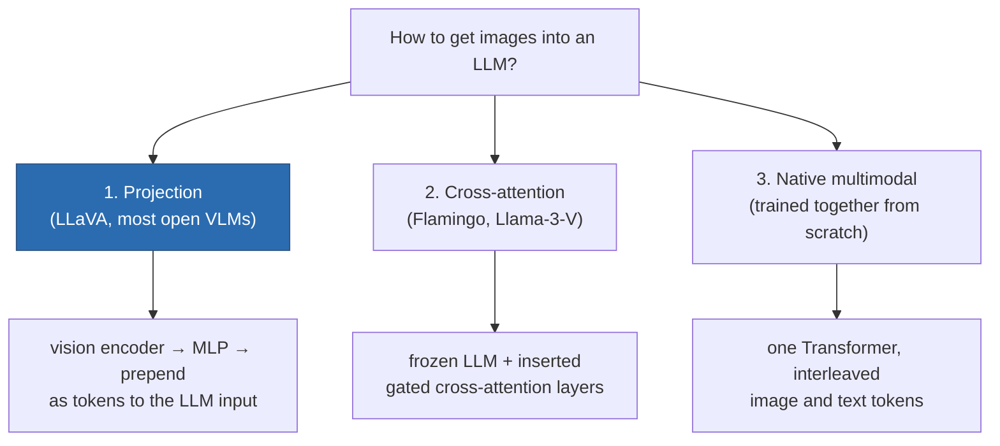

# Vision and Multimodal Models

> **Summary** — How images get into and out of Transformers: the Vision Transformer's patch
> embedding, CLIP's contrastive training that created a shared image–text space, the three
> architectural patterns for vision-language models, and how video and audio generation extend
> the same machinery. Also: why multimodal models still fail at spatial reasoning and counting.

**Prerequisites**: → [The Transformer](../03-sequence-models/04-transformer.md), → [Latent diffusion](03-latent-diffusion.md) · **Next**: → [Audio & speech generation](06-audio-and-speech.md)

---

## 1. Vision Transformer: images as sequences

```
   224×224×3 image
        │
        ▼  split into 16×16 patches
   ┌──┬──┬──┬──┐
   │  │  │  │  │   (224/16)² = 196 patches
   ├──┼──┼──┼──┤
   │  │  │  │  │   each patch: 16×16×3 = 768 values
   ├──┼──┼──┼──┤
   │  │  │  │  │
   └──┴──┴──┴──┘
        │
        ▼  linear projection (768 → d)
   [CLS] p₁ p₂ p₃ ... p₁₉₆     ← a sequence of 197 tokens
        + positional embeddings
        │
        ▼
   standard Transformer encoder
```

> [!TIP]
> **The whole trick is the first line: treat patches as tokens.** ViT contains no convolutions and
> no vision-specific inductive bias — no translation equivariance, no locality prior. Dosovitskiy et
> al.'s finding was that at sufficient data scale (300M+ images), the model *learns* these biases
> and surpasses CNNs. Below that scale, CNNs win because their built-in priors substitute for data.

**Patch size is the central trade-off**:

| Patch size | Tokens (224²) | Attention cost | Detail |
|---|---|---|---|
| 32 | 49 | 2.4 K pairs | coarse |
| **16** | **196** | 38 K pairs | **standard** |
| 14 | 256 | 66 K pairs | better (CLIP ViT-L/14) |
| 8 | 784 | 614 K pairs | expensive |

> [!WARNING]
> **The resolution problem.** Positional embeddings are learned for a fixed grid, so feeding a
> different resolution requires interpolating them (standard practice, works reasonably) or using
> native-resolution designs (NaViT packs variable-resolution images into one sequence; many modern
> VLMs tile large images into fixed-size crops plus a downsampled overview).

---

## 2. CLIP: a shared embedding space

```
   "a photo of a dog"                      🐕 image
          │                                    │
    ┌─────▼──────┐                      ┌──────▼─────┐
    │Text encoder│                      │Image encoder│
    │(Transformer│                      │   (ViT)     │
    └─────┬──────┘                      └──────┬──────┘
          ▼                                    ▼
      t ∈ R^512  ◄─── pull together ───►   i ∈ R^512
                      (if they match)
                      push apart otherwise
```

**The contrastive (InfoNCE) loss** over a batch of $N$ image–text pairs:

$$\mathcal{L} = -\frac{1}{2N}\sum_{k=1}^{N}\left[
\log\frac{\exp(i_k\cdot t_k/\tau)}{\sum_{j}\exp(i_k\cdot t_j/\tau)}
+ \log\frac{\exp(i_k\cdot t_k/\tau)}{\sum_{j}\exp(i_j\cdot t_k/\tau)}\right]$$

Symmetric: image→text and text→image. $\tau$ is a **learned** temperature (typically converging to
~0.01).

```
   Similarity matrix for a batch of 4:

              t₁   t₂   t₃   t₄
         i₁ [ ██ | ░░ | ░░ | ░░ ]      diagonal = matching pairs
         i₂ [ ░░ | ██ | ░░ | ░░ ]      → maximize
         i₃ [ ░░ | ░░ | ██ | ░░ ]      off-diagonal = mismatches
         i₄ [ ░░ | ░░ | ░░ | ██ ]      → minimize

   Softmax over each row AND each column.
```

**Batch size is critical.** InfoNCE's MI bound is capped at $\log N$
(→ [Probability & information theory §6](../01-foundations/02-probability-and-information-theory.md#6-mutual-information)),
and more negatives means a harder, more informative task. CLIP used **32,768**. Small-batch
contrastive training is measurably worse.

**What CLIP enabled:**

| Capability | How |
|---|---|
| **Zero-shot classification** | embed "a photo of a {class}" for each class; pick the nearest |
| **Text→image retrieval** | nearest neighbour in the shared space |
| **Conditioning for generation** | the text encoder in SD 1.x/SDXL |
| **CLIPScore** | an automatic image–text alignment metric |
| Guidance | steer generation toward a CLIP direction |

> [!WARNING]
> **CLIP's well-documented weaknesses:**

| Failure | Example |
|---|---|
| **Compositionality** | "a red cube on a blue sphere" ≈ "a blue cube on a red sphere" |
| **Counting** | cannot reliably distinguish 3 from 4 objects |
| Spatial relations | "left of", "above" are poorly represented |
| Negation | "a photo without a dog" retrieves dogs |
| Typographic attacks | text in the image overrides visual content ("iPod" label on an apple) |

> [!TIP]
> **Why**: contrastive training pushes toward a *bag-of-concepts* representation. If "red", "blue",
> "cube" and "sphere" are all present, the image matches — nothing in the objective forces the model
> to bind attributes to objects. This is precisely why generation systems moved to T5-based
> conditioning. → [Latent diffusion §2](03-latent-diffusion.md#2-text-conditioning-via-cross-attention)

SigLIP replaces the softmax with a pairwise sigmoid loss, removing the need for a global
normalization across the batch — which means it works well at much smaller batch sizes and trains
more efficiently. It is now a common CLIP replacement.

---

## 3. Vision-language models: the three patterns



### Pattern 1: Projection (LLaVA-style): the dominant open approach

```
   image ──► [CLIP/SigLIP ViT] ──► 576 patch embeddings
                                        │
                                   ┌────▼────┐
                                   │ MLP     │  ← the ONLY new parameters
                                   │ proj    │     in stage 1
                                   └────┬────┘
                                        ▼
   "What is in this image?" ──► [v₁...v₅₇₆, t₁...tₙ] ──► LLM ──► answer
                                 image tokens treated exactly like text tokens
```

**Training in two stages:**
1. **Alignment**: freeze the vision encoder and the LLM; train *only* the projector on
   image–caption pairs. Teaches the projector to speak the LLM's embedding language.
2. **Instruction tuning**: unfreeze the LLM (and sometimes the encoder); train on visual
   instruction data.

**Remarkably cheap.** LLaVA-1.5 trains in about **1 day on a single 8×A100 node**, using
1.2M publicly available samples, on top of existing components
([Liu et al. 2023](https://arxiv.org/abs/2310.03744)). This is why nearly every open VLM uses this pattern.

> [!WARNING]
> **The cost**: 576 image tokens consume context, and for multiple images or video it becomes
> prohibitive. Mitigations: **token pooling/merging**, a Q-Former (BLIP-2) that resamples to a fixed
> 32 queries, or perceiver-style resamplers.

### Pattern 2: Cross-attention (Flamingo-style)

Keep the LLM frozen; insert **gated cross-attention** layers that attend to image features. The
gate is `tanh`-initialized to zero, so the model starts exactly as the original LLM — the same
zero-init trick as ControlNet.

- ✅ Preserves language ability perfectly; handles interleaved image–text sequences naturally.
- ⚠️ More new parameters; more complex.

### Pattern 3: Native multimodal

Train one Transformer on interleaved text and image tokens from scratch, often with both
understanding *and* generation objectives (image tokens from a VQ-VAE, or continuous patches with
a diffusion head).

- ✅ Best integration, enables true any-to-any generation.
- ⚠️ Vastly more expensive; you cannot reuse an existing LLM.

**The trend is toward pattern 3** for frontier models, with pattern 1 remaining dominant in
open-source because it is so cheap.

---

## 4. Video generation

Video = images + time. The additional problems are **temporal consistency** and **cost**.

5 seconds at 24 fps = 120 frames. At $512\times512$ that is $120 \times 262{,}144 = 31$ M pixels.
With an 8× spatial + 4× temporal VAE compression: $30\times64\times64\times16 = 1.97$ M latent
values — still a very large sequence.

| Approach | Method |
|---|---|
| **Spatio-temporal VAE** | compress in space *and* time (e.g. 8×8×4) before diffusing |
| **3-D / factorized attention** | spatial attention within frames + temporal attention across them |
| **Full 3-D attention** | DiT over all space-time patches — best quality, highest cost |
| Cascaded generation | keyframes first, then interpolate |
| Autoregressive over latents | generate frame latents sequentially; good for long/streaming video |

> [!TIP]
> **The factorized attention pattern** is the workhorse: alternate a spatial attention block
> (each frame attends within itself) with a temporal one (each spatial position attends across
> frames). Cost drops from $O((HWT)^2)$ to $O(HW\cdot(HW + T^2))$ — the difference between feasible
> and not.

**What's hard, and why:**

| Problem | Why |
|---|---|
| Temporal flicker | small per-frame differences compound; consistency is not directly supervised |
| **Object permanence** | occluded objects reappear changed — the model has no explicit object representation |
| Physics | fluids, collisions, gravity are learned statistically, not simulated |
| Long-range coherence | attention over thousands of frames is infeasible; drift accumulates |
| Data | high-quality captioned video is far scarcer than images |

> [!TIP]
> **The "world model" claim** — some argue that video models trained at scale learn implicit
> physics. The evidence is mixed: models produce plausible short clips but violate conservation laws,
> object permanence and causality under mild stress-testing. The honest reading is that they have
> learned strong *visual priors about how scenes tend to look over time*, which is genuinely useful
> and is not the same as a physics engine.

---

## 5. Audio generation

Two families, mirroring the discrete/continuous split from → [Taxonomy](../01-foundations/06-taxonomy.md):

### Discrete: neural codec plus language model

```
   waveform (24 kHz)
        │
   ┌────▼─────┐
   │ EnCodec /│   residual vector quantization:
   │SoundStream│   multiple codebooks, each refining the previous
   └────┬─────┘
        ▼
   ~75 tokens/second × 8 codebooks
        │
   ┌────▼──────────────┐
   │ Transformer LM    │  ← generate tokens autoregressively,
   │ over audio tokens │    conditioned on text
   └────┬──────────────┘
        ▼
   decode back to a waveform
```

**The compression**: 24 kHz × 16 bits = 384 kbps raw → ~6 kbps as tokens, a **64× reduction**,
with a sequence length that a Transformer can handle. This is MusicGen, VALL-E, AudioLM and most
music generation.

> [!TIP]
> **Residual VQ** is the key component: quantize, then quantize the *residual error*, then quantize
> *that* residual, 8 times. Each codebook adds detail, giving far better reconstruction than a single
> huge codebook — and it gives a natural coarse-to-fine generation order.

### Continuous: diffusion or flow matching on spectrograms or waveforms

Used by many TTS systems (Voicebox uses flow matching). Better quality for speech, faster than
autoregressive, but less natural for streaming.

**Text-to-speech state**: near-human naturalness, voice cloning from a few seconds of reference
audio, controllable emotion and pacing. ⚠️ The voice-cloning capability is a genuine
misuse concern — → [Societal impact](../08-safety-and-ethics/03-societal-impact.md).

---

## 6. What multimodal models still get wrong

Persistent failure categories, with the mechanism:

| Failure | Example | Likely cause |
|---|---|---|
| **Counting** | "how many chairs?" fails past ~4 | patch tokens have no object-instance structure |
| **Spatial reasoning** | "is A left of B?" | contrastive pretraining discards spatial relations |
| **Fine detail / small text** | reading a distant sign | resolution lost at patch embedding |
| **Chart and diagram reading** | misreads axis values | requires precise spatial-numeric binding |
| **Negation** | "an image without a cat" | contrastive objectives don't model negation |
| **Hallucinated objects** | describes objects not present | the LLM's language prior overrides weak visual evidence |

> [!TIP]
> **Object hallucination is the most instructive failure.** The LLM has a strong prior: kitchens
> contain refrigerators. If the visual evidence is weak (low resolution, occluded, ambiguous), the
> prior wins and the model confidently describes a refrigerator that isn't there. This is the
> multimodal instance of the general hallucination mechanism — the model is doing exactly what
> next-token prediction asks, which is producing the *likely* description, not the *accurate* one.
> → [Safety](../08-safety-and-ethics/01-safety.md)

Mitigations that help: higher input resolution (the single biggest lever), tiling large images,
training on hard negatives, and grounding objectives that force the model to point at what it
describes.

---

## 7. Implementation

A minimal but complete LLaVA-style VLM:

```python
import torch, torch.nn as nn

class SimpleVLM(nn.Module):
    def __init__(self, vision_encoder, llm, vision_dim=1024, llm_dim=4096):
        super().__init__()
        self.vision = vision_encoder            # e.g. SigLIP ViT — often frozen
        self.llm    = llm
        # the projector: the only new parameters in stage-1 training
        self.proj = nn.Sequential(
            nn.Linear(vision_dim, llm_dim),
            nn.GELU(),
            nn.Linear(llm_dim, llm_dim),
        )

    def forward(self, images, input_ids, labels=None):
        # 1. encode the image -> (B, n_patches, vision_dim)
        with torch.no_grad():                   # frozen encoder in stage 1
            feats = self.vision(images).last_hidden_state[:, 1:]   # drop the CLS token

        # 2. project into the LLM's embedding space -> (B, n_patches, llm_dim)
        img_emb = self.proj(feats)

        # 3. embed the text and concatenate: image tokens become a prefix
        txt_emb = self.llm.get_input_embeddings()(input_ids)
        inputs  = torch.cat([img_emb, txt_emb], dim=1)

        # 4. labels must be padded with -100 over the image positions,
        #    so no loss is computed on them
        if labels is not None:
            pad = torch.full((labels.size(0), img_emb.size(1)), -100,
                             dtype=labels.dtype, device=labels.device)
            labels = torch.cat([pad, labels], dim=1)

        return self.llm(inputs_embeds=inputs, labels=labels)
```

> [!WARNING]
> **The `-100` padding over image positions is essential.** Without it, the model computes a
> language-modelling loss over image embeddings — which is meaningless and actively harmful. This is
> the visual analogue of the prompt-masking bug in
> → [PEFT §6](../04-large-language-models/04-finetuning-peft.md#6-the-data-is-what-actually-matters).

---

## 8. Exercises

**Problem 1 — patch count, a different resolution.** Using §1's method, compute the number of
patches for a $384\times384$ image with patch size 16. How does attention cost (roughly
quadratic in patch count) compare with §1's $224\times224$, patch-16 example (196 patches)?

<details markdown="1"><summary>Solution</summary>

$(384/16)^2 = 24^2 = 576$ patches (vs §1's 196 at $224\times224$).

Attention cost scales roughly as (patch count)$^2$: $576^2/196^2 = 331776/38416 \approx8.6\times$
more attention computation for the $384\times384$ image, even though the *linear* resolution only
increased by $384/224\approx1.71\times$ — a direct illustration of why higher-resolution ViT
inputs get expensive fast, and why §1's patch-size table frames the choice as a genuine
resolution/cost trade-off rather than "always use small patches for detail."

</details>

**Problem 2 — InfoNCE's batch-size ceiling, applied.** Using §2's $\log N$ mutual-information
bound, compare the maximum certifiable MI (in nats) for CLIP-style training at batch size
$N{=}1024$ versus $N{=}65{,}536$ (CLIP's actual batch size, per §2). Roughly how many *times*
larger a batch would you need beyond 65,536 to double the certifiable-MI ceiling?

<details markdown="1"><summary>Solution</summary>

$\log(1024)=6.93$ nats; $\log(65536)=11.09$ nats — batch size 64× larger yields a ceiling only
$11.09/6.93=1.60\times$ higher, because the bound grows **logarithmically**, not linearly, in $N$.

To *double* the ceiling from 11.09 to 22.18 nats, you'd need $N=e^{22.18}\approx4.3\times10^9$ —
**over 65,000× larger** than CLIP's actual batch size. This is a sharp illustration of why §2's
"→ [Probability & information theory §6]" cross-reference matters: batch size has rapidly
diminishing returns on the MI ceiling, which is part of why practical contrastive training
settled on batch sizes in the tens of thousands rather than continuing to scale batch size
indefinitely — the ceiling moves too slowly to justify the cost past a point.

</details>

**Problem 3 — the three VLM patterns, applied.** A startup wants to add basic image
understanding to an existing, well-tuned 70B chat LLM, with a total compute budget of roughly one
GPU-day and a strong preference not to touch the LLM's existing weights or degrade its language
quality. Using §3's three patterns, which should they choose, and what's the specific mechanism
that satisfies "don't touch/degrade the existing weights"?

<details markdown="1"><summary>Solution</summary>

**Pattern 2 (cross-attention, Flamingo-style)** is the best match specifically for the "don't
touch or degrade the LLM" requirement: §3 states this pattern "preserves language ability
perfectly" because the gated cross-attention layers are zero-tanh-initialized, so at the start of
training the augmented model is mathematically identical to the original frozen LLM, and training
only ever *adds* new capability rather than risking disruption of existing weights (the LLM's own
parameters stay frozen throughout).

Pattern 1 (projection, LLaVA-style) is cheaper (§3: "~1 GPU-day" matches the stated budget almost
exactly, referencing → [multimodal §3](05-multimodal.md#3-vision-language-models-the-three-patterns)'s
own LLaVA-1.5 citation) but its second stage typically *unfreezes the LLM*, which risks exactly
the language-quality degradation the team wants to avoid. Given the explicit "strong preference"
stated, pattern 2's frozen-LLM guarantee is worth its added complexity over pattern 1's raw cost
advantage — though if the 1-GPU-day budget is a hard constraint (not just a rough target) and
some quality risk is tolerable, pattern 1 with the LLM kept frozen throughout (not just in stage
1) would be the practical fallback.

</details>

## 9. Key takeaways

| # | Takeaway |
|---|---|
| 1 | ViT treats 16×16 patches as tokens; it has no vision-specific inductive bias and needs scale to compensate. |
| 2 | CLIP aligns image and text in one space via symmetric InfoNCE; large batches are essential ($\log N$ bound). |
| 3 | CLIP is a bag-of-concepts model: it fails at composition, counting, spatial relations and negation. |
| 4 | SigLIP's sigmoid loss removes the global batch normalization and works at smaller batch sizes. |
| 5 | Three VLM patterns: projection (cheap, dominant in open source), cross-attention, native multimodal. |
| 6 | Image tokens consume context — resampling/pooling is necessary for multi-image and video. |
| 7 | Video uses spatio-temporal compression + factorized attention; object permanence and physics remain unsolved. |
| 8 | Audio splits the same way: neural codec + LM (discrete) or diffusion/flow (continuous). |
| 9 | Object hallucination happens when the language prior overrides weak visual evidence; resolution is the biggest lever. |
| 10 | Mask the loss over image token positions (`-100`) — a common and silent bug. |

---

## Further reading

- Dosovitskiy et al., [*An Image is Worth 16x16 Words*](https://arxiv.org/abs/2010.11929) (ViT, 2020).
- Radford et al., [*Learning Transferable Visual Models From Natural Language Supervision*](https://arxiv.org/abs/2103.00020) (CLIP, 2021).
- Zhai et al., [*Sigmoid Loss for Language Image Pre-Training*](https://arxiv.org/abs/2303.15343) (SigLIP, 2023).
- Liu et al., [*Visual Instruction Tuning*](https://arxiv.org/abs/2304.08485) (LLaVA, 2023); Li et al., [*BLIP-2*](https://arxiv.org/abs/2301.12597) (2023).
- Alayrac et al., [*Flamingo*](https://arxiv.org/abs/2204.14198) (2022).
- Yu et al., *SoundStream* (2021); Défossez et al., [*EnCodec*](https://arxiv.org/abs/2210.13438) (2022); Copet et al., [*MusicGen*](https://arxiv.org/abs/2306.05284) (2023).
- Thrush et al., [*Winoground*](https://arxiv.org/abs/2204.03162) (2022) — the compositionality failure, measured.
- Li et al., [*Evaluating Object Hallucination in Large Vision-Language Models*](https://arxiv.org/abs/2305.10355) (POPE, 2023).

**Next** → [Audio & speech generation](06-audio-and-speech.md)
