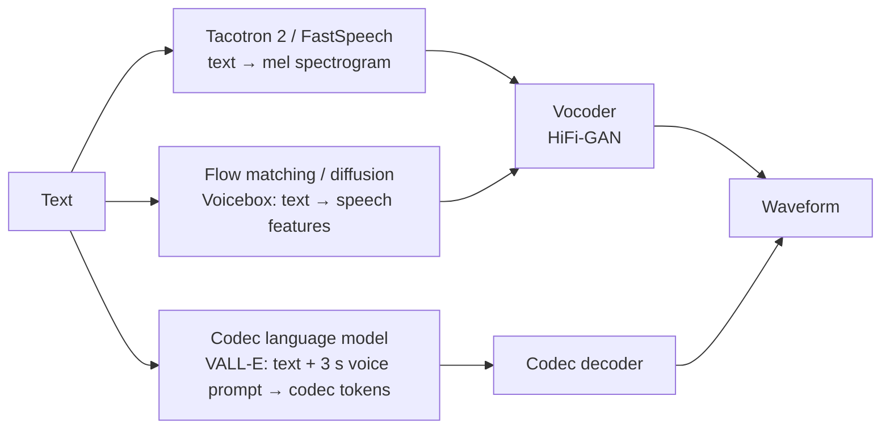

# Audio and Speech Generation

> **Summary**: Audio is the hardest common modality to generate directly: a single second of
> speech is tens of thousands of samples. Every successful system works around that by
> generating a much shorter representation (a spectrogram, or tokens from a neural codec) and
> converting it back to sound at the end. This page covers audio representations, vocoders,
> neural codecs and their token arithmetic, the main text-to-speech and music architectures, and
> how generated audio is evaluated.

**Prerequisites**: → [Vision & multimodal models](05-multimodal.md), → [VAE §7: VQ-VAE](../02-classical-models/02-vae.md#7-vq-vae-discrete-latents) · **Next**: Part VI → [Prompt engineering](../06-applications/01-prompt-engineering.md)

---

## 1. Why raw audio is hard

Sound is a pressure wave, recorded as samples of amplitude over time.

| Audio | Samples per second | Samples in 10 seconds |
|---|---|---|
| Telephone | 8,000 | 80,000 |
| Speech models (typical) | 16,000–24,000 | 160,000–240,000 |
| Music / CD quality | 44,100 | 441,000 |

**Worked example.** Ten seconds of 24 kHz audio is 240,000 samples. A Transformer with full
attention over that sequence would build a $240{,}000^2 \approx 5.8\times10^{10}$-entry attention
matrix per head per layer. An autoregressive model generating one sample per forward pass would
need 240,000 sequential steps. Neither is practical, which is why WaveNet, the first high-quality
raw-audio model, needed minutes to produce seconds of speech
(→ [Autoregressive models §5](../02-classical-models/01-autoregressive-models.md#5-pixelcnn-and-wavenet-ar-beyond-text)).

> [!TIP]
> **The pattern every audio system follows.** Don't generate the waveform directly. Generate a
> short, information-dense representation, then use a separate, fast model to turn it into sound.
> It is the same split as latent diffusion for images: one model decides *what*, another handles
> the fine detail.

---

## 2. Representations

```
  WAVEFORM (what you hear)          MEL SPECTROGRAM (what the model sees)

  amplitude                          frequency (mel bins, low → high)
     │ ╱╲    ╱╲  ╱╲                    80 ┤ ░░▒▒░░    ░░▓▓░░
     │╱  ╲  ╱  ╲╱  ╲╱╲                    ┤ ░▒▓▓▒░  ░░▒▓▓▓▒░
     ┼────╲╱────────── time            40 ┤▒▓██▓▒░░▒▓███▓▒░░
     │                                    ┤▓███▓▓▒▓████▓▓▒▒
   24,000 values per second            0 ┼─────────────────── time
                                        ~94 frames per second, 80 values each
```

| Representation | What it is | Rate | Used for |
|---|---|---|---|
| **Waveform** | raw samples | 16–48k values/s | final output |
| **Spectrogram** | energy per frequency per short window (STFT magnitude) | ~100 frames/s × ~500 bins | analysis |
| **Mel spectrogram** | spectrogram on a perceptual (mel) frequency scale, ~80 bins | ~100 frames/s × 80 | classic TTS, ASR input |
| **Codec tokens** | discrete codes from a neural audio codec | 50–75 frames/s × a few codebooks | modern speech and music LMs |

**Worked example: mel frames.** At 24 kHz with a hop of 256 samples between windows, you get
$24{,}000 / 256 \approx 94$ frames per second. With 80 mel bins, one second becomes a
$94 \times 80$ grid: 7,500 numbers instead of 24,000, and far more structured.

**Why mel?** Human hearing resolves low frequencies finely and high frequencies coarsely. The mel
scale spaces bins the same way, so model capacity goes where listeners notice differences.

**What a spectrogram throws away.** A magnitude spectrogram drops the *phase* of each frequency
component. Phase matters for sound quality, and recovering it is exactly the job of a vocoder.

---

## 3. Vocoders: from spectrogram back to sound

A vocoder generates the waveform conditioned on a spectrogram.

| Vocoder | Year | Approach | Speed |
|---|---|---|---|
| Griffin-Lim | 1984 | iterative phase estimation, no learning | fast, audibly metallic |
| WaveNet | 2016 | autoregressive over samples | far slower than real time |
| WaveGlow | 2018 | normalizing flow, parallel | real time on a GPU |
| **HiFi-GAN** | 2020 | GAN with multi-scale and multi-period discriminators | **much faster than real time, high quality** |
| Diffusion / flow vocoders | 2021+ | denoising conditioned on the spectrogram | good quality, several steps |

> [!TIP]
> **Why GANs survive here.** A vocoder's job is tightly constrained: the spectrogram already fixes
> most of the content, so there is little risk of mode collapse and a single forward pass is
> enough. That is exactly where GANs shine
> (→ [GAN §7](../02-classical-models/03-gan.md#7-what-happened-to-gans)).

---

## 4. Neural audio codecs: audio as tokens

A neural codec is a VQ-VAE for sound: an encoder compresses the waveform into a short sequence of
frames, each frame is quantized to discrete codes, and a decoder reconstructs the waveform.

The key technique is **residual vector quantization (RVQ)**. Quantize the frame with one codebook,
then quantize what's left over (the residual) with a second, then the residual of that with a
third, and so on:

```
  frame vector e  ──► codebook 1 ──► code c₁, approximation q₁
                      residual r₁ = e − q₁
                  ──► codebook 2 ──► code c₂, approximation q₂ of r₁
                      residual r₂ = r₁ − q₂
                  ──► ...
  reconstruction ≈ q₁ + q₂ + ... + q_K         each extra codebook adds finer detail
```

Early codebooks carry the coarse content (what was said, the melody); later ones carry fine detail
(timbre, room acoustics). Dropping codebooks lowers the bitrate gracefully instead of breaking the
audio.

**Worked example: the bitrate.** EnCodec at 24 kHz produces 75 frames per second (a stride of 320
samples), with codebooks of 1,024 entries, which is 10 bits per code. Using 8 codebooks:

$$75\ \tfrac{\text{frames}}{\text{s}} \times 8\ \text{codes} \times 10\ \text{bits} = 6{,}000\ \text{bits/s} = 6\ \text{kbps}$$

The raw 16-bit audio is $24{,}000 \times 16 = 384$ kbps, so this is a **64× compression**, and the
result is a token sequence of 75 frames per second instead of 24,000 samples.

| Codec | Sample rate | Frame rate | Codebooks × size | Used by |
|---|---|---|---|---|
| SoundStream (2021) | 24 kHz | 75 Hz | RVQ, variable | AudioLM |
| EnCodec (2022) | 24 kHz | 75 Hz | up to 32 × 1,024 | VALL-E |
| EnCodec, MusicGen setup | 32 kHz | 50 Hz | 4 × 2,048 | MusicGen |

**Worked example: MusicGen's setup.** $50 \times 4 \times 11$ bits (2,048 = 2¹¹) = 2,200 bits/s.
Thirty seconds of music becomes $30 \times 50 = 1{,}500$ frames of 4 codes each: a sequence length
a Transformer handles comfortably.

---

## 5. Text-to-speech architectures



| Generation | Example | How it works | Strength | Weakness |
|---|---|---|---|---|
| **Two-stage, autoregressive** | Tacotron 2 (2018) | attention-based seq2seq predicts mel frames one at a time | natural prosody | slow; can skip or repeat words |
| **Two-stage, parallel** | FastSpeech (2019) | predicts each phoneme's duration, then all mel frames at once | fast, robust | flatter prosody |
| **Codec language model** | VALL-E (2023) | TTS as language modelling over codec tokens | clones a voice from a short prompt | autoregressive latency; occasional word errors |
| **Flow matching / diffusion** | Voicebox (2023) | generates speech by in-filling masked audio | fast, flexible editing | needs duration alignment |

**VALL-E, in its own words:** it treats TTS as "conditional language modeling" over "discrete codes
derived from an off-the-shelf neural audio codec", trained on 60K hours of English speech, and can
imitate an unseen speaker from "only a 3-second enrolled recording".

> [!TIP]
> **Why codec language models took over.** Once audio is tokens, speech generation becomes the
> same problem as text generation, and everything built for LLMs (Transformers, in-context
> prompting, scaling) transfers. A 3-second clip of a voice is just a prompt the model continues
> in the same voice.

**The delay pattern.** With $K$ codebooks per frame, a model could predict the $K$ codes of each
frame one after another, but that multiplies the sequence length by $K$. MusicGen instead offsets
each codebook by one step, so at every step the model predicts codebook 1 for the current frame,
codebook 2 for the previous frame, and so on. All $K$ streams advance together in roughly one
step per frame.

---

## 6. Music and general audio

| System | Idea |
|---|---|
| **AudioLM** (2022) | two token levels: *semantic* tokens from a self-supervised speech model for long-range structure, then *acoustic* codec tokens for detail |
| **MusicGen** (2023) | one Transformer over 4 EnCodec codebooks with the delay pattern; conditioned on text or melody |
| Latent diffusion for audio | diffuse in the latent space of an audio autoencoder, as Stable Diffusion does for images |

**The hierarchy idea behind AudioLM** is worth keeping in mind generally. Coherence over tens of
seconds (a melody returning, a sentence finishing) and fidelity within milliseconds (the texture of
a violin) need different things. Modelling them at separate levels, coarse first, is a recurring
solution across modalities.

---

## 7. The reverse direction: speech recognition

Automatic speech recognition (ASR) is generation too: generate text conditioned on audio.
**Whisper** is an encoder-decoder Transformer: log-mel spectrogram in, text tokens out, trained on
"680,000 hours of multilingual and multitask supervision" gathered from the web. Its value is
robustness: trained on messy real-world audio, it transfers across accents, noise and languages
without fine-tuning.

---

## 8. Evaluation

| Metric | Measures | Notes |
|---|---|---|
| **MOS** (mean opinion score) | human rating of naturalness, 1–5 | the gold standard; expensive and noisy |
| **WER of an ASR model on the output** | intelligibility: were the right words spoken? | automatic; catches skipped or repeated words |
| **Speaker similarity** | cosine similarity of speaker embeddings | for voice cloning |
| **FAD** (Fréchet Audio Distance) | FID's audio counterpart: distance between embedding distributions | for music and general audio |

> [!WARNING]
> **Automatic metrics miss prosody.** Speech can have a perfect WER and high speaker similarity
> while sounding flat, rushed or oddly stressed. For anything user-facing, listening tests remain
> necessary.

---

## 9. Voice cloning and misuse

Cloning a voice from seconds of audio creates direct risks: impersonation scams, fraudulent
authorization of payments, and non-consensual use of someone's voice
(→ [Societal impact §5](../08-safety-and-ethics/03-societal-impact.md#5-synthetic-media-and-provenance)).

Mitigations used in practice:

- consent checks before cloning a voice
- audio watermarking of generated speech
- restricting zero-shot cloning to verified voices
- detection classifiers, which are useful but not reliable against a determined adversary

---

## 10. Exercises

**Problem 1 — mel frame rate, a different setup.** Using §2's method, compute the frame rate for
16 kHz audio with a hop of 200 samples. How does this compare with §2's own 24 kHz/256-hop
example (93.75 fps), and does a *lower* sample rate with a *smaller* hop necessarily mean a
higher or lower frame rate?

<details markdown="1"><summary>Solution</summary>

$16000/200 = 80.0$ fps — **lower** than §2's 93.75 fps example, even though the hop is smaller
(200 vs 256, which alone would push frame rate *up*). The reason: sample rate dropped
proportionally *more* (16000/24000$=0.667\times$) than hop dropped (200/256$=0.781\times$), and
frame rate is the *ratio* of these two, so the net effect is a lower frame rate here
($0.667/0.781=0.854\times$ the original, matching $80/93.75=0.853$ ✓). There's no fixed
directional rule — frame rate depends on the *ratio* of sample rate to hop size, so you have to
compute it, not guess from either number in isolation.

</details>

**Problem 2 — codec bitrate, a smaller setup.** Using §4's RVQ bitrate formula, compute the
bitrate for a codec at 50 fps with 6 codebooks of size 1024 each. Compare the resulting
compression ratio against raw 16-bit, 16kHz audio (256 kbps) with §4's own EnCodec example (64×
at 24kHz/6kbps).

<details markdown="1"><summary>Solution</summary>

Bits/code $=\log_2(1024)=10$. Bitrate $=50\times6\times10=3000$ bits/s $=3.0$ kbps.

Raw 16-bit, 16kHz: $16000\times16=256{,}000$ bps $=256$ kbps.

Compression ratio: $256/3=85.3\times$ — **higher** compression than §4's EnCodec example (64×),
mainly because this setup uses fewer codebooks (6 vs 8) at a lower frame rate (50 vs 75 fps) while
also compressing from a lower raw bitrate (256 vs 384 kbps for 24kHz) — fewer bits spent per
second of *encoded* audio, applied to a *smaller* amount of raw information to begin with,
compounding into a higher ratio. This illustrates that "compression ratio" depends on the raw
format you're comparing against, not just the codec's own bitrate — always state both sides of
the ratio explicitly, exactly as §4's worked example does.

</details>

**Problem 3 — why codec LMs need no KV-cache-breaking innovation, reasoned.** §5 explains the
delay pattern lets one Transformer handle $K$ codebooks without multiplying sequence length by
$K$. Using that mechanism, explain why a codec-token language model (like the TTS architecture in
§5) *can* still use a standard KV cache during generation — unlike the diffusion language model
described elsewhere in this wiki
(→ [Diffusion LMs §5](../04-large-language-models/11-diffusion-language-models.md#5-sampling)),
which explicitly cannot.

<details markdown="1"><summary>Solution</summary>

A codec-token LM (even with the delay pattern interleaving multiple codebook streams) is still
fundamentally **autoregressive left-to-right**: once a codebook's code is emitted at a given
position, it is *never revised* — exactly the property that makes KV caching valid (per
→ [Attention §7](../03-sequence-models/03-attention.md#7-mqa-and-gqa-shrinking-the-kv-cache) and
→ [Diffusion LMs §5](../04-large-language-models/11-diffusion-language-models.md#5-sampling)'s
own contrast): the keys and values for already-generated positions never need to be recomputed,
because the tokens at those positions are permanently fixed the moment they're generated. The
delay pattern only changes *which* codebook's code is being predicted at each step, not the
fact that generation still proceeds strictly forward through time with no revision.

A masked diffusion LM, by contrast, can change *any* previously-masked or even previously-filled
position at a later denoising step (per its own §5) — so the keys/values computed for a position
at one step may no longer be valid once that position's value changes at a later step, which is
exactly why standard KV caching doesn't carry over and why caching schemes for diffusion LMs
remain "an active research area" as that page notes.

</details>

## 11. Key takeaways

| # | Takeaway |
|---|---|
| 1 | Raw audio is tens of thousands of samples per second; nobody generates it directly at scale. |
| 2 | Generate a compact representation (mel spectrogram or codec tokens), then decode it to sound. |
| 3 | A mel spectrogram is ~94 frames/s × 80 bins at 24 kHz; it drops phase, which the vocoder restores. |
| 4 | HiFi-GAN vocoders are fast because the spectrogram already fixes most of the content. |
| 5 | Neural codecs use residual VQ: each codebook quantizes the leftover error of the previous ones. |
| 6 | EnCodec at 6 kbps is 75 frames/s × 8 codes × 10 bits: 64× smaller than raw 16-bit audio. |
| 7 | Once audio is tokens, TTS becomes language modelling: VALL-E clones a voice from a 3-second prompt. |
| 8 | MusicGen's delay pattern lets one Transformer handle several codebooks without multiplying sequence length. |
| 9 | Evaluate with MOS plus automatic WER and speaker similarity; automatic metrics miss prosody. |

---

## Further reading

- van den Oord et al., [*WaveNet: A Generative Model for Raw Audio*](https://arxiv.org/abs/1609.03499) (2016).
- Shen et al., *Natural TTS Synthesis by Conditioning WaveNet on Mel Spectrogram Predictions* (Tacotron 2, 2018).
- Ren et al., *FastSpeech: Fast, Robust and Controllable Text to Speech* (2019).
- Kong et al., *HiFi-GAN: Generative Adversarial Networks for Efficient and High Fidelity Speech Synthesis* (2020).
- Zeghidour et al., *SoundStream: An End-to-End Neural Audio Codec* (2021).
- Défossez et al., *High Fidelity Neural Audio Compression* (EnCodec, 2022).
- Borsos et al., *AudioLM: a Language Modeling Approach to Audio Generation* (2022).
- Wang et al., *Neural Codec Language Models are Zero-Shot Text to Speech Synthesizers* (VALL-E, 2023).
- Le et al., *Voicebox: Text-Guided Multilingual Universal Speech Generation at Scale* (2023).
- Copet et al., *Simple and Controllable Music Generation* (MusicGen, 2023).
- Radford et al., *Robust Speech Recognition via Large-Scale Weak Supervision* (Whisper, 2022).

**Next** → Part VI: [Prompt engineering](../06-applications/01-prompt-engineering.md)
