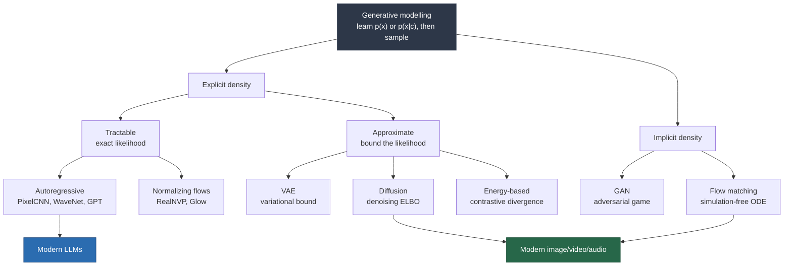

---
hide:
  - navigation
---

<!-- AUTO-GENERATED from README.md by scripts/sync_index.py. Do not edit. -->

# The Generative AI Wiki

A reference on generative models for students of AI and ML: the math, the models, and how
they are used in practice. 50 articles, each with intuition, derivations, worked examples and code.

New here? Start with [What is generative AI?](01-foundations/01-what-is-generative-ai.md), or follow the [study roadmap](09-reference/05-roadmap.md).

## The field at a glance

Every generative model learns something close to the data distribution and samples from it.
The families differ in how they handle the likelihood. See [the taxonomy](01-foundations/06-taxonomy.md) for the full comparison.

## Foundations

- **Start here**
    - [What is generative AI?](01-foundations/01-what-is-generative-ai.md)
    - [Generative vs discriminative](01-foundations/01-what-is-generative-ai.md#1-the-core-distinction)
    - [The curse of dimensionality](01-foundations/01-what-is-generative-ai.md#2-why-modelling-px-is-hard-the-curse-of-dimensionality)
    - [The generative trilemma](01-foundations/01-what-is-generative-ai.md#4-the-generative-trilemma)
    - [Why now: compute, data, architecture](01-foundations/01-what-is-generative-ai.md#5-why-now-the-three-factor-explanation)
    - [Emergence, or the lack of it](01-foundations/01-what-is-generative-ai.md#8-emergence-or-the-lack-of-it)
    - [Study roadmap](09-reference/05-roadmap.md)
- **Probability and information**
    - [Entropy](01-foundations/02-probability-and-information-theory.md#2-entropy-the-cost-of-describing-a-random-variable)
    - [Cross-entropy](01-foundations/02-probability-and-information-theory.md#3-cross-entropy-what-you-actually-optimize)
    - [KL divergence (forward vs reverse)](01-foundations/02-probability-and-information-theory.md#4-kl-divergence-the-excess-cost-of-being-wrong)
    - [Perplexity](01-foundations/02-probability-and-information-theory.md#5-perplexity-cross-entropy-in-disguise)
    - [Mutual information](01-foundations/02-probability-and-information-theory.md#6-mutual-information)
    - [The ELBO](01-foundations/02-probability-and-information-theory.md#7-the-elbo-what-to-do-when-the-likelihood-is-intractable)
    - [Gaussian closed forms](01-foundations/02-probability-and-information-theory.md#8-gaussians-the-closed-forms-you-will-use-constantly)
    - [Softmax and temperature](01-foundations/02-probability-and-information-theory.md#9-the-softmax-and-its-temperature)
    - [Gradient estimators](01-foundations/02-probability-and-information-theory.md#10-monte-carlo-estimation-and-the-two-gradient-estimators)
- **Math toolkit**
    - [Tensor shapes](01-foundations/03-math-toolkit.md#1-shapes-the-thing-that-actually-causes-bugs)
    - [Matrix calculus](01-foundations/03-math-toolkit.md#2-matrix-calculus-the-six-rules-you-need)
    - [Change of variables](01-foundations/03-math-toolkit.md#3-jacobians-and-the-change-of-variables-formula)
    - [High-dimensional geometry](01-foundations/03-math-toolkit.md#4-high-dimensional-geometry-why-your-intuition-is-wrong)
    - [SVD and low rank](01-foundations/03-math-toolkit.md#5-svd-and-low-rank-structure-the-math-behind-lora)
    - [Numerical precision](01-foundations/03-math-toolkit.md#8-numerical-precision-the-practical-constraint)
- **Neural networks**
    - [Backpropagation by hand](01-foundations/04-neural-network-refresher.md#2-backpropagation-worked-by-hand)
    - [Activations: GELU, SwiGLU](01-foundations/04-neural-network-refresher.md#3-activation-functions)
    - [LayerNorm, RMSNorm, pre-norm](01-foundations/04-neural-network-refresher.md#4-normalization)
    - [Residual connections](01-foundations/04-neural-network-refresher.md#5-residual-connections)
    - [Initialization](01-foundations/04-neural-network-refresher.md#6-initialization)
    - [Regularization](01-foundations/04-neural-network-refresher.md#7-regularization-what-survives-at-scale)
- **Optimization**
    - [From SGD to AdamW](01-foundations/05-optimization.md#1-the-optimizer-family-tree)
    - [Optimizer memory](01-foundations/05-optimization.md#2-the-optimizer-memory-bill)
    - [Learning-rate schedules](01-foundations/05-optimization.md#3-learning-rate-schedules)
    - [Critical batch size](01-foundations/05-optimization.md#4-batch-size-and-the-critical-batch-size)
    - [Mixed precision](01-foundations/05-optimization.md#6-mixed-precision-training)
    - [Debugging loss spikes](01-foundations/05-optimization.md#7-loss-spikes-the-debugging-playbook)
- **The big picture**
    - [Taxonomy of generative models](01-foundations/06-taxonomy.md)
    - [Comparison table](01-foundations/06-taxonomy.md#2-the-master-comparison-table)
    - [How the families connect](01-foundations/06-taxonomy.md#4-the-connections-this-is-where-understanding-clicks)
    - [Which model for which data](01-foundations/06-taxonomy.md#5-why-each-modality-picked-what-it-picked)
    - [Decision guide](01-foundations/06-taxonomy.md#6-decision-guide)
- **Reinforcement learning**
    - [Why supervised learning isn't enough](01-foundations/07-reinforcement-learning.md#1-when-supervised-learning-isnt-enough)
    - [The policy-gradient theorem](01-foundations/07-reinforcement-learning.md#3-the-policy-gradient-theorem)
    - [Baselines and variance](01-foundations/07-reinforcement-learning.md#4-variance-and-why-baselines-fix-it)
    - [PPO](01-foundations/07-reinforcement-learning.md#6-ppo-small-safe-steps)
    - [Text generation as RL](01-foundations/07-reinforcement-learning.md#7-text-generation-as-an-rl-problem)

## Classical generative models

- **Autoregressive models**
    - [The chain rule](02-classical-models/01-autoregressive-models.md#1-the-idea-in-one-equation)
    - [Teacher forcing](02-classical-models/01-autoregressive-models.md#2-training-teacher-forcing)
    - [A bigram model by hand](02-classical-models/01-autoregressive-models.md#3-a-complete-worked-micro-example)
    - [PixelCNN and WaveNet](02-classical-models/01-autoregressive-models.md#5-pixelcnn-and-wavenet-ar-beyond-text)
    - [A GPT in 60 lines](02-classical-models/01-autoregressive-models.md#7-minimal-implementation)
- **Variational autoencoders**
    - [The ELBO in a VAE](02-classical-models/02-vae.md#2-the-elbo-and-what-each-half-wants)
    - [Reparameterization trick](02-classical-models/02-vae.md#3-the-reparameterization-trick)
    - [Why VAEs are blurry](02-classical-models/02-vae.md#4-the-loss-concretely)
    - [Posterior collapse](02-classical-models/02-vae.md#5-the-two-classic-failure-modes)
    - [VQ-VAE](02-classical-models/02-vae.md#7-vq-vae-discrete-latents)
    - [Where VAEs are used today](02-classical-models/02-vae.md#9-where-vaes-actually-live-today)
- **GANs**
    - [The minimax game](02-classical-models/03-gan.md#1-the-game)
    - [Optimal discriminator and JSD](02-classical-models/03-gan.md#2-theory-what-the-game-actually-optimizes)
    - [Mode collapse](02-classical-models/03-gan.md#3-why-gans-are-hard-the-four-structural-problems)
    - [Wasserstein GAN](02-classical-models/03-gan.md#4-wasserstein-gan-a-better-divergence)
    - [DCGAN to StyleGAN](02-classical-models/03-gan.md#5-the-architecture-lineage)
    - [Training recipe](02-classical-models/03-gan.md#6-practical-training-recipe)
- **Normalizing flows**
    - [Change of variables](02-classical-models/04-normalizing-flows.md#1-the-core-idea)
    - [Coupling layers](02-classical-models/04-normalizing-flows.md#3-affine-coupling-layers-realnvp)
    - [Limits of invertibility](02-classical-models/04-normalizing-flows.md#6-the-constraints-stated-honestly)
    - [Continuous flows](02-classical-models/04-normalizing-flows.md#8-continuous-normalizing-flows-the-bridge-to-modern-methods)
- **Energy-based models**
    - [The Boltzmann form](02-classical-models/05-energy-based-models.md#1-the-boltzmann-form)
    - [Contrastive divergence](02-classical-models/05-energy-based-models.md#4-contrastive-divergence-the-practical-hack)
    - [Langevin dynamics](02-classical-models/05-energy-based-models.md#3-sampling-langevin-dynamics)
    - [Score matching](02-classical-models/05-energy-based-models.md#5-score-matching-training-without-mcmc-at-all)

## Sequence models

- **Tokenization**
    - [BPE worked by hand](03-sequence-models/01-tokenization.md#2-byte-pair-encoding-worked-completely-by-hand)
    - [BPE, WordPiece, Unigram](03-sequence-models/01-tokenization.md#3-the-three-algorithms)
    - [Byte-level BPE](03-sequence-models/01-tokenization.md#4-byte-level-bpe-the-trick-that-removes-the-last-oov)
    - [The multilingual tax](03-sequence-models/01-tokenization.md#6-the-multilingual-tax)
    - [Failures caused by tokenization](03-sequence-models/01-tokenization.md#7-failure-modes-caused-by-tokenization)
- **Recurrent networks**
    - [Vanishing gradients](03-sequence-models/02-rnn-lstm-gru.md#2-backpropagation-through-time-and-the-vanishing-gradient)
    - [LSTM](03-sequence-models/02-rnn-lstm-gru.md#3-lstm-an-additive-memory-path)
    - [GRU](03-sequence-models/02-rnn-lstm-gru.md#4-gru-the-same-idea-cheaper)
    - [Why RNNs lost](03-sequence-models/02-rnn-lstm-gru.md#6-why-rnns-lost-the-decisive-table)
    - [State-space models and Mamba](03-sequence-models/02-rnn-lstm-gru.md#7-the-return-of-recurrence-state-space-models)
- **Attention**
    - [Queries, keys and values](03-sequence-models/03-attention.md#1-from-a-dictionary-to-attention)
    - [A full numeric trace](03-sequence-models/03-attention.md#2-a-complete-numeric-trace)
    - [Why divide by √d](03-sequence-models/03-attention.md#3-why-scale-the-scores-the-d-factor)
    - [Multi-head attention](03-sequence-models/03-attention.md#4-multi-head-attention)
    - [FlashAttention](03-sequence-models/03-attention.md#6-flashattention-never-materialize-the-matrix)
    - [MQA and GQA](03-sequence-models/03-attention.md#7-mqa-and-gqa-shrinking-the-kv-cache)
- **The Transformer**
    - [Encoder vs decoder](03-sequence-models/04-transformer.md#1-the-three-families)
    - [The block](03-sequence-models/04-transformer.md#2-the-block-in-detail)
    - [Counting parameters](03-sequence-models/04-transformer.md#3-parameter-counting-exactly)
    - [Counting FLOPs](03-sequence-models/04-transformer.md#4-flop-counting)
    - [2017 vs today](03-sequence-models/04-transformer.md#6-design-decisions-2017-vs-today)
    - [What it cannot do](03-sequence-models/04-transformer.md#9-what-the-transformer-cannot-do)
- **Positional encoding**
    - [Sinusoidal](03-sequence-models/05-positional-encoding.md#3-sinusoidal-encoding)
    - [ALiBi](03-sequence-models/05-positional-encoding.md#5-alibi-a-linear-bias-no-embeddings-at-all)
    - [RoPE](03-sequence-models/05-positional-encoding.md#6-rope-rotary-position-embedding)
    - [Extending the context window](03-sequence-models/05-positional-encoding.md#7-extending-the-context-window)

## Large language models

- **Architecture**
    - [The modern LLM](04-large-language-models/01-llm-architecture.md)
    - [Where memory goes](04-large-language-models/01-llm-architecture.md#3-where-the-parameters-and-the-memory-go)
    - [Prefill vs decode](04-large-language-models/01-llm-architecture.md#4-request-lifecycle-prefill-and-decode)
    - [Reading a model config](04-large-language-models/01-llm-architecture.md#8-reading-a-model-config)
- **Pretraining**
    - [Data and filtering](04-large-language-models/02-pretraining.md#2-data-the-actual-differentiator)
    - [Parallelism and ZeRO](04-large-language-models/02-pretraining.md#3-distributed-training-the-four-parallelisms)
    - [What training costs](04-large-language-models/02-pretraining.md#4-cost)
    - [What goes wrong](04-large-language-models/02-pretraining.md#5-what-goes-wrong)
    - [Train a small GPT yourself](04-large-language-models/02-pretraining.md#7-a-small-scale-recipe-you-can-actually-run)
- **Scaling laws**
    - [Power laws](04-large-language-models/03-scaling-laws.md#1-the-empirical-finding)
    - [Kaplan vs Chinchilla](04-large-language-models/03-scaling-laws.md#2-kaplan-vs-chinchilla-the-correction-that-changed-the-field)
    - [Budgeting a training run](04-large-language-models/03-scaling-laws.md#3-working-the-numbers)
    - [Fit your own](04-large-language-models/03-scaling-laws.md#6-fitting-your-own-scaling-law)
- **Fine-tuning**
    - [Should you fine-tune?](04-large-language-models/04-finetuning-peft.md#1-should-you-fine-tune-read-this-first)
    - [LoRA](04-large-language-models/04-finetuning-peft.md#3-lora)
    - [QLoRA](04-large-language-models/04-finetuning-peft.md#4-qlora-fine-tune-a-65b-model-on-one-gpu)
    - [The PEFT family](04-large-language-models/04-finetuning-peft.md#5-the-peft-family)
    - [Fine-tuning data](04-large-language-models/04-finetuning-peft.md#6-the-data-is-what-actually-matters)
- **Alignment**
    - [Reward models](04-large-language-models/05-alignment.md#4-stage-2-reward-modelling)
    - [PPO and RLHF](04-large-language-models/05-alignment.md#5-stage-3a-ppo)
    - [DPO](04-large-language-models/05-alignment.md#6-stage-3b-dpo-the-derivation-that-removed-the-reward-model)
    - [RL on verifiable rewards](04-large-language-models/05-alignment.md#7-stage-3c-rlvr-rl-on-verifiable-rewards)
    - [Constitutional AI](04-large-language-models/05-alignment.md#8-constitutional-ai-and-rlaif)
    - [What goes wrong](04-large-language-models/05-alignment.md#9-what-goes-wrong)
- **Inference**
    - [Why greedy decoding fails](04-large-language-models/06-inference-and-decoding.md#2-the-likelihood-trap)
    - [Temperature, top-p, min-p](04-large-language-models/06-inference-and-decoding.md#3-the-sampling-methods)
    - [The KV cache](04-large-language-models/06-inference-and-decoding.md#5-the-kv-cache)
    - [Speculative decoding](04-large-language-models/06-inference-and-decoding.md#6-speculative-decoding)
    - [Sampling settings](04-large-language-models/06-inference-and-decoding.md#9-settings-cheat-sheet)
- **Efficiency**
    - [Quantization](04-large-language-models/07-efficiency.md#2-quantization-the-arithmetic)
    - [Activation outliers](04-large-language-models/07-efficiency.md#3-the-outlier-problem-why-naive-int8-fails)
    - [Distillation](04-large-language-models/07-efficiency.md#5-distillation)
    - [Pruning](04-large-language-models/07-efficiency.md#6-pruning-and-sparsity)
- **Beyond the dense model**
    - [Mixture of experts](04-large-language-models/08-mixture-of-experts.md)
    - [Load balancing](04-large-language-models/08-mixture-of-experts.md#3-load-balancing-the-core-difficulty)
    - [Long context](04-large-language-models/09-long-context.md)
    - [Lost in the middle](04-large-language-models/09-long-context.md#6-what-long-context-actually-delivers)
    - [Chain of thought](04-large-language-models/10-reasoning.md#2-chain-of-thought-prompting)
    - [Test-time compute](04-large-language-models/10-reasoning.md#3-scaling-test-time-compute)
    - [Diffusion language models](04-large-language-models/11-diffusion-language-models.md)
    - [Masked diffusion vs autoregressive](04-large-language-models/11-diffusion-language-models.md#6-where-they-stand)

## Diffusion and vision

- **Diffusion models**
    - [Forward process](05-diffusion-and-vision/01-diffusion-models.md#2-the-forward-process)
    - [Reverse process](05-diffusion-and-vision/01-diffusion-models.md#3-the-reverse-process)
    - [The simple loss](05-diffusion-and-vision/01-diffusion-models.md#4-the-loss-from-full-elbo-to-three-lines-of-code)
    - [U-Net and DiT](05-diffusion-and-vision/01-diffusion-models.md#7-the-architecture-u-net-and-dit)
    - [Why diffusion beat GANs](05-diffusion-and-vision/01-diffusion-models.md#8-why-diffusion-beat-gans)
- **Score-based view**
    - [The score function](05-diffusion-and-vision/02-score-based-models.md#1-the-score-function)
    - [SDEs and the probability-flow ODE](05-diffusion-and-vision/02-score-based-models.md#5-the-continuous-time-sde-view)
    - [Samplers: DDIM, DPM-Solver](05-diffusion-and-vision/02-score-based-models.md#6-samplers-the-practical-menu)
    - [Few-step distillation](05-diffusion-and-vision/02-score-based-models.md#7-distillation-to-very-few-steps)
- **Latent diffusion**
    - [Compressing with a VAE](05-diffusion-and-vision/03-latent-diffusion.md#1-the-compression-argument)
    - [Text conditioning](05-diffusion-and-vision/03-latent-diffusion.md#2-text-conditioning-via-cross-attention)
    - [Classifier-free guidance](05-diffusion-and-vision/03-latent-diffusion.md#3-classifier-free-guidance)
    - [ControlNet](05-diffusion-and-vision/03-latent-diffusion.md#4-controlnet-and-spatial-conditioning)
    - [Editing and inpainting](05-diffusion-and-vision/03-latent-diffusion.md#5-editing-and-inpainting)
    - [LoRA and DreamBooth](05-diffusion-and-vision/03-latent-diffusion.md#6-personalization)
- **Flow matching**
    - [Straight paths](05-diffusion-and-vision/04-flow-matching.md#1-the-problem-with-curved-paths)
    - [The training objective](05-diffusion-and-vision/04-flow-matching.md#2-the-construction)
    - [Flow matching vs diffusion](05-diffusion-and-vision/04-flow-matching.md#3-comparison-with-diffusion)
    - [Rectified flow and reflow](05-diffusion-and-vision/04-flow-matching.md#4-rectified-flow-and-reflow)
- **Multimodal**
    - [Vision Transformer](05-diffusion-and-vision/05-multimodal.md#1-vision-transformer-images-as-sequences)
    - [CLIP](05-diffusion-and-vision/05-multimodal.md#2-clip-a-shared-embedding-space)
    - [Vision-language models](05-diffusion-and-vision/05-multimodal.md#3-vision-language-models-the-three-patterns)
    - [Video generation](05-diffusion-and-vision/05-multimodal.md#4-video-generation)
    - [Audio generation](05-diffusion-and-vision/05-multimodal.md#5-audio-generation)
- **Audio & speech**
    - [Neural audio codecs](05-diffusion-and-vision/06-audio-and-speech.md#4-neural-audio-codecs-audio-as-tokens)
    - [Text-to-speech architectures](05-diffusion-and-vision/06-audio-and-speech.md#5-text-to-speech-architectures)
    - [Music generation](05-diffusion-and-vision/06-audio-and-speech.md#6-music-and-general-audio)

## Applications

- **Prompting**
    - [How prompting works](06-applications/01-prompt-engineering.md#1-the-mechanism)
    - [What reliably works](06-applications/01-prompt-engineering.md#2-what-reliably-works)
    - [What doesn't](06-applications/01-prompt-engineering.md#3-what-doesnt-work-or-stopped-working)
    - [Evaluating prompts](06-applications/01-prompt-engineering.md#6-evaluating-prompts)
- **Search and retrieval**
    - [How embeddings are trained](06-applications/02-embeddings-and-vector-search.md#2-how-embedding-models-are-trained)
    - [Vector indexes: HNSW, IVF-PQ](06-applications/02-embeddings-and-vector-search.md#4-approximate-nearest-neighbour-search)
    - [Hybrid search](06-applications/02-embeddings-and-vector-search.md#6-hybrid-search)
    - [Rerankers](06-applications/02-embeddings-and-vector-search.md#7-rerankers-cross-encoders)
- **RAG**
    - [The RAG pipeline](06-applications/03-rag.md#1-the-pipeline)
    - [Chunking](06-applications/03-rag.md#2-chunking-the-decision-that-matters-most)
    - [Why RAG fails](06-applications/03-rag.md#4-the-failure-taxonomy)
    - [Evaluating RAG](06-applications/03-rag.md#6-evaluation)
- **Agents**
    - [Function calling](06-applications/04-agents-and-tool-use.md#2-function-calling-the-mechanism)
    - [ReAct](06-applications/04-agents-and-tool-use.md#3-react-reason-act-observe)
    - [Why long tasks fail](06-applications/04-agents-and-tool-use.md#4-the-compounding-error-problem)
    - [Memory](06-applications/04-agents-and-tool-use.md#5-memory)
    - [Agent security](06-applications/04-agents-and-tool-use.md#8-security)
- **Structured output**
    - [Constrained decoding](06-applications/05-structured-output.md#2-how-constrained-decoding-works)
    - [Schema design](06-applications/05-structured-output.md#5-schema-design-principles)

## Evaluation, safety and ethics

- **Metrics**
    - [Perplexity](07-evaluation/01-metrics.md#1-perplexity)
    - [BLEU, ROUGE, BERTScore](07-evaluation/01-metrics.md#2-text-comparison-metrics)
    - [FID and CLIPScore](07-evaluation/01-metrics.md#3-image-metrics)
    - [LLM-as-judge](07-evaluation/01-metrics.md#4-llm-as-judge)
    - [Statistical significance](07-evaluation/01-metrics.md#6-statistical-significance)
- **Benchmarks**
    - [The benchmark landscape](07-evaluation/02-benchmarks.md#1-the-benchmark-landscape)
    - [Contamination](07-evaluation/02-benchmarks.md#3-contamination)
    - [Elo arenas](07-evaluation/02-benchmarks.md#4-elo-arenas)
    - [Reading a leaderboard](07-evaluation/02-benchmarks.md#5-reading-a-leaderboard-critically)
- **Safety**
    - [Hallucination](08-safety-and-ethics/01-safety.md#1-hallucination)
    - [Sycophancy](08-safety-and-ethics/01-safety.md#2-sycophancy)
    - [Reward hacking](08-safety-and-ethics/01-safety.md#3-reward-hacking-and-specification-gaming)
    - [Jailbreaks](08-safety-and-ethics/01-safety.md#4-jailbreaks)
    - [Interpretability](08-safety-and-ethics/01-safety.md#6-interpretability)
- **Security**
    - [Prompt injection](08-safety-and-ethics/02-security.md#1-prompt-injection-the-fundamental-problem)
    - [The lethal trifecta](08-safety-and-ethics/02-security.md#2-the-lethal-trifecta)
    - [Defences that work](08-safety-and-ethics/02-security.md#3-defences-that-work-and-those-that-dont)
    - [Security checklist](08-safety-and-ethics/02-security.md#7-a-security-checklist-for-llm-applications)
- **Society**
    - [Bias](08-safety-and-ethics/03-societal-impact.md#1-bias)
    - [Copyright](08-safety-and-ethics/03-societal-impact.md#2-copyright-and-training-data)
    - [Labour](08-safety-and-ethics/03-societal-impact.md#3-labour)
    - [Energy use](08-safety-and-ethics/03-societal-impact.md#4-environment)
    - [Deepfakes and provenance](08-safety-and-ethics/03-societal-impact.md#5-synthetic-media-and-provenance)

## Reference

- **Look things up**
    - [Glossary](09-reference/01-glossary.md)
    - [Math cheatsheet](09-reference/02-math-cheatsheet.md)
    - [Notation](09-reference/06-notation.md)
- **Go further**
    - [Timeline](09-reference/03-timeline.md)
    - [Paper list](09-reference/04-papers.md)
    - [Study roadmap](09-reference/05-roadmap.md)

## About this wiki

- Every page starts with a summary and its prerequisites, and ends with key takeaways and further reading.
- Callout boxes mark **intuition** (the mental model) and **pitfalls** (mistakes people actually make).
- Numbers that date quickly (model sizes, benchmark scores, prices) were last checked in September 2026.
  The math does not go out of date.
- To run the site locally: `pip install -r requirements.txt`, then `make serve`.
