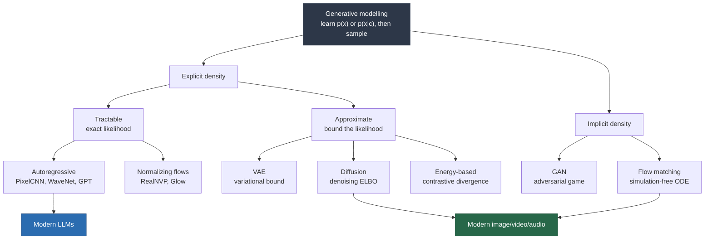

<!-- AUTO-GENERATED from README.md by scripts/sync_index.py. Do not edit. -->

# The Generative AI Wiki

> A dense, diagram-first reference on generative modelling — written for students of AI/ML who
> want the *math*, the *intuition*, and the *engineering numbers* in one place.

**How to read this**: every page is self-contained. Each one opens with a one-paragraph summary,
states its prerequisites, builds intuition with an analogy, derives the math, draws the mechanism,
then grounds it in a worked numeric example and runnable code. Cross-links (`→`) let you wander
like a wiki; the roadmap below gives you a linear path if you prefer one.

---

## Quick navigation

| Part | Topic | Pages |
|---|---|---|
| **I** | [Foundations](#part-i-foundations) | Probability, information theory, the learning problem, taxonomy |
| **II** | [Classical generative models](#part-ii-classical-generative-models) | Autoregressive, VAE, GAN, flows, energy-based |
| **III** | [Sequence models](#part-iii-sequence-models) | Tokenization, RNNs, attention, the Transformer |
| **IV** | [Large language models](#part-iv-large-language-models) | Architecture, pretraining, scaling, fine-tuning, alignment, inference |
| **V** | [Diffusion & vision](#part-v-diffusion-and-vision) | DDPM, score matching, latent diffusion, flow matching, multimodal |
| **VI** | [Applications](#part-vi-applications) | Prompting, RAG, embeddings, agents, structured output |
| **VII** | [Evaluation](#part-vii-evaluation) | Metrics, benchmarks, LLM-as-judge |
| **VIII** | [Safety & ethics](#part-viii-safety-and-ethics) | Alignment failures, security, societal impact |
| **IX** | [Reference](#part-ix-reference) | Glossary, math cheatsheet, timeline, papers, roadmap |

---

## The whole field on one page



**The one-sentence version**: all generative models answer *"given data drawn from an unknown
distribution $p_{\text{data}}$, how do I build a machine that produces new samples from something
close to it?"* — and they differ only in whether they model the density explicitly, how they
approximate the intractable parts, and what sampling costs at inference.

---

## Part I: Foundations

| Page | What it covers |
|---|---|
| [What is generative AI?](01-foundations/01-what-is-generative-ai.md) | Discriminative vs generative, the sampling problem, why it exploded |
| [Probability & information theory](01-foundations/02-probability-and-information-theory.md) | Entropy, KL, cross-entropy, MI, ELBO — with worked bit-counts |
| [Linear algebra & calculus you actually need](01-foundations/03-math-toolkit.md) | Matrix calculus, Jacobians, change of variables, SVD |
| [Neural networks refresher](01-foundations/04-neural-network-refresher.md) | MLPs, backprop by hand, initialization, normalization, activations |
| [Optimization & training dynamics](01-foundations/05-optimization.md) | SGD → Adam → AdamW, schedules, gradient clipping, mixed precision |
| [Taxonomy of generative models](01-foundations/06-taxonomy.md) | The full map, with the trilemma that explains every design choice |

## Part II: Classical Generative Models

| Page | What it covers |
|---|---|
| [Autoregressive models](02-classical-models/01-autoregressive-models.md) | Chain rule factorization, teacher forcing, PixelCNN/WaveNet |
| [Variational autoencoders](02-classical-models/02-vae.md) | ELBO derivation, reparameterization, posterior collapse, VQ-VAE |
| [Generative adversarial networks](02-classical-models/03-gan.md) | Minimax game, JSD equivalence, mode collapse, WGAN, StyleGAN |
| [Normalizing flows](02-classical-models/04-normalizing-flows.md) | Change of variables, coupling layers, exact likelihood |
| [Energy-based models](02-classical-models/05-energy-based-models.md) | Boltzmann distributions, contrastive divergence, Langevin dynamics |

## Part III: Sequence Models

| Page | What it covers |
|---|---|
| [Tokenization](03-sequence-models/01-tokenization.md) | BPE walkthrough by hand, WordPiece, Unigram, byte-level, pitfalls |
| [RNNs, LSTMs & GRUs](03-sequence-models/02-rnn-lstm-gru.md) | BPTT, vanishing gradients, gating, why they lost |
| [Attention](03-sequence-models/03-attention.md) | From alignment to scaled dot-product, with a full numeric trace |
| [The Transformer](03-sequence-models/04-transformer.md) | Block-by-block, parameter counts, FLOPs, every variant |
| [Positional encoding](03-sequence-models/05-positional-encoding.md) | Sinusoidal, learned, ALiBi, RoPE, and context extension |

## Part IV: Large Language Models

| Page | What it covers |
|---|---|
| [LLM architecture](04-large-language-models/01-llm-architecture.md) | The modern decoder stack: RMSNorm, SwiGLU, GQA, RoPE |
| [Pretraining](04-large-language-models/02-pretraining.md) | Data pipelines, objectives, parallelism, stability, cost |
| [Scaling laws](04-large-language-models/03-scaling-laws.md) | Kaplan vs Chinchilla, compute-optimal math, worked budgets |
| [Fine-tuning & PEFT](04-large-language-models/04-finetuning-peft.md) | SFT, LoRA/QLoRA math, adapters, prefix tuning, memory tables |
| [Alignment: RLHF, DPO & friends](04-large-language-models/05-alignment.md) | Reward models, PPO, DPO derivation, constitutional AI |
| [Inference & decoding](04-large-language-models/06-inference-and-decoding.md) | Greedy → beam → nucleus, KV cache math, speculative decoding |
| [Efficiency: quantization, distillation, sparsity](04-large-language-models/07-efficiency.md) | INT8/INT4, GPTQ/AWQ/NF4, pruning, distillation |
| [Mixture of Experts](04-large-language-models/08-mixture-of-experts.md) | Routing, load balancing, active vs total parameters |
| [Long context](04-large-language-models/09-long-context.md) | Position extrapolation, sparse/linear attention, SSMs, retrieval |
| [Reasoning & test-time compute](04-large-language-models/10-reasoning.md) | CoT, self-consistency, RL on reasoning, inference scaling laws |

## Part V: Diffusion and Vision

| Page | What it covers |
|---|---|
| [Diffusion models (DDPM)](05-diffusion-and-vision/01-diffusion-models.md) | Forward/reverse process, full ELBO derivation, the simple loss |
| [Score-based models & SDEs](05-diffusion-and-vision/02-score-based-models.md) | Score matching, Langevin, the unifying SDE view, samplers |
| [Latent diffusion & conditioning](05-diffusion-and-vision/03-latent-diffusion.md) | VAE compression, cross-attention, CFG, ControlNet, LoRA |
| [Flow matching & rectified flow](05-diffusion-and-vision/04-flow-matching.md) | Continuous normalizing flows without simulation |
| [Vision & multimodal models](05-diffusion-and-vision/05-multimodal.md) | ViT, CLIP, VLM architectures, video & audio generation |

## Part VI: Applications

| Page | What it covers |
|---|---|
| [Prompt engineering](06-applications/01-prompt-engineering.md) | What actually works, with mechanism explanations not folklore |
| [Embeddings & vector search](06-applications/02-embeddings-and-vector-search.md) | Contrastive training, ANN indexes (HNSW/IVF-PQ), metrics |
| [Retrieval-augmented generation](06-applications/03-rag.md) | Chunking, hybrid search, reranking, failure taxonomy |
| [Agents & tool use](06-applications/04-agents-and-tool-use.md) | ReAct, function calling, planning, memory, multi-agent |
| [Structured output & constrained decoding](06-applications/05-structured-output.md) | Grammars, FSM-guided decoding, JSON schema |

## Part VII: Evaluation

| Page | What it covers |
|---|---|
| [Evaluation metrics](07-evaluation/01-metrics.md) | Perplexity, BLEU/ROUGE/BERTScore, FID/IS/CLIPScore — and their lies |
| [Benchmarks](07-evaluation/02-benchmarks.md) | MMLU, GSM8K, HumanEval, pass@k math, contamination, Elo arenas |

## Part VIII: Safety and Ethics

| Page | What it covers |
|---|---|
| [Alignment & safety](08-safety-and-ethics/01-safety.md) | Hallucination, sycophancy, reward hacking, interpretability |
| [Security](08-safety-and-ethics/02-security.md) | Prompt injection, jailbreaks, data extraction, defenses |
| [Societal impact](08-safety-and-ethics/03-societal-impact.md) | Bias, copyright, labour, environment, provenance |

## Part IX: Reference

| Page | What it covers |
|---|---|
| [Glossary](09-reference/01-glossary.md) | ~200 terms, one crisp line each |
| [Math cheatsheet](09-reference/02-math-cheatsheet.md) | Every formula in the wiki on one page |
| [Timeline](09-reference/03-timeline.md) | 1943 → today, with why each step mattered |
| [Paper list](09-reference/04-papers.md) | The ~90 papers that matter, annotated |
| [Study roadmap](09-reference/05-roadmap.md) | 12-week plan with projects and checkpoints |
| [Notation](09-reference/06-notation.md) | Symbol conventions used throughout |

---

## Study roadmap (the short version)

```
Week 1-2   Foundations ......... I.1 → I.6        Build: n-gram model from scratch
Week 3     Autoregressive ...... II.1             Build: char-level MLP language model
Week 4     VAE + GAN ........... II.2, II.3       Build: VAE on MNIST, watch latent space
Week 5-6   Attention + Transformer  III.1 → III.5 Build: GPT from scratch (~300 lines)
Week 7     LLM architecture .... IV.1, IV.2       Build: train a 10M-param LM on TinyStories
Week 8     Scaling + finetuning  IV.3, IV.4       Build: LoRA fine-tune on a small task
Week 9     Alignment + inference IV.5, IV.6       Build: DPO on a preference set
Week 10    Diffusion ........... V.1 → V.3        Build: DDPM on MNIST/CIFAR
Week 11    RAG + agents ........ VI.1 → VI.4      Build: RAG over your own notes
Week 12    Evaluation + safety . VII, VIII        Build: an eval harness for your own model
```

Full version with checkpoints: [Study roadmap](09-reference/05-roadmap.md).

---

## Conventions used in this wiki

| Marker | Meaning |
|---|---|
| 🧠 **Intuition** | The analogy / mental model. Read this first if the math is heavy. |
| 📐 **Derivation** | Step-by-step math. Safe to skim on a first pass, essential on a second. |
| 🔢 **Worked example** | Real numbers plugged in, arithmetic shown. |
| 💻 **Code** | Minimal, runnable, dependency-light (PyTorch or NumPy). |
| ⚠️ **Pitfall** | A mistake people actually make. |
| 📊 **Numbers** | Empirical values: parameter counts, FLOPs, memory, costs. |
| → | Cross-link to another page. |

Math renders as LaTeX. GitHub, VS Code, Obsidian and MkDocs all display it; diagrams use
[Mermaid](https://mermaid.js.org/) with ASCII fallbacks where structure matters more than beauty.

### Rendering it as a site

```bash
pip install -r requirements.txt
make serve            # → http://127.0.0.1:8001  (make serve PORT=9000 to change)
```

A ready-made `mkdocs.yml` is included at the repo root.

---

*Last reviewed: September 2026. Fast-moving areas — model names, benchmark scores and price
points — are marked 📊 and carry dates; treat them as snapshots, not constants. The math does
not go stale.*
